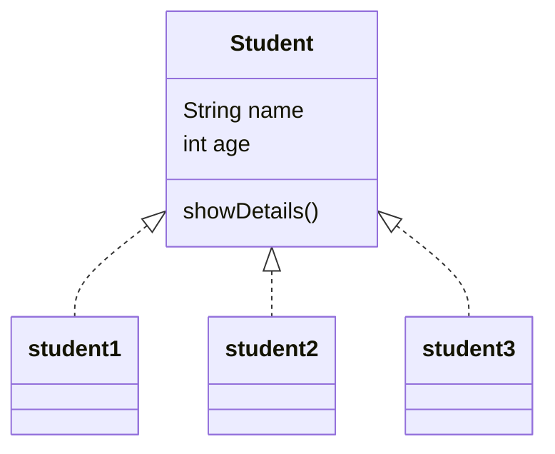
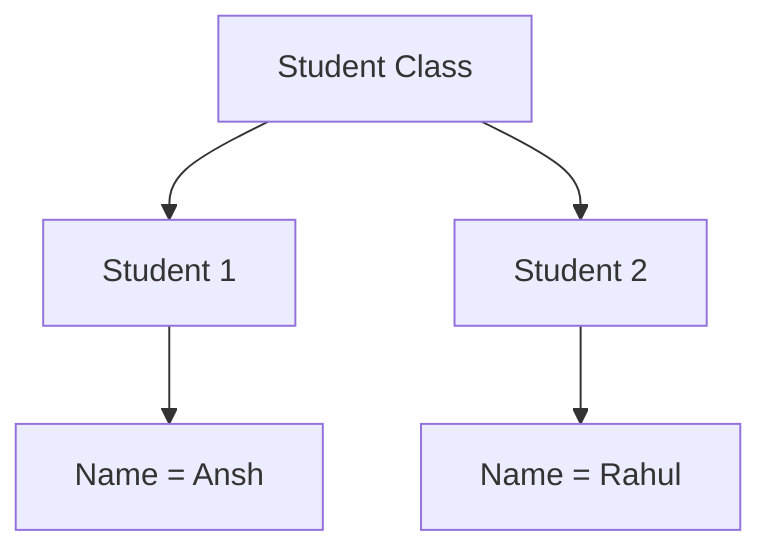

# 📘 Day 16 — Classes & Objects

> Module: 07 - Object-Oriented Programming (OOP)  
> Topic: Classes & Objects  
> Language: Dart

---

# 🎯 Learning Objectives

After completing these notes, you should be able to:

- Explain Object-Oriented Programming (OOP).
- Differentiate between a Class and an Object.
- Create multiple objects from a single class.
- Use Instance Variables and Instance Methods.
- Access members using the Dot (`.`) operator.
- Understand why `late` was required before learning Constructors.
- Relate everything to Flutter Widgets.

---

# 🌍 Why Do We Need OOP?

Imagine creating details of 100 students.

Without OOP:

```dart
String student1Name;
int student1Age;

String student2Name;
int student2Age;

String student3Name;
int student3Age;
```

😵 Imagine writing this for 1000 students.

Now imagine this instead:

```dart
class Student {

}
```

Now simply create:

```dart
Student s1 = Student();

Student s2 = Student();

Student s3 = Student();
```

One Class.

Unlimited Objects.

---

# 🏗️ Real Life Analogy

Imagine a company that manufactures Cars.

The company first creates a Design.

That Design is NOT an actual car.

It is only a Blueprint.

```
             CAR BLUEPRINT

          Engine
          Wheels
          Seats
          Color

         (Design Only)
```

After manufacturing...

```
        🚗 Car 1

        🚙 Car 2

        🚘 Car 3
```

All are made from

ONE

Blueprint.

Exactly the same happens in programming.

---

# 🧠 What is a Class?

A Class is a Blueprint or Template.

It defines

- What data an object will store.
- What work an object can perform.

A Class itself does NOT consume meaningful real-world data.

It only describes future objects.

---

# 📦 Visual Diagram

```
                CLASS

          +----------------+
          |    Student     |
          +----------------+
          | name           |
          | age            |
          | rollNo         |
          +----------------+
          | showDetails()  |
          +----------------+

          Blueprint Only
```

---

# 🧠 What is an Object?

An Object is a Real Instance of a Class.

Objects contain Actual Values.

Example

```
Object 1

Name : Ansh

Age : 20

Roll : 101
```

```
Object 2

Name : Rahul

Age : 19

Roll : 102
```

Different Data.

Same Blueprint.

---

# 📊 Class vs Object

| Class | Object |
|---------|--------|
| Blueprint | Real Thing |
| Template | Instance |
| No Actual Data | Contains Actual Data |
| Created Once | Can be Unlimited |

---

# Mermaid Diagram



---

# Relationship

```
             Student Class

                    │

        ┌───────────┼───────────┐

        │           │           │

      Student1   Student2   Student3
```

---

# Object Creation

Syntax

```dart
Student s1 = Student();
```

Visual

```
Student

↓

Student()

↓

Memory Allocation

↓

Object Created

↓

s1 points to Object
```

---

# Dot Operator

The Dot Operator is used to access

- Variables
- Methods

Example

```dart
s1.name = "Ansh";

s1.showDetails();
```

Visual

```
s1

↓

.

↓

name

↓

Value Assigned
```

---

# Instance Variables

Variables inside a Class.

Example

```dart
late String name;

late int age;
```

Every Object gets its own copy.

Visual

```
Student

↓

Object 1

Name = Ansh

Age = 20
```

```
Student

↓

Object 2

Name = Rahul

Age = 19
```

---

# Mermaid



---

# Instance Methods

Functions declared inside a class.

Example

```dart
void showDetails(){

}
```

Purpose

To perform operations using object data.

---

# Runtime Input

Instead of

```dart
student.name = "Ansh";
```

We learned

```dart
student.name = stdin.readLineSync()!;
```

Now the user decides the value.

Applications become Dynamic.

---

# Why did we use `late`?

Question

Why didn't we simply write

```dart
String name;
```

Because Dart says

> "Non-nullable variables must have a value."

But when an object is created

```
Student s1 = Student();
```

the variables are still empty.

So we wrote

```dart
late String name;
```

Meaning

> "Don't worry Compiler.
>
> I promise I will initialize this variable later."

Visual

```
Without late

Create Object

↓

Compiler checks

↓

Variable Empty

↓

❌ Error
```

```
With late

Create Object

↓

Compiler waits

↓

Later Value Assigned

↓

✅ Success
```

---

# Important Note

We are using `late`

ONLY

because we have not learned Constructors yet.

Soon

```
Student(

"Ansh",

20

)
```

will initialize everything automatically.

---

# Java vs Dart

Java

```java
Student s = new Student();
```

Dart

```dart
Student s = Student();
```

Difference

Dart removed the `new` keyword.

---

# Flutter Connection

Every Widget is an Object.

```
Text()

↓

Object
```

```
Container()

↓

Object
```

```
Scaffold()

↓

Object
```

```
Column()

↓

Object
```

Flutter itself is built using OOP.

Understanding Classes and Objects means understanding Flutter.

---

# Common Beginner Mistakes

❌ Thinking Class stores actual data.

✔️ Objects store actual data.

---

❌ Thinking every object shares values.

✔️ Every object has its own independent values.

---

❌ Forgetting `late`

Result

Compilation Error.

---

❌ Accessing members without object.

Wrong

```dart
name = "Ansh";
```

Correct

```dart
student.name = "Ansh";
```

---

# Interview Questions

### What is OOP?

A programming paradigm that models real-world entities using Objects.

---

### What is a Class?

A Blueprint used to create Objects.

---

### What is an Object?

A real instance of a Class.

---

### Why do we create Objects?

To store independent real-world data.

---

### What is an Instance Variable?

A variable declared inside a class.

---

### What is an Instance Method?

A method declared inside a class that works on object data.

---

### Why did we use `late`?

Because variables are initialized after object creation. `late` tells Dart that initialization will happen before the variable is used.

---

# 📝 Copy Notes (Notebook Version)

- OOP models real-world entities using Objects.
- A Class is a Blueprint or Template.
- An Object is an Instance of a Class.
- One Class can create unlimited Objects.
- Every Object stores its own data.
- Variables inside a Class are called Instance Variables.
- Functions inside a Class are called Instance Methods.
- Members are accessed using the Dot Operator (`.`).
- `late` allows delayed initialization of non-nullable variables.
- Flutter Widgets are Objects created from Classes.

---

# 🎯 Day 16 Summary

Today I learned the foundation of Object-Oriented Programming.

I understood how Classes act as Blueprints and Objects act as Real Instances.

I created multiple real-world programs, practiced runtime input with Objects, and built the knowledge required for Constructors and advanced OOP concepts.

This topic is the backbone of Flutter because every Widget in Flutter is an Object created from a Class.