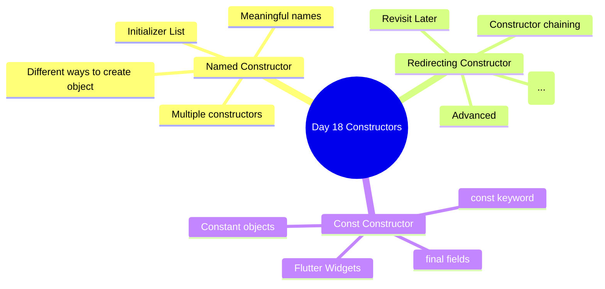
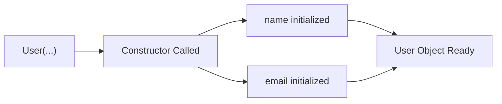
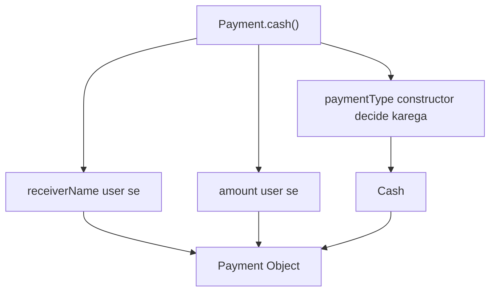
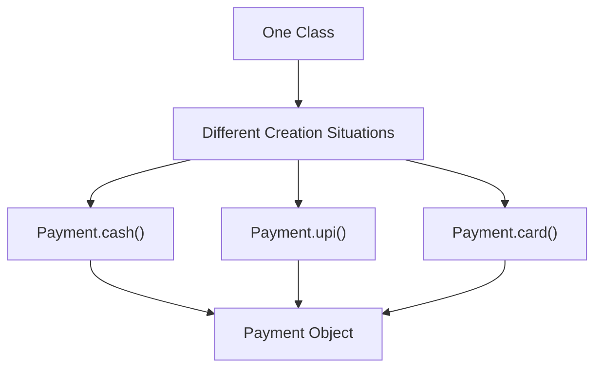
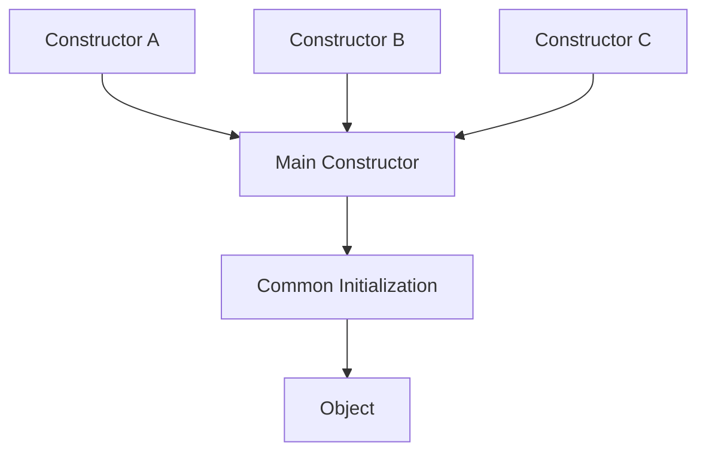
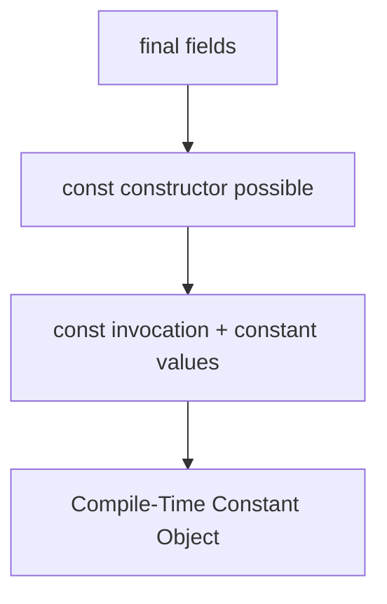
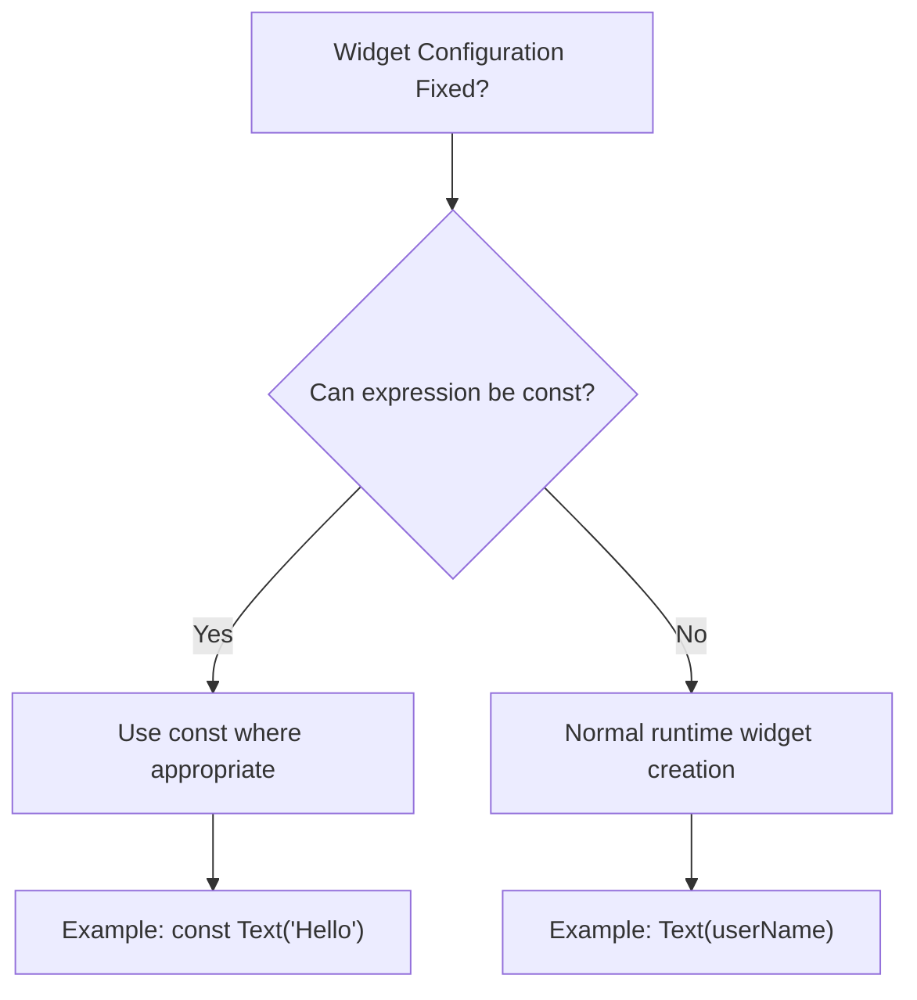
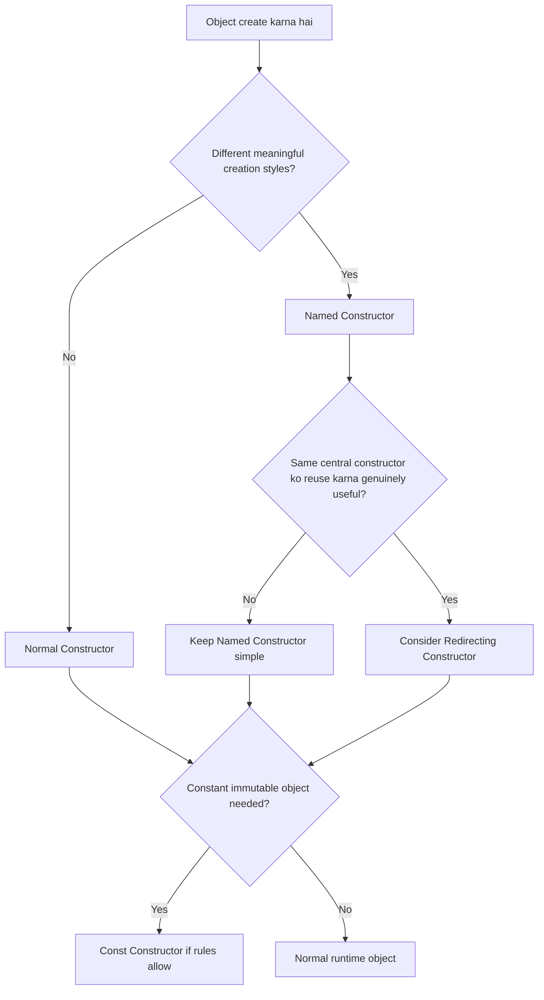
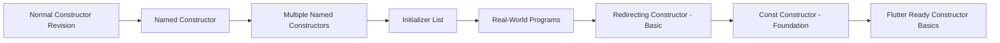

# 📘 Day 18 — Advanced Constructors in Dart

> **Goal:** Constructors ko itna samajhna ki Flutter me constructor syntax dekhkar confusion na ho.

---

# 📌 Day Overview

Day 18 me humne constructors ko basic level se aage explore kiya.

Main focus raha:

1. Named Constructors
2. Multiple Named Constructors
3. Named Constructor + Parameters
4. Named Constructor + Initializer List
5. Redirecting Constructor — Basic Understanding
6. Const Constructor — Flutter Foundation
7. `final` and `const` relationship
8. Flutter me constructors ka importance

---

# 🧠 Memory Map



---

# 1️⃣ Quick Constructor Revision

Constructor ek special member hota hai jo object create hote waqt uski initial values set karne me help karta hai.

Example:

```dart
class User {
  String name;
  String email;

  User({
    required this.name,
    required this.email,
  });
}
```

Object:

```dart
User user1 = User(
  name: "Ansh",
  email: "ansh@gmail.com",
);
```

Flow:



---

# 2️⃣ Why Named Constructors?

Suppose ek `Payment` class hai.

Payment different methods se ho sakti hai:

- Cash
- UPI
- Card
- Net Banking

Class fir bhi same hai:

```text
Payment
```

Lekin object create karne ke **situations different hain**.

Normal constructor:

```dart
Payment(...)
```

Named constructors:

```dart
Payment.cash(...)
Payment.upi(...)
Payment.card(...)
Payment.netBanking(...)
```

---

# 📖 Named Constructor Definition

> A Named Constructor allows us to provide multiple meaningful ways of creating objects of the same class.

Simple Hinglish:

> **Class same hai, object banane ke situations/tareeke different hain, to hum constructors ko meaningful names de sakte hain.**

---

# 3️⃣ Named Constructor Syntax

General syntax:

```dart
ClassName.constructorName() {
}
```

Example:

```dart
class User {
  User.google() {
  }
}
```

Object:

```dart
User user = User.google();
```

---

# 🧠 Syntax Memory Trick

```text
Normal Constructor

ClassName()


Named Constructor

ClassName.name()
```

Example:

```text
Payment()

Payment.upi()

Payment.cash()

Payment.card()
```

Bas constructor ke baad:

```text
.name
```

add hua.

---

# 4️⃣ Named Constructor with Parameters

Named Constructor bhi normal constructor ki tarah parameters receive kar sakta hai.

Example structure:

```dart
class User {
  final String name;
  final String email;

  User.google({
    required this.name,
    required this.email,
  });
}
```

Object:

```dart
User user = User.google(
  name: "Ansh",
  email: "ansh@gmail.com",
);
```

---

# 5️⃣ Multiple Named Constructors

Ek class me multiple named constructors ho sakte hain.

Example:

```dart
class Message {

  Message.text();

  Message.image();

  Message.voice();

  Message.video();
}
```

Objects:

```dart
Message.text();

Message.image();

Message.voice();

Message.video();
```

---

# 🌍 Real-World Thinking

WhatsApp me:

```text
                MESSAGE
                   │
        ┌──────────┼──────────┐
        │          │          │
        ▼          ▼          ▼
      Text       Image      Voice
        │          │          │
        └──────────┼──────────┘
                   ▼
             Message Object
```

Hume ye classes banane ki zarurat nahi:

```text
TextMessage
ImageMessage
VoiceMessage
```

agar fundamental entity same hai aur sirf creation/configuration ka tareeka different hai.

Instead:

```dart
Message.text()
Message.image()
Message.voice()
```

zyada meaningful ho sakta hai.

> Note: Real production design situation par depend karega. Har different behavior ko automatically named constructor me convert nahi karna chahiye.

---

# 6️⃣ Named Constructor + Initializer List

Day 18 me humne ye pattern bahut use kiya:

```dart
Payment.cash({
  required this.receiverName,
  required this.amount,
}) : paymentType = "Cash";
```

Isko pieces me samjho.

### Parameters

```dart
required this.receiverName
required this.amount
```

User values provide karega.

### Initializer List

```dart
: paymentType = "Cash"
```

`paymentType` constructor khud decide kar raha hai.

User ko ye nahi dena padega:

```dart
paymentType: "Cash"
```

---

# 🧠 Visual Flow



---

# 7️⃣ Why is this useful?

Suppose user calls:

```dart
Payment.upi(
  receiverName: "Ansh",
  amount: 500,
);
```

`Payment.upi()` ka naam already bata raha hai ki:

```text
Payment Type = UPI
```

To user se dobara:

```dart
paymentType: "UPI"
```

mangna unnecessary hai.

Constructor automatically set kar sakta hai.

---

# 🧠 Developer Thinking

Bad / unnecessary API:

```dart
Payment.upi(
  receiverName: "Ansh",
  amount: 500,
  paymentType: "UPI",
);
```

Question:

```text
UPI constructor hai hi,
to UPI dobara kyun likhwa rahe ho?
```

Better:

```dart
Payment.upi(
  receiverName: "Ansh",
  amount: 500,
);
```

Constructor internally:

```text
paymentType = UPI
```

set karega.

---

# 8️⃣ Named Constructor — Main Mental Model



Remember:

> **Class same → creation situations different → Named Constructors may be useful.**

---

# 9️⃣ Normal + Named Constructor Together

Ek class me normal aur named constructors dono ho sakte hain.

Example structure:

```dart
class Car {

  Car(...);

  Car.petrol(...);

  Car.diesel(...);

  Car.electric(...);
}
```

Normal:

```dart
Car(...)
```

Generic/manual creation ke liye.

Named:

```dart
Car.petrol(...)
```

specific configuration ke liye.

---

# 🔥 Important Lesson

Normal constructor compulsory nahi hai.

Agar class ka design sirf named creation methods demand karta hai, named constructors sufficient ho sakte hain.

Likewise, sirf feature available hai isliye unnecessary constructors nahi banane chahiye.

---

# 🔟 Named Constructor vs Normal Constructor

| Normal Constructor | Named Constructor |
|---|---|
| `User()` | `User.google()` |
| Class ke naam jaisa | Extra meaningful name |
| General object creation | Specific creation situation |
| Usually one unnamed generative constructor | Multiple named constructors possible |
| `Payment()` | `Payment.upi()` |

---

# 1️⃣1️⃣ Programs Built

## 01 — Bank Account

Concept:

```text
Named Constructor Foundation
```

---

## 02 — Car

Constructors:

```dart
Car(...)
Car.petrol(...)
Car.diesel(...)
Car.electric(...)
```

Concepts:

- Normal Constructor
- Multiple Named Constructors
- Initializer List
- Fixed constructor values

---

## 03 — Payment

Constructors:

```dart
Payment(...)
Payment.cash(...)
Payment.upi(...)
Payment.card(...)
Payment.netBanking(...)
```

Concepts:

- Real-world object creation
- Multiple payment modes
- Named Constructor
- Initializer List

---

## 04 — Message

Constructors:

```dart
Message(...)
Message.text(...)
Message.image(...)
Message.voice(...)
Message.video(...)
```

Concept:

```text
One entity
+
Different creation styles
```

---

# 1️⃣2️⃣ Redirecting Constructor

Redirecting Constructor ko Day 18 me basic level par explore kiya.

## Definition

> A Redirecting Constructor forwards object initialization to another constructor of the same class.

Simple Hinglish:

> **Ek constructor khud initialization karne ke bajay doosre constructor ko kaam de deta hai.**

---

# Syntax

```dart
ClassName.namedConstructor(...)
    : this(...);
```

Important part:

```dart
: this(...)
```

---

# Visual Flow


---

# Normal Named Constructor

```text
Named Constructor
      ↓
Fields directly initialize
      ↓
Object
```

# Redirecting Constructor

```text
Redirecting Constructor
      ↓
Another Constructor
      ↓
Fields initialize
      ↓
Object
```

---

# Why does it exist?

Suppose multiple constructors ko same central initialization process use karna hai.

Conceptually:



Possible benefits:

- Common initialization path
- Constructor chaining
- Less duplicated initialization logic
- Easier maintenance in suitable situations

---

# ⚠️ Our Day 18 Conclusion

Redirecting Constructor **har situation me useful nahi hai**.

Simple classes me:

```dart
Payment.cash(...)
Payment.upi(...)
```

direct Named Constructors zyada readable ho sakte hain.

Therefore:

> **Do not use Redirecting Constructors just because they exist.**

Use them when they genuinely simplify constructor design.

For our current Flutter foundation:

```text
Redirecting Constructor
        ↓
Basic concept understood
        ↓
Syntax recognized
        ↓
Advanced usage later
```

---

# 1️⃣3️⃣ `const` Constructor

Flutter ke liye ye important constructor concept hai.

Syntax:

```dart
class AppTheme {
  final String themeName;

  const AppTheme({
    required this.themeName,
  });
}
```

Notice:

```dart
const AppTheme(...)
```

Constructor ke aage:

```text
const
```

hai.

---

# 📖 Simple Definition

> A const constructor allows a class to create compile-time constant objects when the supplied values are also constant.

Beginner memory:

> **`const` constructor class ko constant objects banane ki capability deta hai.**

---

# 1️⃣4️⃣ Important Rule — Fields Must Be Final

Generative const constructor ke instance fields ko mutable nahi rakha ja sakta.

Correct:

```dart
final String name;
final int age;
```

Then:

```dart
const User({
  required this.name,
  required this.age,
});
```

---

# Why `final`?

Because:

```text
Constant Object
      ↓
Object ki instance state mutable nahi honi chahiye
```

Therefore fields:

```dart
final
```

hote hain.

---

# Visual Memory



---

# 1️⃣5️⃣ `final` vs `const`

Ye bahut important distinction hai.

## `final`

```dart
final String name;
```

Meaning:

> Field ko initialize hone ke baad reassign nahi kar sakte.

Memory:

```text
final
 ↓
Assign Once
```

---

## `const` Constructor

```dart
const User(...)
```

Meaning:

> Constructor constant objects create karne ke liye eligible/capable hai.

Memory:

```text
const constructor
       ↓
Constant object creation capability
```

---

# 🧠 Memory Chart

```text
┌───────────────────────────────────────────┐
│                 FINAL                     │
├───────────────────────────────────────────┤
│ Field/reference ek baar assign            │
│ Example: final String name;               │
└───────────────────────────────────────────┘

                    VS

┌───────────────────────────────────────────┐
│            CONST CONSTRUCTOR              │
├───────────────────────────────────────────┤
│ Constant instances create karne ki        │
│ capability deta hai                       │
│ Example: const User(...);                 │
└───────────────────────────────────────────┘
```

---

# 1️⃣6️⃣ Very Important Misconception

`const` ka matlab:

```text
Only ONE object
```

❌ **NAHI HAI**

Example:

```dart
const AppTheme dark = AppTheme(
  themeName: "Dark",
);

const AppTheme light = AppTheme(
  themeName: "Light",
);
```

Dono valid hain.

So:

```text
const ≠ Singleton
```

Singleton ek alag design concept hai.

---

# 1️⃣7️⃣ Const Constructor Does NOT Force Const Usage

Suppose constructor:

```dart
const User({
  required this.name,
});
```

hai.

Still normal invocation possible ho sakta hai:

```dart
User user = User(
  name: "Ansh",
);
```

Aur constant context me:

```dart
const User user = User(
  name: "Ansh",
);
```

So remember:

```text
const constructor
      ↓
"Const object bana SAKTE ho"

Not

"Har object const banana PADEGA"
```

---

# 1️⃣8️⃣ Flutter Connection 📱

Flutter me `const` bahut commonly dikhega.

Examples:

```dart
const Text("Hello")
```

```dart
const SizedBox(height: 20)
```

```dart
const Icon(Icons.home)
```

```dart
const MyApp()
```

Flutter widgets generally immutable configurations hote hain, isliye `const` constructors Flutter code me extremely common hain.

---

# Flutter Mental Model



---

# Example

Fixed text:

```dart
const Text("Login")
```

`"Login"` compile-time constant hai.

But runtime data:

```dart
Text(userName)
```

`userName` runtime par aa sakta hai.

Isliye har widget ko blindly `const` nahi laga sakte.

---

# ☕ Java vs Dart

## Normal Constructor

Java:

```java
User(String name) {
    this.name = name;
}
```

Dart:

```dart
User(this.name);
```

Dart shorthand provide karta hai.

---

## Named Constructor

Java me Dart jaisa direct named-constructor feature nahi hota.

Dart:

```dart
User.guest()
User.admin()
User.fromApi()
```

Java me similar intent often overloaded constructors or static factory methods se achieve kiya ja sakta hai.

---

## Constructor Chaining

Java:

```java
this(...);
```

Dart redirecting syntax:

```dart
: this(...);
```

Idea similar:

```text
One Constructor
      ↓
Another Constructor
```

---

## `const`

Dart ka constructor-level `const` concept Java constructor syntax me directly equivalent nahi hai.

Dart/Flutter me ye particularly important hai.

---

# 1️⃣9️⃣ Complete Constructor Decision Chart



---

# 2️⃣0️⃣ Constructor Memory Chart 🧠

```text
┌─────────────────────────────────────────────┐
│              CONSTRUCTORS                   │
├─────────────────────────────────────────────┤
│                                             │
│  Normal                                     │
│    User(...)                                │
│       ↓                                     │
│  General Object Creation                    │
│                                             │
├─────────────────────────────────────────────┤
│                                             │
│  Named                                      │
│    User.guest(...)                          │
│    User.google(...)                         │
│       ↓                                     │
│  Different Meaningful Creation Styles       │
│                                             │
├─────────────────────────────────────────────┤
│                                             │
│  Redirecting                                │
│    User.guest() : this(...)                 │
│       ↓                                     │
│  Another Constructor Handles Initialization │
│                                             │
├─────────────────────────────────────────────┤
│                                             │
│  Const                                      │
│    const User(...)                          │
│       ↓                                     │
│  Constant Object Capability                 │
│                                             │
└─────────────────────────────────────────────┘
```

---

# 2️⃣1️⃣ Syntax Cheat Sheet

## Normal Constructor

```dart
ClassName({
  required this.value,
});
```

---

## Named Constructor

```dart
ClassName.name({
  required this.value,
});
```

---

## Named Constructor + Initializer List

```dart
ClassName.name({
  required this.value,
}) : type = "Fixed Value";
```

---

## Redirecting Constructor

```dart
ClassName.name({
  required String value,
}) : this(
       value: value,
     );
```

---

## Const Constructor

```dart
const ClassName({
  required this.value,
});
```

Field:

```dart
final String value;
```

---

# 2️⃣2️⃣ Common Mistakes

## ❌ Mistake 1 — Named Constructor syntax bhoolna

Wrong thinking:

```text
ConstructorName()
```

Remember:

```text
ClassName.constructorName()
```

Example:

```dart
Payment.upi()
```

---

## ❌ Mistake 2 — Fixed value user se bhi mangna

If:

```dart
Payment.upi()
```

already tells us payment type, then unnecessary:

```dart
paymentType: "UPI"
```

avoid kiya ja sakta hai.

---

## ❌ Mistake 3 — `const` constructor declare na karna

If constructor is:

```dart
AppTheme(...)
```

then const construction cannot be used as if the constructor were const.

Need:

```dart
const AppTheme(...)
```

---

## ❌ Mistake 4 — `const` ko Singleton samajhna

Wrong:

```text
const = only one object
```

Correct:

```text
const = compile-time constant object capability
```

---

## ❌ Mistake 5 — Har jagah advanced constructor use karna

Professional developer ka goal:

```text
Maximum Features Use Karna ❌

Simplest Correct Design Choose Karna ✅
```

---

# 2️⃣3️⃣ Think Like a Developer 🧠

Constructor choose karte waqt ye questions poochho:

### Question 1

Kya mujhe general object creation chahiye?

```text
YES → Normal Constructor
```

### Question 2

Kya same class ko different meaningful situations me create karna hai?

```text
YES → Named Constructor
```

### Question 3

Kya multiple constructors ko genuinely ek central initialization path reuse karwana useful hai?

```text
YES → Redirecting Constructor consider karo
```

### Question 4

Kya immutable constant configuration hai aur const rules satisfy hote hain?

```text
YES → const Constructor useful ho sakta hai
```

---

# 2️⃣4️⃣ Flutter Constructor Recognition Chart 📱

Future me ye code:

```dart
class MyApp extends StatelessWidget {
  const MyApp({super.key});

  @override
  Widget build(BuildContext context) {
    // ...
  }
}
```

dekhoge.

Ab constructor line:

```dart
const MyApp({super.key});
```

dekhkar kam se kam ye recognize kar paoge:

```text
const
 ↓
Const Constructor

MyApp
 ↓
Class/Constructor Name

(...)
 ↓
Constructor Parameters
```

Baaki `super.key` inheritance/Flutter ke saath properly padhenge.

---

# 2️⃣5️⃣ Day 18 Learning Flow



---

# 🏆 Day 18 Final Outcome

After Day 18, I can:

- ✅ Understand Named Constructors
- ✅ Create multiple Named Constructors
- ✅ Pass parameters to Named Constructors
- ✅ Combine Named Constructors with Initializer Lists
- ✅ Choose meaningful constructor names
- ✅ Understand the basic purpose of Redirecting Constructors
- ✅ Recognize `: this(...)`
- ✅ Understand the basic purpose of `const` Constructors
- ✅ Understand why const classes use `final` instance fields
- ✅ Differentiate `final` and `const` at a foundation level
- ✅ Recognize common Flutter constructor syntax
- ✅ Decide when a simple constructor is better than an advanced feature

---

# 📊 Day 18 Status

| Topic | Status |
|---|---|
| Named Constructor | ✅ Strong |
| Multiple Named Constructors | ✅ Strong |
| Initializer List with Named Constructor | ✅ Strong |
| Redirecting Constructor | 🟡 Foundation Only |
| Const Constructor | ✅ Flutter Foundation |
| Factory Constructor | ⏳ Later |
| Flutter Constructor Readiness | 🟢 Ready |

---

# 🧠 30-Second Revision

```text
Normal Constructor
→ General object creation

Named Constructor
→ Same class, different meaningful creation styles

Initializer List
→ Constructor body se pehle fields initialize/check karna

Redirecting Constructor
→ Ek constructor → doosra constructor

const Constructor
→ Constant object creation capability

final
→ Value assign hone ke baad field reassign nahi

Factory Constructor
→ Later / Advanced / API & Flutter Models
```

---

# 📱 Flutter Connection — Final Revision

```text
DART OOP                         FLUTTER

Class                    →       Widget Class

Object                   →       Widget Instance

Constructor              →       MyApp(...)

Const Constructor        →       const MyApp(...)

Named Constructor        →       Meaningful alternate creation APIs

final Fields             →       Immutable Widget Configuration

Inheritance              →       extends StatelessWidget
                                  ↑
                              Day 20
```

---

# 🚀 What's Next?

## 🔐 Day 19 — Encapsulation

Next we will learn:

- What is Encapsulation?
- Why data needs protection
- Dart private members using `_`
- Getters
- Setters
- Controlled data access
- Validation through setters/methods
- Java vs Dart Encapsulation
- Banking App examples
- User/Profile examples
- Flutter connection

---

# 🏁 Day 18 Completed

> **Constructors are not about memorizing different syntax. They are about controlling how an object is created and initialized.**

**Next → Day 19: Encapsulation 🔐**