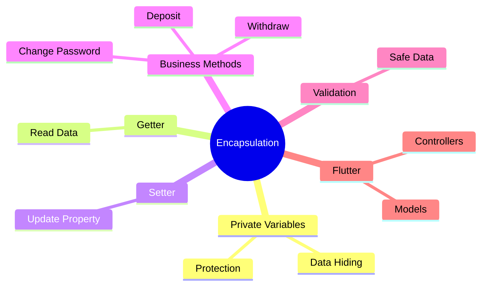
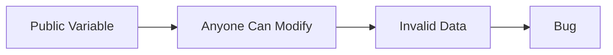
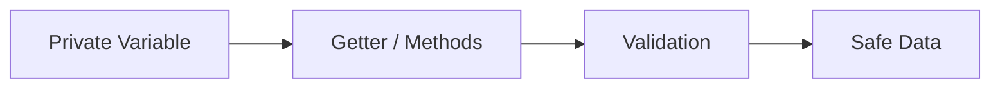
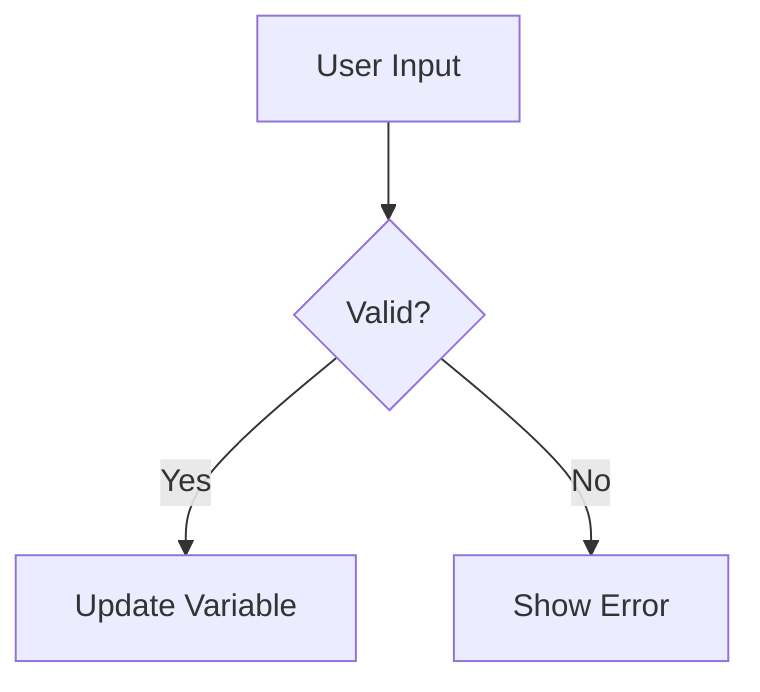
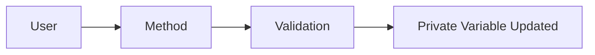

# 📘 Day 19 — Encapsulation 🔒

> **Goal:** Encapsulation ko itna achhe se samajhna ki Flutter me Controllers, Models aur Business Logic dekhkar confusion na ho.

---

# 📌 Day Overview

Day 19 me humne Object-Oriented Programming (OOP) ke ek bahut important pillar **Encapsulation** ko detail me samjha.

Main focus raha:

1. What is Encapsulation?
2. Why Encapsulation?
3. Private Variables (`_`)
4. Getters
5. Setters
6. Business Methods
7. Validation
8. Flutter Connection
9. Professional Design Thinking

---

# 🧠 Memory Map



---

# 1️⃣ What is Encapsulation?

## 📖 Definition

> **Encapsulation is the process of binding data and methods together inside a class while protecting the data from direct access.**

Simple Hinglish:

> **Data ko hide karke usko sirf controlled way me access karna hi Encapsulation hai.**

---

# 🏦 Real Life Example

Imagine tumhare paas ek **Bank Account** hai.

Kya tum directly bank ke database me jaakar balance change kar sakte ho?

```text
Balance = ₹10,00,000
```

❌ Bilkul nahi.

Tum sirf ye actions kar sakte ho:

- Deposit
- Withdraw
- Transfer

Bank decide karega ki balance kaise update hoga.

Yehi Encapsulation hai.

---

# 🧠 Memory Trick

```text
Data
   ↓
Hide

↓

Allow

↓

Controlled Access

↓

Safe Program
```

---

# 2️⃣ Why Encapsulation?

Agar variables sabke liye public honge to koi bhi unki value change kar sakta hai.

Example:

```dart
wallet.balance = -5000;
```

Ye logically galat hai.

Balance kabhi negative nahi hona chahiye.

Isi problem ko solve karta hai **Encapsulation**.

---

## Without Encapsulation



---

## With Encapsulation



---

# 🎯 Benefits of Encapsulation

✅ Data Security

✅ Controlled Access

✅ Validation

✅ Better Code Design

✅ Easy Maintenance

✅ Professional Programming

---

# 3️⃣ Private Variables

Dart me kisi variable ke aage underscore (`_`) lagane ka matlab hota hai:

```dart
_balance
```

Ye variable **private** hai.

Outside code ise directly access nahi kar sakta.

---

## Example

```dart
class Wallet {

  double _balance = 5000;

}
```

Ab koi bhi ye nahi kar sakta:

```dart
wallet._balance = -5000;
```

---

# 🧠 Visual Memory

```text
Public Variable

balance

↓

Everyone Can Access


Private Variable

_balance

↓

Only Class Controls It
```

---

# Why Private Variables?

Socho agar Password public ho.

```dart
user.password = "123";
```

Koi bhi password change kar dega.

Isi liye password ko private rakhte hain.

```dart
String _password;
```

Ab sirf class hi password ko control karegi.

---

# 🌍 Real World Examples

| Data | Public? | Private? |
|-------|---------|----------|
| User Name | ✅ | ❌ |
| Email | ✅ | ❌ |
| Password | ❌ | ✅ |
| Wallet Balance | ❌ | ✅ |
| OTP | ❌ | ✅ |
| Bank PIN | ❌ | ✅ |

---

# 💡 Important Note

Private ka matlab ye nahi hai ki data kabhi access hi nahi hoga.

Private ka matlab hai:

> **Direct access allowed nahi hai.**

Access sirf controlled way me hoga.

Isi liye hum use karte hain:

- Getter
- Setter
- Business Methods

---

# 🔥 Think Like a Developer

Question:

Kya har variable private hona chahiye?

Answer:

❌ Nahi.

Jo data protect karna zaruri hai usi ko private banao.

Example:

```text
Password

Balance

OTP

PIN

Token
```

Ye private hone chahiye.

Lekin

```text
App Name

Version

Developer Name
```

Ye public bhi ho sakte hain.

---

# 🏁 Part 1 Summary

✅ What is Encapsulation

✅ Why Encapsulation

✅ Private Variables

✅ Data Hiding

✅ Benefits

✅ Real World Thinking

---
# 4️⃣ Getter

## 📖 Definition

A **Getter** is used to read the value of a private variable safely.

Instead of accessing the private variable directly, we expose only its value.

---

## General Syntax

```dart
datatype get getterName => variable;
```

Example:

```dart
class Wallet {

  double _balance = 5000;

  double get balance => _balance;

}
```

Usage:

```dart
Wallet wallet = Wallet();

print(wallet.balance);
```

Notice:

```dart
wallet.balance
```

looks like a normal variable,

but actually **Getter** execute hota hai.

---

# 🧠 Memory Trick

```text
Getter

↓

Read Data

↓

No Modification
```

---

# 5️⃣ Setter

## 📖 Definition

A **Setter** is used to update a private variable in a controlled way.

Setter ke andar hum validation bhi laga sakte hain.

---

## General Syntax

```dart
set variableName(datatype value){

}
```

Example

```dart
class User {

  String _name = "";

  set name(String value){

    if(value.trim().isNotEmpty){

      _name = value;

    }

  }

}
```

Usage

```dart
User user = User();

user.name = "Ansh";
```

Notice:

Setter ko function ki tarah call nahi karte.

```dart
user.name = "Ansh";
```

Ye internally setter ko call karta hai.

---

# 🧠 Memory Trick

```text
Setter

↓

Update Data

↓

Validation

↓

Safe Update
```

---

# 6️⃣ Getter vs Setter

| Getter | Setter |
|----------|---------|
| Read Data | Update Data |
| Returns Value | No Return |
| No Parameters | Takes One Parameter |
| Used for Reading | Used for Updating |

---

# 7️⃣ Validation

Validation ka matlab hota hai:

> **Incoming data ko check karna before accepting it.**

Examples

Name

```dart
name.trim().isNotEmpty
```

Email

```dart
email.contains("@")
```

Password

```dart
password.length >= 8
```

Balance

```dart
amount > 0
```

Phone

```dart
phone.length == 10
```

---

## Validation Flow



---

# 8️⃣ Business Methods

Har cheez Setter se nahi karni chahiye.

Example:

Wallet Balance

Wrong

```dart
wallet.balance = 5000;
```

Better

```dart
wallet.deposit(5000);

wallet.withdraw(1000);
```

Kyun?

Kyuki Deposit aur Withdraw **Business Operations** hain.

---

## Real Examples

Wallet

```dart
deposit()

withdraw()
```

Password

```dart
changePassword()
```

Email

```dart
verifyEmail()

changeEmail()
```

Bank

```dart
deposit()

withdraw()

transfer()
```

---

# 🧠 Business Logic Flow



---

# 9️⃣ Setter vs Business Method

Setter

```text
Update Property
```

Business Method

```text
Perform Business Operation
```

Example

Setter

```dart
user.name = "Ansh";
```

Business Method

```dart
wallet.deposit(500);
```

---

# 🔟 Flutter Connection 📱

Flutter me Encapsulation bahut use hoti hai.

Example

```dart
class AuthController{

  String _token = "";

  bool get isLoggedIn => _token.isNotEmpty;

  void login(){

  }

  void logout(){

  }

}
```

Yaha:

```text
_token

↓

Private

↓

Getter

↓

Business Methods
```

Exactly wahi concepts jo humne aaj padhe.

---

# ☕ Java vs Dart

Java

```java
private String password;

public String getPassword(){

    return password;

}
```

Dart

```dart
String _password;

String get password => _password;
```

---

Java Setter

```java
setPassword()
```

Dart Setter

```dart
set password(String value)
```

---

# ❌ Common Mistakes

## Mistake 1

Public Balance

```dart
double balance;
```

Instead

```dart
double _balance;
```

---

## Mistake 2

Password Getter banana.

```dart
String get password
```

❌ Avoid

---

## Mistake 3

Balance ke liye Setter banana.

Better

```dart
deposit()

withdraw()
```

---

## Mistake 4

Validation na lagana.

Wrong

```dart
_name = value;
```

Better

```dart
if(value.trim().isNotEmpty){

}
```

---

# 🧠 Complete Memory Chart

```text
              ENCAPSULATION

                     │

      ┌──────────────┼──────────────┐

      │              │              │

      ▼              ▼              ▼

 Private         Getter         Setter

      │              │              │

 Hide Data      Read Data     Update Data

      │                             │

      └──────────────┬──────────────┘

                     ▼

               Validation

                     ▼

             Business Methods

                     ▼

               Safe Application
```

---

# 🏆 Day 19 Final Outcome

After Day 19, I can:

✅ Create Private Variables

✅ Use Getters

✅ Use Setters

✅ Apply Validation

✅ Create Business Methods

✅ Decide when Setter is useful

✅ Decide when Method is better

✅ Understand Flutter Encapsulation

---

# 📊 Day 19 Status

| Topic | Status |
|--------|--------|
| Private Variables | ✅ Strong |
| Getter | ✅ Strong |
| Setter | ✅ Strong |
| Validation | ✅ Strong |
| Business Methods | ✅ Strong |
| Flutter Readiness | 🟢 Ready |

---

# 🧠 30-Second Revision

```text
Private Variable

↓

Hide Data

↓

Getter

↓

Read Data

↓

Setter

↓

Update Property

↓

Validation

↓

Business Method

↓

Safe Application
```

---

# 🚀 What's Next?

## 🧬 Day 20 — Inheritance

Next we will learn:

- extends Keyword
- Parent Class
- Child Class
- Code Reusability
- Method Inheritance
- Flutter Widgets
- StatelessWidget
- StatefulWidget

---

# 🏁 Day 19 Completed

> **Encapsulation is not just about hiding data. It is about protecting business rules and allowing controlled access to data.**