# 🧬 Day 20 — Inheritance in Dart

> Building reusable, structured, and Flutter-ready OOP foundations with Dart.


---

## 🚀 Overview

Day 20 focused on **Inheritance in Dart**, one of the core pillars of Object-Oriented Programming.

The main goal was not just to understand the syntax of inheritance, but to learn how parent and child classes work together, how constructors communicate through `super`, how methods can be overridden, and how these concepts directly connect with Flutter.

By the end of the day, inheritance concepts such as:

```dart
extends
```

```dart
super.key
```

```dart
@override
```

started connecting naturally with Flutter-style code.

---

## 📊 Day 20 Dashboard

| Metric | Progress |
|---|---|
| 📅 Day | 20 |
| 🧠 Main Topic | Inheritance |
| 💻 Language | Dart |
| 📂 Practice Programs | 11 |
| 🧬 Inheritance Types Covered | 3 |
| 📱 Flutter Connection | Completed |
| 🎯 Status | ✅ Completed |

---

## 🧠 Topics Learned

- ✅ Purpose of Inheritance
- ✅ Parent & Child Classes
- ✅ `extends` Keyword
- ✅ Inherited Properties
- ✅ Inherited Methods
- ✅ Child Constructors
- ✅ `super(...)`
- ✅ `super.parameter`
- ✅ Method Overriding
- ✅ `@override`
- ✅ `super.method()`
- ✅ Single Inheritance
- ✅ Multilevel Inheritance
- ✅ Hierarchical Inheritance
- ✅ Private Members with Inheritance
- ✅ Constructor Execution Order
- ✅ Multiple Inheritance Rule in Dart
- ✅ IS-A Relationship
- ✅ Flutter Inheritance Connection

---

# 🧬 Inheritance Architecture

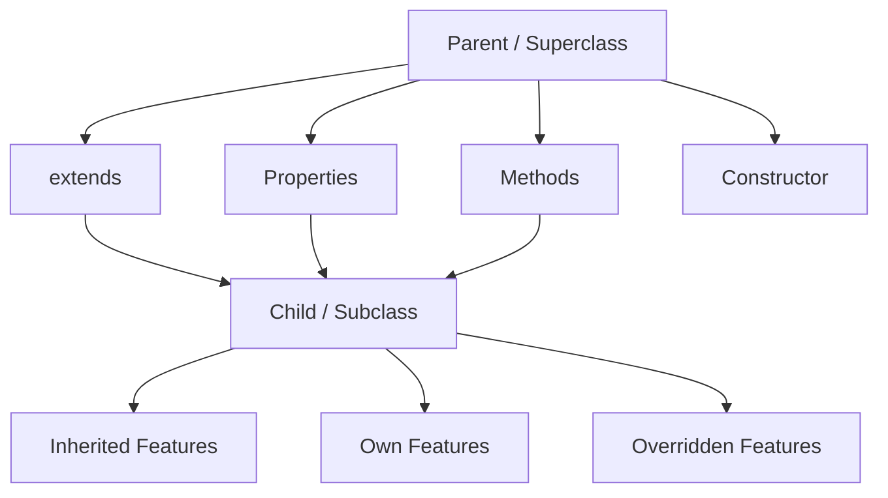

Inheritance allows a child class to reuse functionality already available in its parent class while still adding or customizing its own behavior.

---

## 💡 Basic Syntax

```dart
class Parent {
  void show() {
    print("Parent Method");
  }
}

class Child extends Parent {
}
```

Usage:

```dart
Child child = Child();

child.show();
```

The `Child` object can access `show()` because the method was inherited from `Parent`.

---

# 👨‍👦 Parent vs Child

```text
Parent / Superclass
        │
        │ provides
        ▼
Properties + Methods
        │
        │ inherited by
        ▼
Child / Subclass
        │
        └── Own Additional Features
```

### Memory Rule

```text
Parent = Existing functionality

Child = Existing functionality
              +
        New functionality
```

---

# 🔗 Working with `super`

One of the major parts of Day 20 was understanding the different uses of `super`.

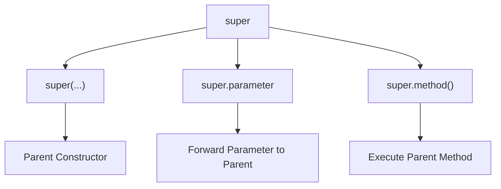

---

## 1. `super(...)`

Used to call the parent constructor.

```dart
Manager({
  required String name,
  required double salary,
  required this.department,
}) : super(
       name: name,
       salary: salary,
     );
```

---

## 2. `super.parameter`

Modern and cleaner Dart syntax:

```dart
Manager({
  required super.name,
  required super.salary,
  required this.department,
});
```

### Quick Memory

```text
super.x
   ↓
Parent Constructor Parameter

this.x
   ↓
Current Class Property
```

This syntax is especially useful because Flutter frequently uses patterns such as:

```dart
const HomePage({
  super.key,
});
```

---

# 🔄 Method Overriding

A child class can provide its own implementation of a method already available in the parent.

```dart
class Notification {

  void sendNotification() {
    print("Sending Notification...");
  }
}

class EmailNotification extends Notification {

  @override
  void sendNotification() {
    print("Sending Email Notification...");
  }
}
```

---

## 🧠 Overriding Flow

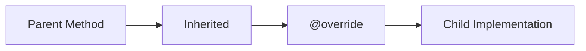

### Purpose

```text
Inherited Method
      ↓
Child needs different behavior
      ↓
@override
      ↓
Custom Implementation
```

---

# 🔁 `super.method()`

Sometimes the child should not completely replace the parent's behavior.

Instead, it may need:

```text
Parent Behavior
      +
Child Behavior
```

Example:

```dart
@override
void processPayment() {
  super.processPayment();

  print("Child-specific processing...");
}
```

---

## Override Comparison

### Replace Parent Behavior

```dart
@override
void render() {
  print("Child Rendering...");
}
```

### Extend Parent Behavior

```dart
@override
void render() {
  super.render();

  print("Child Rendering...");
}
```

> `super.method()` is **not compulsory** while overriding. It is used only when the parent implementation should also execute.

---

# 🌳 Types of Inheritance

## 1️⃣ Single Inheritance

One parent and one child.

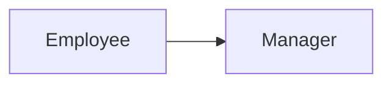

```text
Employee
    ↓
Manager
```

---

## 2️⃣ Multilevel Inheritance

An inheritance chain where one child becomes the parent of another class.

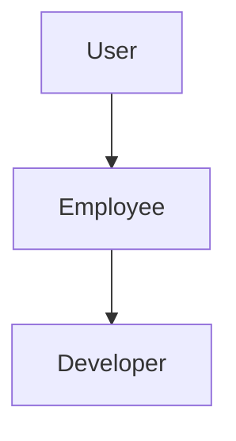

```text
User
 ↓
Employee
 ↓
Developer
```

A `Developer` can use accessible behavior inherited through the complete chain.

---

## 3️⃣ Hierarchical Inheritance

One parent with multiple children.

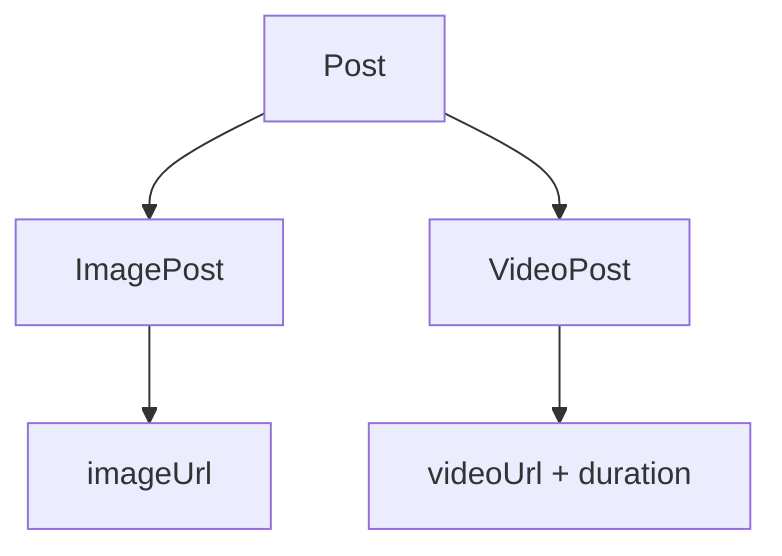

Structure:

```text
               Post
              /    \
             /      \
            ▼        ▼
      ImagePost   VideoPost
```

Common features belong to `Post`, while specialized features stay inside their respective child classes.

---

# 📊 Inheritance Types Summary

| Type | Structure | Meaning |
|---|---|---|
| Single | `A → B` | One Parent → One Child |
| Multilevel | `A → B → C` | Inheritance Chain |
| Hierarchical | `A → B, C` | One Parent → Multiple Children |
| Multiple via `extends` | ❌ | Not supported by Dart classes |

---

# 🔒 Private Members + Inheritance

Private fields were combined with inheritance to maintain controlled data access.

Example:

```dart
class User {
  String _email;

  User({
    required String email,
  }) : _email = email;

  String get email => _email;
}
```

The constructor exposes:

```dart
email
```

while internally storing:

```dart
_email
```

---

## 🔐 Private Initialization Pattern

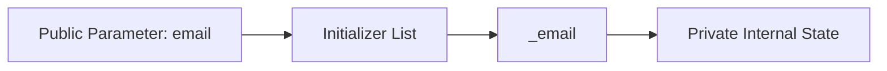

For multiple private fields:

```dart
User({
  required String email,
  required String password,
})  : _email = email,
      _password = password;
```

### Syntax Memory

```text
:   → Start initializer list

,   → Separate initializations

;   → End constructor
```

> In Dart, underscore-prefixed identifiers are library-private rather than strictly class-private.

---

# 🚫 Multiple Inheritance Rule

Dart does not support extending multiple classes like this:

```dart
class Child extends ParentA, ParentB {
}
```

❌ Invalid.

A Dart class directly extends one superclass.

```text
Child
  │
  └──── extends → One Direct Superclass
```

Dart provides **Mixins** for reusable behavior from multiple sources, which will be covered separately.

---

# ⚙️ Constructor Execution Order

Constructor chaining was also observed using multilevel inheritance.

Example hierarchy:

```text
App
 ↓
HomeScreen
 ↓
ProfileScreen
 ↓
EditProfileScreen
```

Creating:

```dart
EditProfileScreen screen = EditProfileScreen();
```

produced the constructor-body order:

```text
1. App Constructor
2. HomeScreen Constructor
3. ProfileScreen Constructor
4. EditProfileScreen Constructor
```

---

## 🔄 Constructor Flow

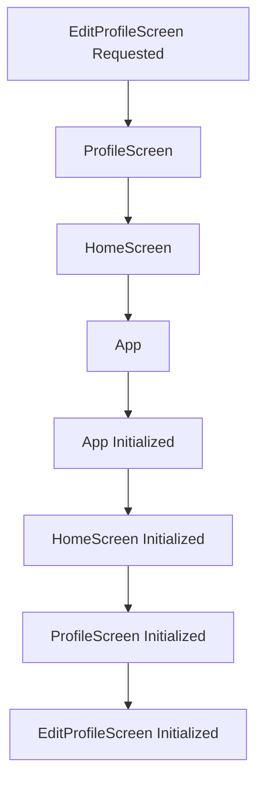

This connects closely with constructor chaining already familiar from Java.

---

# 🔗 IS-A Relationship

Inheritance should represent a logical relationship.

### Correct

```text
PremiumUser IS-A User           ✅

Developer IS-AN Employee        ✅

ImagePost IS-A Post             ✅
```

### Incorrect

```text
Car IS-AN Engine                ❌
```

A car **has an** engine; it is not an engine.

---

## 🧠 Inheritance Decision

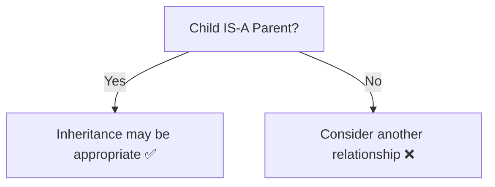

---

# 📱 Flutter Connection

The most important outcome of Day 20 was connecting normal Dart inheritance with Flutter syntax.

A common Flutter class looks like:

```dart
class HomePage extends StatelessWidget {
  const HomePage({
    super.key,
  });

  @override
  Widget build(BuildContext context) {
    return const Text("Hello Flutter");
  }
}
```

After learning inheritance, this can now be decoded.

---

## 🔍 Flutter Syntax Decoder

| Flutter Syntax | Dart Concept |
|---|---|
| `class HomePage` | Child Class |
| `extends StatelessWidget` | Inheritance |
| `StatelessWidget` | Superclass |
| `super.key` | Super Parameter |
| `@override` | Method Override |
| `build()` | Overridden Method |
| `Widget` | Return Type |
| `BuildContext context` | Method Parameter |

---

## 📱 Flutter Inheritance Flow

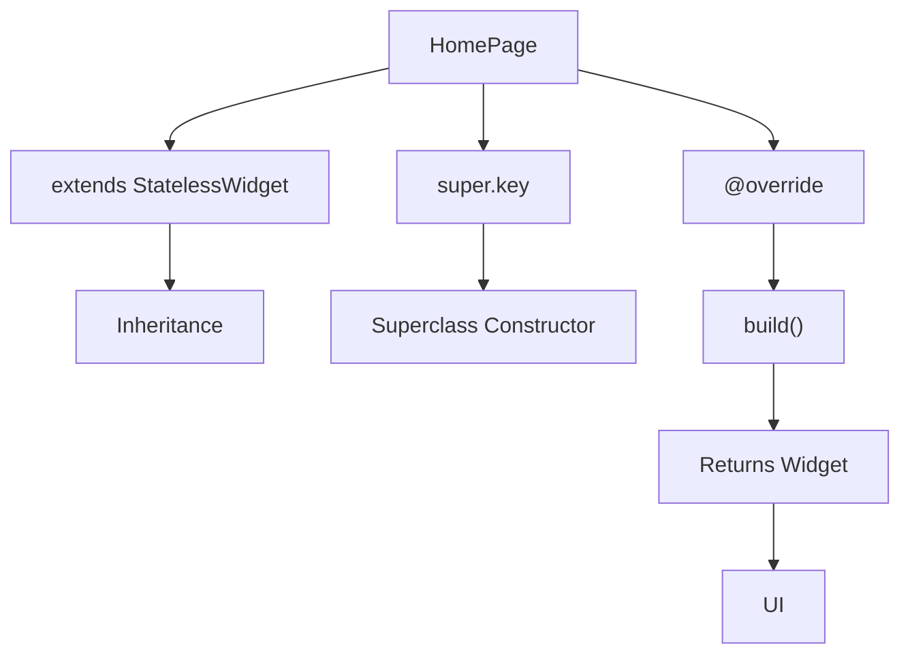

---

# 🧪 Practice Programs

The Day 20 practice journey included inheritance-focused programs such as:

```text
01 → Basic Inheritance
02 → Child Constructor Practice
03 → Constructor + super Practice
04 → super.parameter Practice
05 → Notification Method Override
06 → super.method() Practice
07 → Multilevel Inheritance
08 → Hierarchical Inheritance
09 → Private Members + Inheritance
10 → Constructor Execution Order
11 → Flutter-Style Final Inheritance Revision
```

---

# 🏗️ Final Revision Architecture

The final program used a Flutter-inspired architecture:

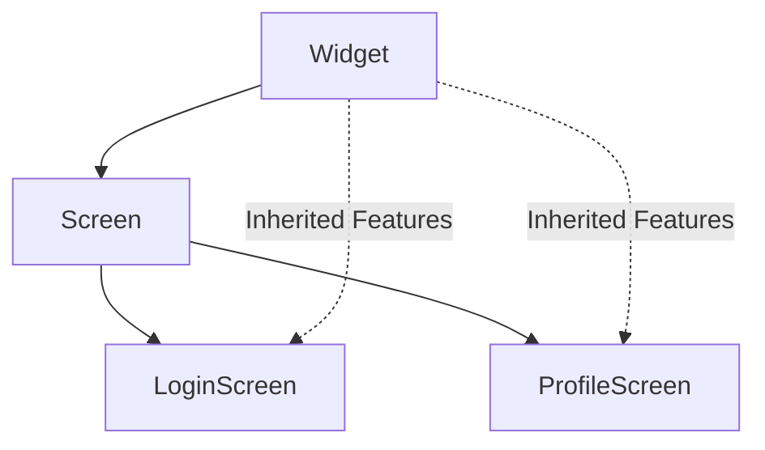

This single architecture revised:

```text
Widget → Screen
      = Single Inheritance

Widget → Screen → LoginScreen
      = Multilevel Inheritance

             Screen
             /    \
      LoginScreen ProfileScreen
      = Hierarchical Inheritance
```

It also revised:

- `extends`
- Inherited members
- `super(...)`
- `super.parameter`
- Private fields
- Getter
- `@override`
- `super.method()`
- Constructor chaining

---

# 🧠 Day 20 Ultimate Memory Map

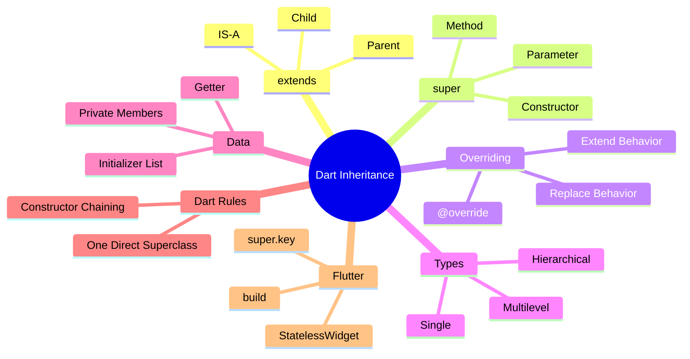

---

# ⚡ Quick Revision

```text
Inheritance
     ↓
Reuse + Extend Existing Classes

extends
     ↓
Parent → Child

super(...)
     ↓
Parent Constructor

super.parameter
     ↓
Forward Parent Parameter

@override
     ↓
Custom Child Implementation

super.method()
     ↓
Parent Behavior + Child Behavior

Single
     ↓
A → B

Multilevel
     ↓
A → B → C

Hierarchical
     ↓
   A
  / \
 B   C

IS-A
     ↓
Check whether inheritance makes logical sense

Flutter
     ↓
extends + super.key + @override
```

---

# 🎯 What I Learned

After completing Day 20, I can:

- Create Parent and Child Classes
- Use `extends` confidently
- Reuse inherited properties and methods
- Work with child constructors
- Use both long `super(...)` and modern `super.parameter`
- Override parent methods using `@override`
- Decide when `super.method()` is required
- Identify Single, Multilevel and Hierarchical Inheritance
- Work with private data in inheritance-based designs
- Understand Dart's direct multiple inheritance limitation
- Understand constructor execution order
- Apply the IS-A relationship
- Read basic Flutter inheritance syntax confidently

---

# 📈 Learning Progress

```text
Core Dart
   │
   ├── Classes & Objects        ✅
   │
   ├── Constructors             ✅
   │
   ├── Named Constructors       ✅
   │
   ├── Encapsulation            ✅
   │
   └── Inheritance              ✅
   │
   ▼
Flutter-Ready OOP Foundation 🚀
```

---

# 📊 Final Status

| Category | Status |
|---|:---:|
| 🧠 Theory | ✅ |
| 💻 Coding Practice | ✅ |
| 🧬 Inheritance Types | ✅ |
| 🔄 Method Overriding | ✅ |
| 🔗 Constructor Chaining | ✅ |
| 🔒 Private Members | ✅ |
| 📱 Flutter Connection | ✅ |
| 🧪 Final Revision Program | ✅ |
| 🏆 Day 20 | **COMPLETED** |

---

## 🚀 Next Step

The inheritance foundation is now ready to support upcoming Dart OOP concepts and, more importantly, Flutter code such as:

```dart
class HomePage extends StatelessWidget {
  const HomePage({super.key});

  @override
  Widget build(BuildContext context) {
    return const Text("Hello Flutter 🚀");
  }
}
```

The syntax is no longer just something to memorize — its OOP structure is now understandable.

---

# 🏁 Day 20 Complete

> **Learn → Practice → Understand → Connect with Flutter → Build 🚀**

```text
DAY 20
Inheritance 🧬
     │
     ▼
COMPLETED ✅
     │
     ▼
One Step Closer to Flutter 📱🔥
```