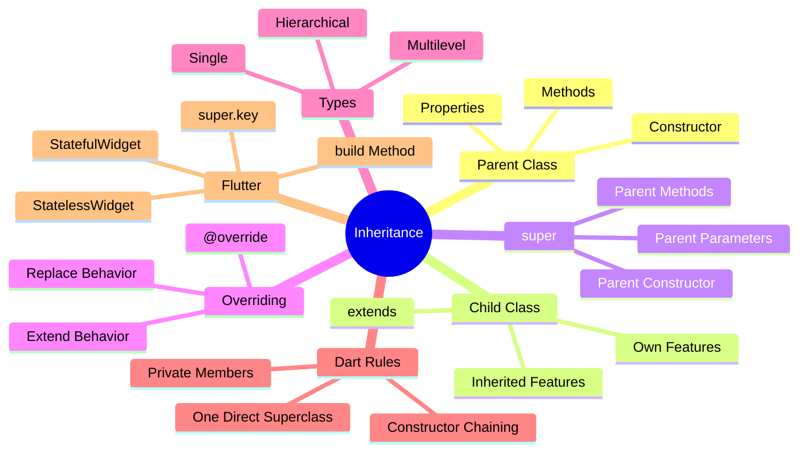
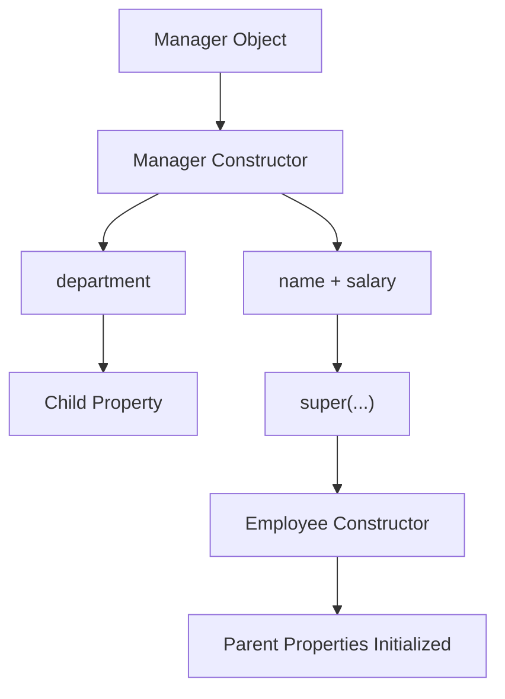
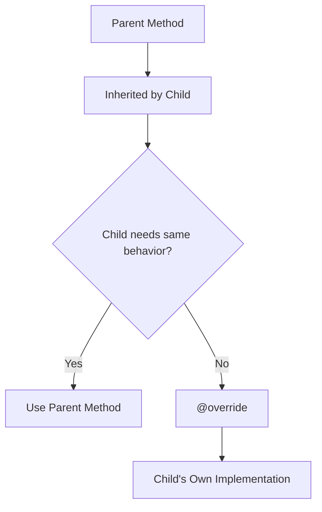
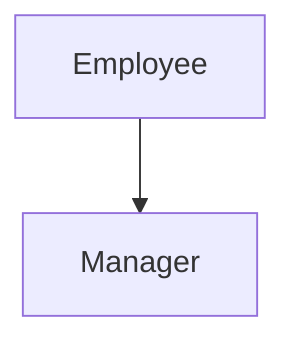
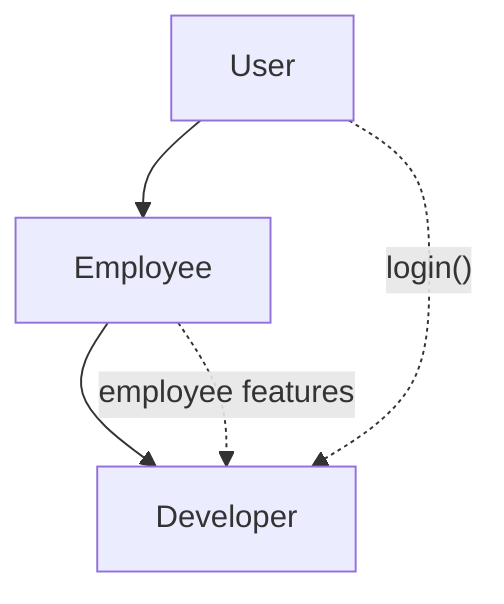
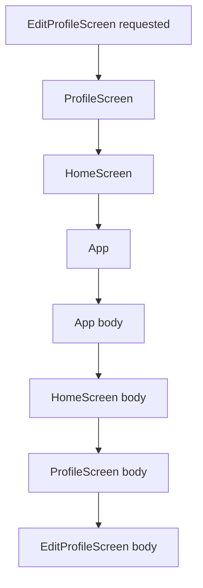
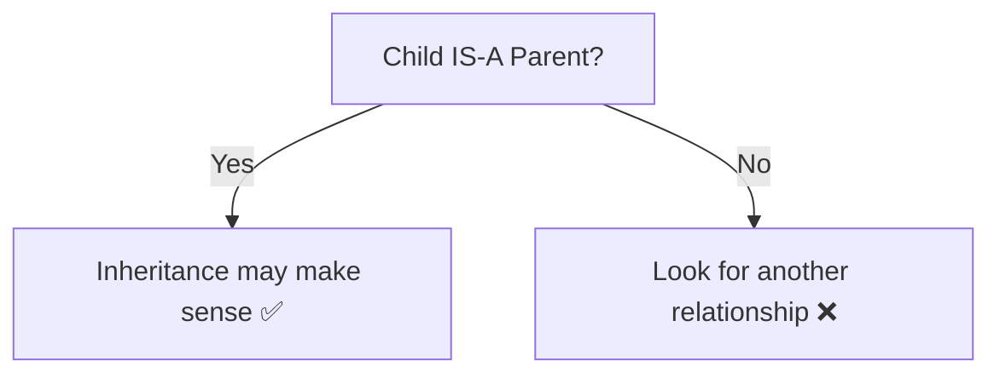
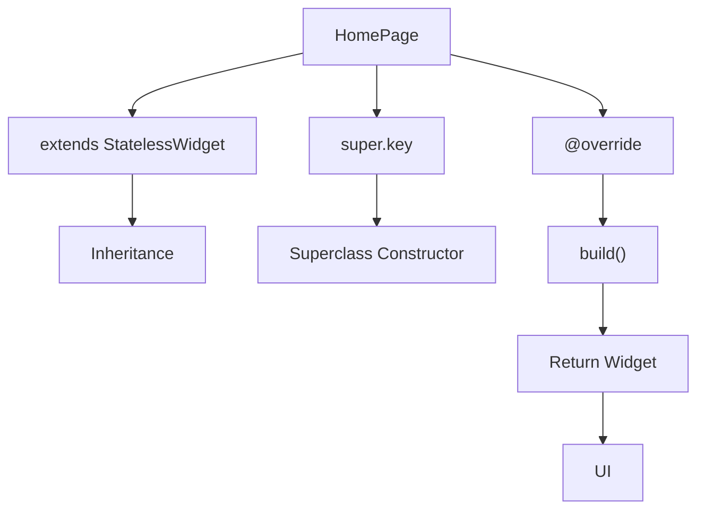
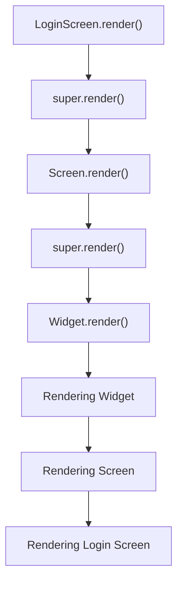

# 📘 Day 20 — Inheritance in Dart 🧬

> **Goal:** Inheritance ko Flutter-useful level tak understand karna — Parent/Child classes, `extends`, `super`, overriding, inheritance types aur Flutter connection.

---

# 📌 Day Overview

Day 20 me humne OOP ke important concept **Inheritance** ko practically understand kiya.

Aaj humne cover kiya:

1. Inheritance ka purpose
2. Parent & Child Classes
3. `extends` keyword
4. Inherited Properties & Methods
5. Child Constructors
6. `super(...)`
7. `super.parameter`
8. Method Overriding
9. `@override`
10. `super.method()`
11. Single Inheritance
12. Multilevel Inheritance
13. Hierarchical Inheritance
14. Private Members with Inheritance
15. Multiple Inheritance Rule
16. Constructor Execution Order
17. IS-A Relationship
18. Flutter Connection

---

# 🧠 Complete Memory Map



---

# 1️⃣ What is Inheritance?

Inheritance ka simple meaning:

> **Ek existing class ki properties aur methods ko doosri class me reuse karna Inheritance kehlata hai.**

Example:

```dart
class User {
  String name;

  User({
    required this.name,
  });

  void login() {
    print("$name logged in.");
  }
}

class PremiumUser extends User {
  PremiumUser({
    required super.name,
  });
}
```

Yahan:

```text
User
 ↓
Parent Class

PremiumUser
 ↓
Child Class
```

Aur:

```dart
extends User
```

batata hai ki `PremiumUser`, `User` ko inherit kar raha hai.

---

# 🎯 Why Inheritance?

Without Inheritance:

```text
User
├── name
├── email
└── login()

PremiumUser
├── name       ← Repeat
├── email      ← Repeat
├── login()    ← Repeat
└── premiumFeature()
```

Inheritance ke saath:

```text
          User
     name, email
        login()
           │
           ▼
     PremiumUser
           +
   premiumFeature()
```

Benefits:

- ✅ Code Reusability
- ✅ Less Duplication
- ✅ Better Structure
- ✅ Easy Maintenance
- ✅ Related Classes ko connect karna

---

# 2️⃣ Parent & Child Class

## Parent Class

Jis class ko inherit kiya jata hai:

```dart
class Employee {
}
```

Isse kaha ja sakta hai:

- Parent Class
- Superclass
- Base Class

---

## Child Class

Jo class parent ko inherit karti hai:

```dart
class Manager extends Employee {
}
```

Isse kaha ja sakta hai:

- Child Class
- Subclass
- Derived Class

---

# 🧠 Memory Trick

```text
Parent
  ↓
Existing Features
  ↓
extends
  ↓
Child
  ↓
Reuse + Own Features
```

---

# 3️⃣ `extends` Keyword

Syntax:

```dart
class Child extends Parent {

}
```

Example:

```dart
class Employee {
  void work() {
    print("Employee is working...");
  }
}

class Manager extends Employee {

}
```

Ab:

```dart
Manager manager = Manager();

manager.work();
```

`Manager` ke andar `work()` dobara nahi likha gaya.

Wo `Employee` se inherit hua hai.

---

# 4️⃣ Inherited Members

Child class parent ki accessible properties aur methods ko use kar sakti hai.

Example:

```dart
class User {
  String name;

  User({
    required this.name,
  });

  void login() {
    print("$name Login Successfully...");
  }
}

class Developer extends User {
  String language;

  Developer({
    required super.name,
    required this.language,
  });
}
```

Child object:

```dart
Developer developer = Developer(
  name: "Ansh",
  language: "Dart",
);

developer.login();
```

`login()` parent me defined hai, lekin child object use kar raha hai.

---

# 5️⃣ Child Constructor & `super(...)`

Ye Day 20 ka important concept tha.

Suppose parent:

```dart
class Employee {
  String name;
  double salary;

  Employee({
    required this.name,
    required this.salary,
  });
}
```

Child:

```dart
class Manager extends Employee {
  String department;

  Manager({
    required String name,
    required double salary,
    required this.department,
  }) : super(
         name: name,
         salary: salary,
       );
}
```

Flow:



---

# 🧠 `this` vs `super`

```dart
required this.department
```

means:

> `department` current/child class ki property hai.

While:

```dart
super(
  name: name,
  salary: salary,
);
```

means:

> Ye values Parent Constructor ko bhejo.

Memory:

```text
this
 ↓
Current Object / Class

super
 ↓
Parent Class
```

---

# 6️⃣ Modern `super.parameter` Syntax

Long syntax:

```dart
PremiumCourse({
  required String courseName,
  required double price,
  required this.certificateValidity,
}) : super(
       courseName: courseName,
       price: price,
     );
```

Modern Dart me:

```dart
PremiumCourse({
  required super.courseName,
  required super.price,
  required this.certificateValidity,
});
```

Dono ka purpose same hai.

---

# 🧠 `super.parameter` Memory Chart

```text
required super.courseName
           │
           ▼
Value Parent Constructor ke liye


required this.certificateValidity
           │
           ▼
Value Current Child Property ke liye
```

### Golden Memory

```text
super.x → Parent ke liye

this.x  → Current class ke liye
```

Modern Flutter code me `super.key` isi concept ka common example hai.

---

# 7️⃣ Method Overriding 🔄

Inheritance se child ko parent methods milte hain.

Lekin kabhi child ko same method ka **apna implementation** chahiye.

Example:

```dart
class Notification {

  void sendNotification() {
    print("Sending Notification...");
  }
}
```

Child:

```dart
class EmailNotification extends Notification {

  @override
  void sendNotification() {
    print("Sending Email Notification...");
  }
}
```

Yahan child ne parent ke method ko override kar diya.

---

# 🧠 Override Flow



---

# 8️⃣ `@override`

Syntax:

```dart
@override
void methodName() {

}
```

`@override` ek annotation hai.

Ye indicate karta hai:

> **Child parent ke existing method ka apna implementation de raha hai.**

Example:

```dart
@override
void sendNotification() {
  print("Email Notification Sent...");
}
```

---

# 9️⃣ `super.method()`

Kabhi hume parent method ko completely replace nahi karna hota.

Hume chahiye:

```text
Parent Behavior
      +
Child Behavior
```

Tab:

```dart
@override
void processPayment() {

  super.processPayment();

  print("UPI Payment Successful...");
}
```

---

# 🧠 Override vs `super.method()`

### Only Override

```dart
@override
void render() {
  print("Child Rendering...");
}
```

Means:

```text
Parent Behavior
      ↓
Replaced
      ↓
Child Behavior
```

### Override + Parent Method

```dart
@override
void render() {
  super.render();

  print("Child Rendering...");
}
```

Means:

```text
Parent Behavior
      ↓
      +
Child Behavior
```

⚠️ `super.method()` har overridden method me compulsory nahi hota.

Use tabhi karo jab parent implementation bhi execute karni ho.

---

# 🔟 `super` — Complete Memory

```text
super(...)
   ↓
Parent Constructor


super.parameter
   ↓
Parent Constructor Parameter


super.method()
   ↓
Parent Method
```

Simple meaning:

> **`super` = Parent class ki taraf reference.**

---

# 1️⃣1️⃣ Single Inheritance

One Parent → One Child

```text
Employee
   │
   ▼
Manager
```

Example:

```dart
class Manager extends Employee {

}
```

Diagram:



---

# 1️⃣2️⃣ Multilevel Inheritance

Inheritance ki chain:

```text
User
 ↓
Employee
 ↓
Developer
```

Example:

```dart
class User {
}

class Employee extends User {
}

class Developer extends Employee {
}
```

`Developer` ko apne direct parent `Employee` ke through upper-level inherited behavior bhi mil sakta hai.

Example:

```dart
developer.login();
developer.showEmployeeDetails();
developer.showDeveloperDetails();
```

---

# 🧠 Multilevel Memory



Memory:

```text
A
↓
B
↓
C

= Multilevel / Chain
```

---

# 1️⃣3️⃣ Hierarchical Inheritance 🌳

Jab ek Parent ke multiple Child Classes hon:

```text
             Post
            /    \
           /      \
          ▼        ▼
    ImagePost   VideoPost
```

Example:

```dart
class Post {
}

class ImagePost extends Post {
}

class VideoPost extends Post {
}
```

Dono children ko common parent features mil sakte hain.

Lekin dono ki own properties separate hain.

```text
Post
├── username
└── caption

ImagePost
└── imageUrl

VideoPost
├── videoUrl
└── duration
```

---

# 🧠 Inheritance Types Memory Chart

```text
SINGLE

A
↓
B


MULTILEVEL

A
↓
B
↓
C


HIERARCHICAL

     A
    / \
   B   C
```

---

# 1️⃣4️⃣ Private Members + Inheritance 🔒

Dart me `_` se start hone wala identifier **library-private** hota hai.

Example:

```dart
class User {
  String _email;

  User({
    required String email,
  }) : _email = email;

  String get email => _email;
}
```

Humne private field ke liye clean constructor interface maintain kiya:

```dart
User(
  email: "ansh@example.com",
);
```

instead of exposing a constructor parameter named:

```dart
_email
```

---

# 🧠 Private Constructor Pattern Used

Humne practice ke liye ye pattern follow kiya:

```dart
class User {
  String _email;
  String _password;

  User({
    required String email,
    required String password,
  })  : _email = email,
        _password = password;
}
```

Memory:

```text
Public Constructor Parameter
        ↓
      email
        ↓
Initializer List
        ↓
     _email 🔒
```

Multiple private fields:

```dart
Constructor({
  required Type value1,
  required Type value2,
  required Type value3,
})  : _private1 = value1,
      _private2 = value2,
      _private3 = value3;
```

### Syntax Rule

```text
:  → Once

,  → Between Initializations

;  → At the End
```

---

# ⚠️ Important Dart Privacy Rule

Dart ka `_private` Java ke `private` jaisa exactly class-private nahi hai.

It is **library-private**.

Same Dart library me private identifiers accessible ho sakte hain.

Lekin clean application design me private data ko controlled interface se access karna better hai:

```dart
String get email => _email;
```

---

# 1️⃣5️⃣ Multiple Inheritance

Multiple inheritance means:

```text
Parent A      Parent B
     \         /
      \       /
        Child
```

Dart classes ke through ye syntax allowed nahi hai:

```dart
class Child extends ParentA, ParentB {
}
```

❌ Invalid.

A Dart class `extends` ke through directly **one superclass** inherit karti hai.

---

## What about multiple reusable behaviors?

Dart me **Mixins** available hain:

```dart
class MyClass extends Parent with MixinA, MixinB {
}
```

Lekin Mixins ko separately detail me padhenge.

### Memory

```text
extends
   ↓
One Direct Superclass


with
   ↓
Mixins
   ↓
Multiple Reusable Behaviors
```

---

# 1️⃣6️⃣ Constructor Execution Order

Suppose:

```text
App
 ↓
HomeScreen
 ↓
ProfileScreen
 ↓
EditProfileScreen
```

Aur object:

```dart
EditProfileScreen screen = EditProfileScreen();
```

Agar parent classes ke suitable unnamed no-argument constructors available hain, constructor chaining parent side tak jaati hai.

Observed output:

```text
1. App Constructor
2. HomeScreen Constructor
3. ProfileScreen Constructor
4. EditProfileScreen Constructor
```

---

# 🧠 Constructor Chain



Java ke constructor chaining concept se ye kaafi similar hai.

---

## Important Condition

Agar parent ka constructor arguments demand karta hai:

```dart
class User {
  User({
    required String name,
  });
}
```

to child ko required value forward karni padegi:

```dart
class PremiumUser extends User {

  PremiumUser({
    required super.name,
  });
}
```

---

# 1️⃣7️⃣ IS-A Relationship

Inheritance use karne se pehle ek simple test:

> **Child IS-A Parent?**

Example:

```text
PremiumUser IS-A User
```

✅ Makes sense.

```text
Manager IS-AN Employee
```

✅ Makes sense.

```text
ImagePost IS-A Post
```

✅ Makes sense.

Lekin:

```text
Car IS-AN Engine
```

❌ Wrong.

Actually:

```text
Car HAS-AN Engine
```

Ye inheritance ke bajay composition-type relationship hai.

---

# 🧠 IS-A Golden Test



---

# 1️⃣8️⃣ Flutter Connection 📱🔥

Ab Day 20 ka sabse important connection.

Flutter me commonly code milega:

```dart
class HomePage extends StatelessWidget {
  const HomePage({
    super.key,
  });

  @override
  Widget build(BuildContext context) {
    return const Text("Hello Flutter");
  }
}
```

Day 20 se pehle ye syntax unfamiliar lag sakta tha.

Ab ise break karo.

---

## `extends StatelessWidget`

```dart
class HomePage extends StatelessWidget
```

Means:

```text
HomePage
   ↓
Child Class

StatelessWidget
   ↓
Superclass
```

Inheritance ho rahi hai.

---

## `super.key`

```dart
const HomePage({
  super.key,
});
```

Day 20 connection:

```text
super.key
    ↓
Constructor parameter ko
superclass constructor ki taraf forward karna
```

Same concept:

```dart
required super.courseName
```

jo hum normal Dart programs me practice kar chuke hain.

---

## `@override`

Flutter me:

```dart
@override
Widget build(BuildContext context)
```

Ab `@override` familiar hai.

Child required/available parent behavior ka apna implementation provide karta hai.

---

## `Widget build(BuildContext context)`

Abhi Flutter ke liye basic understanding:

```text
Widget
 ↓
Return Type

build
 ↓
Method Name

BuildContext context
 ↓
Parameter
```

Structure normal Dart method jaisa hi hai:

```text
ReturnType methodName(Parameter)
```

---

# 🧠 Flutter Code Decoder

```dart
class HomePage extends StatelessWidget {
```

→ Inheritance

```dart
const HomePage({super.key});
```

→ Constructor + superclass parameter forwarding

```dart
@override
```

→ Parent behavior ka implementation/override

```dart
Widget build(BuildContext context)
```

→ Method which returns a Widget

```dart
return const Text("Hello");
```

→ UI Widget return ho raha hai

---

# 📱 Flutter Memory Flow



---

# 1️⃣9️⃣ Final Flutter-Style Architecture

Day 20 ke final revision program me humne conceptual architecture banaya:

```text
                     Widget
                       │
                       ▼
                     Screen
                    /      \
                   /        \
                  ▼          ▼
          LoginScreen    ProfileScreen
```

Is single architecture me multiple concepts revise hue:

### `Widget → Screen`

```text
Single Inheritance
```

### `Widget → Screen → LoginScreen`

```text
Multilevel Inheritance
```

### `Screen → LoginScreen + ProfileScreen`

```text
Hierarchical Inheritance
```

---

# 🔥 Final `render()` Flow

Suppose:

```dart
class Widget {
  void render() {
    print("Rendering Widget");
  }
}
```

Then:

```dart
class Screen extends Widget {

  @override
  void render() {
    super.render();

    print("Rendering Screen");
  }
}
```

Then:

```dart
class LoginScreen extends Screen {

  @override
  void render() {
    super.render();

    print("Rendering Login Screen");
  }
}
```

Calling:

```dart
loginScreen.render();
```

Flow:



Again:

> `super.render()` compulsory nahi hai.

Use tab hota hai jab parent implementation bhi execute karni ho.

---

# 2️⃣0️⃣ Common Mistakes ❌

## Mistake 1 — Parent properties child me repeat karna

Wrong:

```dart
class Manager extends Employee {
  String name;
  double salary;
}
```

Agar `name` aur `salary` already parent me hain, unnecessary duplication avoid karo.

---

## Mistake 2 — `this` and `super` confuse karna

Remember:

```text
this.x
 ↓
Current Class/Object

super.x
 ↓
Superclass
```

---

## Mistake 3 — Har override me `super.method()` lagana

Not required.

```dart
@override
void render() {
  print("My Rendering");
}
```

perfectly valid ho sakta hai.

---

## Mistake 4 — Multiple classes extend karna

Wrong:

```dart
class Phone extends Camera, GPS {
}
```

Dart me allowed nahi.

---

## Mistake 5 — Wrong IS-A Relationship

```text
Car IS-A Engine ❌
```

Inheritance ko sirf code reuse ke liye blindly use nahi karna.

Relationship logically meaningful hona chahiye.

---

# 🧠 Developer Thinking

Inheritance dekhte waqt ye questions pucho:

```text
1. Parent kaun hai?

2. Child kaun hai?

3. Child ko kya inherit ho raha hai?

4. Child ki own properties kya hain?

5. Parent constructor ko kya values chahiye?

6. super(...) / super.parameter ki zarurat hai?

7. Kya child method override kar raha hai?

8. Parent method bhi chalana hai?
   ↓
   super.method()

9. Child really IS-A Parent hai?
```

Ye questions inheritance code ko decode karne me help karenge.

---

# ⚡ Syntax Cheat Sheet

## Basic Inheritance

```dart
class Child extends Parent {

}
```

---

## Long Parent Constructor Call

```dart
Child({
  required String name,
  required this.childValue,
}) : super(
       name: name,
     );
```

---

## Modern Super Parameter

```dart
Child({
  required super.name,
  required this.childValue,
});
```

---

## Method Override

```dart
@override
void method() {

}
```

---

## Override + Parent Method

```dart
@override
void method() {

  super.method();

  // Child Logic
}
```

---

## Private Field + Constructor Pattern

```dart
class User {
  String _email;

  User({
    required String email,
  }) : _email = email;

  String get email => _email;
}
```

---

# 🧠 Ultimate Memory Chart

```text
                    INHERITANCE
                         │
                         ▼
               Reuse Parent Features
                         │
             ┌───────────┴───────────┐
             ▼                       ▼
          extends                  super
             │                       │
             │              ┌────────┼─────────┐
             │              ▼        ▼         ▼
             │          super()   super.x   super.method()
             │              │        │         │
             │           Parent    Parent     Parent
             │         Constructor Parameter  Method
             │
             ▼
        Child Class
             │
             ├──────────────┐
             ▼              ▼
       Own Features      @override
                            │
                            ▼
                     Custom Behavior
```

---

# 📊 Inheritance Types — Final Revision

| Type | Structure | Meaning |
|------|-----------|---------|
| Single | `A → B` | One Parent, One Child |
| Multilevel | `A → B → C` | Inheritance Chain |
| Hierarchical | `A → B & C` | One Parent, Multiple Children |
| Multiple via `extends` | ❌ | Not supported by Dart classes |

---

# 📱 Flutter Quick Revision

When you see:

```dart
class LoginScreen extends StatelessWidget {
  const LoginScreen({
    super.key,
  });

  @override
  Widget build(BuildContext context) {
    return const Text("Login");
  }
}
```

Your brain should decode:

```text
LoginScreen
    ↓
Child Class

extends
    ↓
Inheritance

StatelessWidget
    ↓
Superclass

super.key
    ↓
Superclass Constructor Parameter

@override
    ↓
Parent behavior implementation

build()
    ↓
Returns UI Widget
```

🔥 Flutter syntax is now connected with normal Dart OOP.

---

# ⏱️ 30-Second Revision

```text
Inheritance
    ↓
Reuse Parent Features

Parent → Superclass
Child  → Subclass

extends
    ↓
Create Inheritance

super(...)
    ↓
Parent Constructor

super.parameter
    ↓
Forward Parameter to Parent

@override
    ↓
Child's Own Method Implementation

super.method()
    ↓
Run Parent Method Too

Single
    ↓
A → B

Multilevel
    ↓
A → B → C

Hierarchical
    ↓
   A
  / \
 B   C

Private
    ↓
Use Controlled Access

IS-A
    ↓
Check Logical Inheritance

Flutter
    ↓
extends + super.key + @override
```

---

# 🏆 Day 20 Final Outcome

After completing Day 20, I can:

- ✅ Explain why Inheritance is used
- ✅ Identify Parent and Child Classes
- ✅ Use `extends`
- ✅ Reuse inherited properties and methods
- ✅ Handle Child Constructors
- ✅ Use long `super(...)` syntax
- ✅ Use modern `super.parameter` syntax
- ✅ Override Parent Methods
- ✅ Understand `@override`
- ✅ Use `super.method()` when required
- ✅ Understand Single Inheritance
- ✅ Understand Multilevel Inheritance
- ✅ Understand Hierarchical Inheritance
- ✅ Handle Private Members with Inheritance
- ✅ Explain Dart's Multiple Inheritance rule
- ✅ Understand Constructor Execution Order
- ✅ Apply the IS-A relationship test
- ✅ Decode basic Flutter inheritance syntax

---

# 📊 Day 20 Status

| Concept | Status |
|---------|:------:|
| Inheritance Purpose | ✅ |
| Parent / Child | ✅ |
| `extends` | ✅ |
| Inherited Members | ✅ |
| `super(...)` | ✅ |
| `super.parameter` | ✅ |
| Method Overriding | ✅ |
| `@override` | ✅ |
| `super.method()` | ✅ |
| Single Inheritance | ✅ |
| Multilevel Inheritance | ✅ |
| Hierarchical Inheritance | ✅ |
| Private Members | ✅ |
| Multiple Inheritance Rule | ✅ |
| Constructor Execution Order | ✅ |
| IS-A Relationship | ✅ |
| Flutter Connection | ✅ |

---

# 🚀 What's Next?

Day 20 successfully completed. 🎉

Inheritance ne Flutter ke kuch important syntax ka foundation prepare kar diya:

```dart
extends StatelessWidget
```

```dart
super.key
```

```dart
@override
```

```dart
Widget build(BuildContext context)
```

Ab jab actual Flutter development start hogi, ye syntax completely random nahi lagega.

---

# 🏁 DAY 20 — COMPLETED ✅

> **Inheritance = Don't rebuild what already exists. Reuse it, extend it, and customize it when required.**

```text
DART OOP PROGRESS

Constructors      ✅
Encapsulation     ✅
Inheritance       ✅

        ↓

Flutter Foundation Getting Stronger 🚀
```