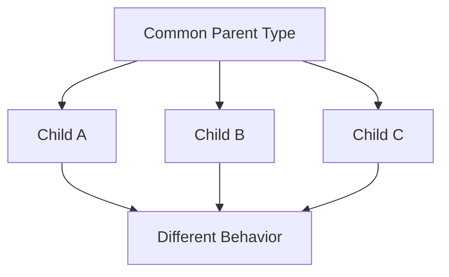
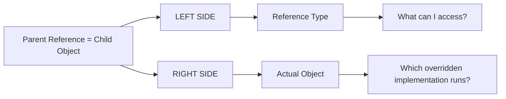
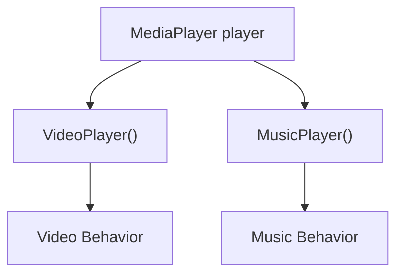
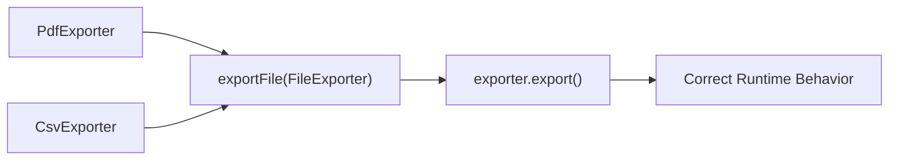
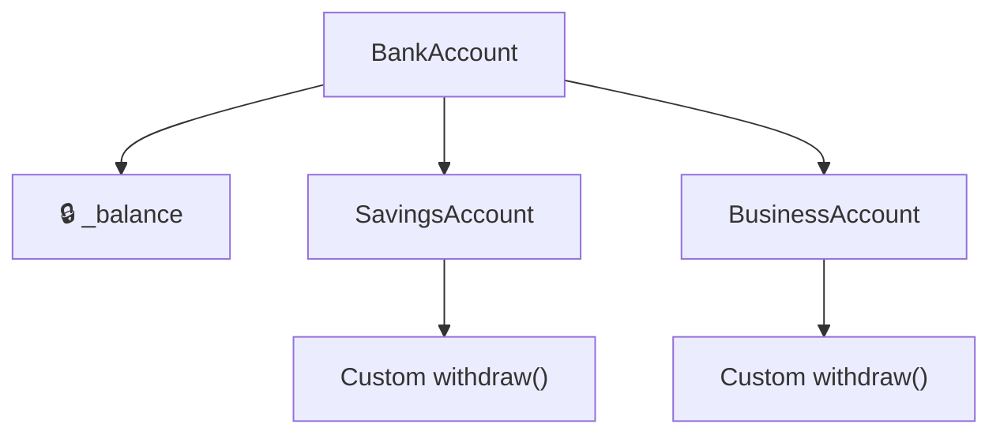
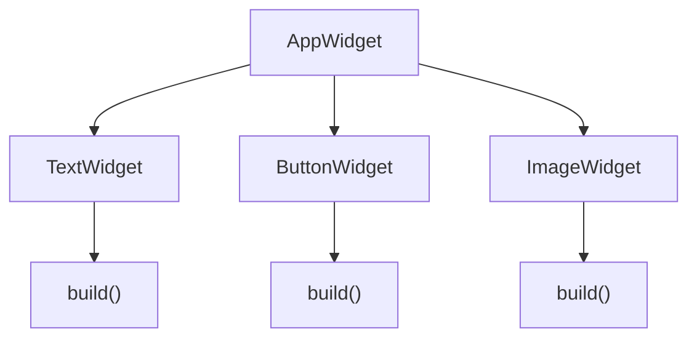
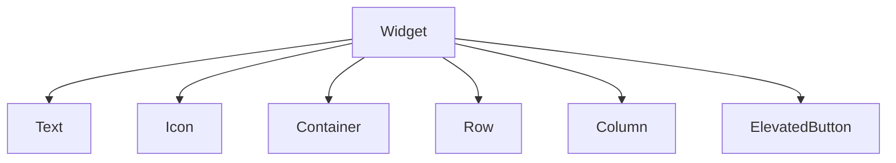
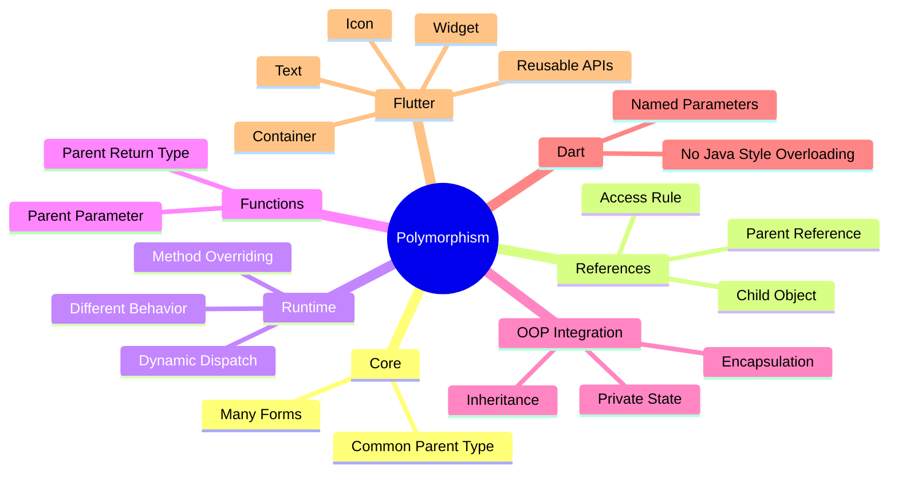
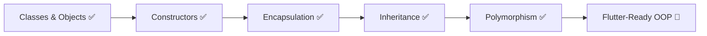

# 🔄 Day 21 — Polymorphism in Dart

> **One Common Type. Multiple Object Forms. Different Runtime Behavior.**


---

## 🚀 Overview

Day 21 focused on **Polymorphism in Dart** and its practical connection with Flutter.

The main goal was to understand how a **common parent type** can represent multiple child objects while each object keeps its own runtime behavior.

During this day, Polymorphism was practiced through real-world examples including:

- 🔔 Notification Systems
- 🎵 Media Players
- 📄 File Exporters
- 👥 User Roles
- 🏦 Bank Accounts
- 📱 Flutter-Style Widgets

---

# 📊 Day 21 Dashboard

| Metric | Progress |
|---|---|
| 📅 Day | 21 |
| 🧠 Main Topic | Polymorphism |
| 💻 Language | Dart |
| 📂 Practice Files | 7 |
| 🔄 Runtime Polymorphism | ✅ |
| ⚙️ Dynamic Dispatch | ✅ |
| 🔒 Encapsulation Integration | ✅ |
| 📱 Flutter Connection | ✅ |
| 🎯 Status | **Completed** |

---

# 🧠 Topics Covered

- ✅ Polymorphism Meaning
- ✅ Parent Reference → Child Object
- ✅ Reference Type vs Object Type
- ✅ Runtime Polymorphism
- ✅ Method Overriding
- ✅ `@override`
- ✅ Dynamic Method Dispatch
- ✅ Same Reference → Different Child Objects
- ✅ Function Parameter Polymorphism
- ✅ Return-Type Polymorphism
- ✅ Polymorphism + Encapsulation
- ✅ Private Members + Getter
- ✅ Common Parent Type
- ✅ Flutter-Style Widget Polymorphism
- ✅ Dart Method Overloading Rule
- ✅ Named / Optional Parameter Alternative

---

# 🔄 What is Polymorphism?

```text
POLY  → Many
MORPH → Forms
```

Polymorphism allows a **common parent type** to represent different child object forms.



### Core Idea

```text
One Common Type
      ↓
Multiple Child Objects
      ↓
Same Method Call
      ↓
Different Runtime Behavior
```

---

# ⭐ Parent Reference → Child Object

One of the most important patterns practiced today:

```dart
User user = AdminUser(...);
```

Structure:

```text
User                  AdminUser(...)
 ↑                         ↑
Reference Type          Actual Object
Parent                  Child
```

This works because:

```text
AdminUser IS-A User ✅
```

---

# 🏆 Golden Rule



### Quick Memory

```text
LEFT SIDE
    ↓
ACCESS


RIGHT SIDE
    ↓
RUNTIME BEHAVIOR
```

---

# 🎵 Runtime Polymorphism

Example:

```dart
MediaPlayer player = VideoPlayer(...);

player.play();
```

If `VideoPlayer` overrides:

```dart
@override
void play() {
  print("Playing Video...");
}
```

then:

```text
Reference Type
     ↓
MediaPlayer

Actual Object
     ↓
VideoPlayer

player.play()
     ↓
VideoPlayer.play()
```

The overridden implementation associated with the actual object executes.

---

# 🔁 Same Reference — Multiple Forms

A single parent reference can point to different compatible child objects at different times.

```dart
MediaPlayer player;

player = VideoPlayer(...);
player.play();

player = MusicPlayer(...);
player.play();
```



This demonstrates the **Many Forms** part of Polymorphism.

---

# ⚙️ Dynamic Method Dispatch

Dynamic Method Dispatch determines which overridden method executes according to the actual runtime object.

```text
Parent Reference
      ↓
Method Call
      ↓
Actual Object Checked
      ↓
Correct Overridden Method
      ↓
Executed
```

Example:

```dart
User user = AdminUser(...);

user.openDashboard();
```

Result:

```text
Actual Object = AdminUser
        ↓
AdminUser.openDashboard()
```

---

# 🧩 Function Parameter Polymorphism

A major practical advantage of Polymorphism is creating functions that work with multiple related object types.

```dart
void exportFile(FileExporter exporter) {
  exporter.export();
}
```

Now:

```dart
exportFile(pdf);
exportFile(csv);
```

both work.



### Benefit

```text
Different Child Objects
         ↓
Common Parent Parameter
         ↓
One Reusable Function
```

---

# 🔙 Return-Type Polymorphism

Parent types can also be used as function return types.

```dart
User createUser(int role) {

  if (role == 1) {
    return AdminUser(...);
  }

  return CustomerUser(...);
}
```

The function promises:

```text
User
```

while the actual returned object may be:

```text
AdminUser

or

CustomerUser
```

because both are valid `User` subtypes.

---

# 🔒 Encapsulation + Polymorphism

Day 19 Encapsulation was combined with Day 21 Polymorphism.



Example:

```dart
BankAccount account;

account = SavingsAccount(...);
account.withdraw(1000);

account = BusinessAccount(...);
account.withdraw(4000);
```

This combined:

```text
Private State
    +
Getter
    +
Controlled Modification
    +
Inheritance
    +
Method Overriding
    +
Runtime Polymorphism
```

---

# 📱 Flutter-Style Polymorphism

The final practice program recreated Flutter-like Widget thinking using pure Dart.



Common function:

```dart
void renderWidget(AppWidget widget) {
  widget.build();
}
```

Then:

```dart
renderWidget(textWidget);
renderWidget(buttonWidget);
renderWidget(imageWidget);
```

Same function accepts different widget objects through their common parent type.

---

# 💙 Flutter Connection

This concept directly prepares the foundation for understanding Flutter APIs.

Conceptually:



So when Flutter code contains something such as:

```dart
Widget child
```

the important thinking is:

```text
Widget
   ↓
Common Type
   ↓
Different Widget Subtypes
```

This allows Flutter APIs to remain flexible and reusable.

---

# 🧠 Reference Type vs Actual Object

Example:

```dart
AppWidget widget = TextWidget(...);
```

If `TextWidget` contains:

```dart
void changeText() {
}
```

then:

```dart
widget.changeText(); // ❌
```

is not directly accessible through an `AppWidget` reference if `AppWidget` does not declare that member.

### Memory Rule

```text
AppWidget widget = TextWidget(...);
    ↑                  ↑
    │                  │
 ACCESS             OVERRIDDEN
 MEMBERS             BEHAVIOR
```

---

# 🚫 Method Overloading in Dart

Dart does **not** support Java-style method overloading by simply changing parameter lists.

This pattern is not allowed:

```dart
void login(String email) {}

void login(String email, String password) {}
```

❌ Invalid Dart approach.

Dart commonly uses:

```text
Optional Parameters
       +
Named Parameters
```

to create flexible APIs instead.

Example:

```dart
void login({
  required String email,
  String? password,
}) {
}
```

---

# 📊 Dart Polymorphism Summary

| Concept | Support |
|---|:---:|
| Parent Reference → Child Object | ✅ |
| Method Overriding | ✅ |
| Runtime Polymorphism | ✅ |
| Dynamic Method Dispatch | ✅ |
| Function Parameter Polymorphism | ✅ |
| Parent Return Type | ✅ |
| Same Reference → Multiple Forms | ✅ |
| Java-Style Method Overloading | ❌ |
| Named / Optional Parameters | ✅ |

---

# 📂 Practice Files

```text
Day-21-Polymorphism/
│
├── 01_Notification_Polymorphism.dart
│
├── 02_Music_Player_Runtime_Polymorphism.dart
│
├── 03_Media_Player_Polymorphism.dart
│
├── 04_File_Exporter_Polymorphism.dart
│
├── 05_User_Role_Polymorphism.dart
│
├── 06_Account_Polymorphism.dart
│
├── 07_Flutter_Style_Widget_Polymorphism.dart
│
├── notes.md
│
└── README.md
```

---

# 🧪 Programs Built

### 🔔 Notification System

Used a common `Notification` parent to handle:

```text
Email
SMS
Push
```

---

### 🎵 Media Player

Practiced:

```text
Parent Reference
      ↓
Different Player Objects
```

---

### 📄 File Exporter

Practiced reusable function polymorphism:

```text
PDF ──┐
      ├── FileExporter
CSV ──┘
```

---

### 👥 User Role System

Practiced Parent Type as a function return type.

```text
createUser()
     ↓
    User
   /    \
Admin  Customer
```

---

### 🏦 Bank Account

Combined:

```text
Encapsulation
      +
Inheritance
      +
Polymorphism
```

---

### 📱 Flutter-Style Widget System

Final revision program combining almost all Day 21 concepts into a Flutter-inspired architecture.

---

# 🧠 Day 21 Complete Memory Map



---

# ⚡ Quick Revision

```text
POLYMORPHISM
      ↓
One Common Type
      ↓
Multiple Child Forms


Parent reference = Child object


LEFT SIDE
      ↓
What can be accessed?


RIGHT SIDE
      ↓
Which overridden implementation runs?


Runtime Polymorphism
      ↓
Method Overriding
      ↓
Dynamic Method Dispatch


Parent Type
      ↓
Variable Type      ✅
Function Parameter ✅
Function Return    ✅


Flutter
      ↓
Widget = Common Type
      ↓
Different Widget Subtypes
```

---

# 📈 OOP Progress



---

# 🏆 What I Learned

After completing Day 21, I can:

- Understand and explain Polymorphism
- Use Parent References with Child Objects
- Differentiate Reference Type and Actual Object Type
- Implement Runtime Polymorphism
- Understand Dynamic Method Dispatch
- Use Method Overriding correctly
- Reassign different Child Objects to one Parent Reference
- Use Parent Types in function parameters
- Use Parent Types as function return types
- Combine Encapsulation and Polymorphism
- Understand Dart's method-overloading limitation
- Connect Polymorphism with Flutter's Widget architecture

---

# 📊 Final Status

| Area | Status |
|---|:---:|
| 🧠 Theory | ✅ |
| 💻 Coding | ✅ |
| 🔄 Runtime Polymorphism | ✅ |
| ⚙️ Dynamic Dispatch | ✅ |
| 🧩 Function Polymorphism | ✅ |
| 🔙 Return-Type Polymorphism | ✅ |
| 🔒 Encapsulation Integration | ✅ |
| 📱 Flutter Connection | ✅ |
| 📝 Notes | ✅ |
| 📖 README | ✅ |
| 🏆 Day 21 | **COMPLETED** |

---

# 🚀 Flutter Foundation Progress

```text
Classes & Objects
       ✅
        ↓
Constructors
       ✅
        ↓
Encapsulation
       ✅
        ↓
Inheritance
       ✅
        ↓
Polymorphism
       ✅
        ↓
Dart OOP Foundation 🔥
        ↓
Closer to Flutter 📱🚀
```

---

# 🏁 Day 21 Complete

> **Polymorphism is not about writing different code for every object — it is about designing common code that can work with different object forms.**

```text
DAY 21
   ↓
POLYMORPHISM 🔄
   ↓
7 PRACTICE FILES 💻
   ↓
FLUTTER CONNECTION 📱
   ↓
COMPLETED ✅
```

**Next → Continue building the Dart foundation required for Flutter development. 🚀**