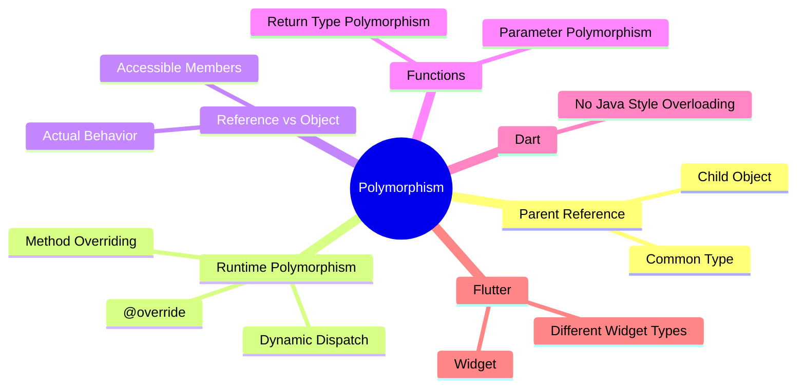
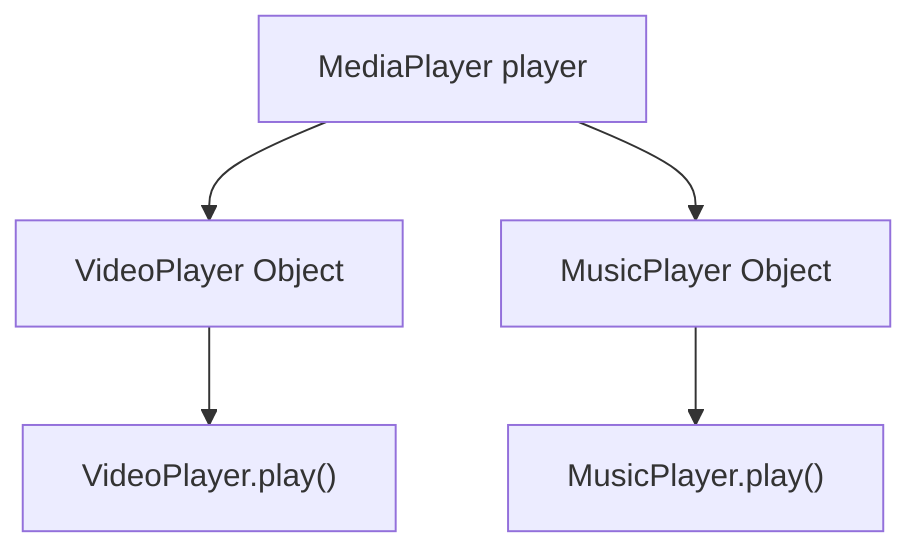
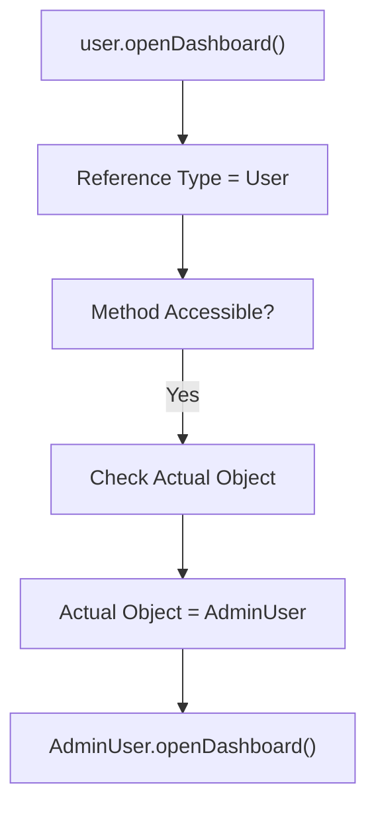
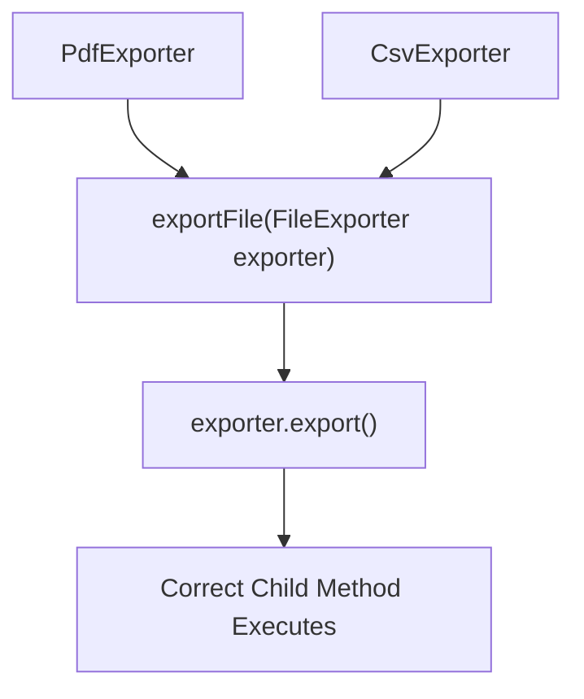

# 📘 Day 21 — Polymorphism in Dart 🔄

> **Goal:** Polymorphism ko Flutter-useful level tak understand karna — Parent Reference, Child Objects, Runtime Polymorphism, Dynamic Method Dispatch aur Common Parent Type.

---

# 📌 Day Overview

Polymorphism OOP ka ek important concept hai.

Simple meaning:

```text
POLY  → Many
MORPH → Forms
```

> **Polymorphism = One common type, many different forms.**

Aaj humne seekha ki ek Parent Type ke through different Child Objects ko common way me handle kiya ja sakta hai.

---

# 🧠 Day 21 Memory Map



---

# 1️⃣ What is Polymorphism?

Polymorphism ka simple meaning hai:

> **Same common type ke through different objects different behavior perform kar sakte hain.**

Example:

```dart
class Notification {
  void send() {
    print("Sending Notification...");
  }
}

class EmailNotification extends Notification {
  @override
  void send() {
    print("Sending Email...");
  }
}

class SmsNotification extends Notification {
  @override
  void send() {
    print("Sending SMS...");
  }
}
```

Dono Child Classes ka common Parent:

```text
             Notification
             /          \
            /            \
           ▼              ▼
EmailNotification    SmsNotification
```

Dono ke paas same:

```dart
send()
```

method hai, lekin behavior different hai.

---

# 2️⃣ Parent Reference → Child Object ⭐

Day 21 ka sabse important syntax:

```dart
Notification notification = EmailNotification();
```

Is line ko do parts me samjho:

```text
Notification          EmailNotification()
     ↑                       ↑
Reference Type           Actual Object
Parent Type              Child Object
```

Ye possible hai because:

```text
EmailNotification IS-A Notification ✅
```

---

# 🧠 Golden Rule

```text
LEFT SIDE
   ↓
Reference Type
   ↓
Kya ACCESS kar sakte hain?


RIGHT SIDE
   ↓
Actual Object
   ↓
Overridden method ka
KAUNSA VERSION chalega?
```

Example:

```dart
AudioPlayer player = SongPlayer(...);
```

`AudioPlayer` decide karega ki `player` reference se kaunse members accessible hain.

`SongPlayer` actual object decide karega ki overridden method ka kaunsa implementation execute hoga.

---

# 3️⃣ Reference Type vs Object Type

Suppose:

```dart
AudioPlayer player = SongPlayer(...);
```

Parent:

```dart
class AudioPlayer {
  void play() {}
}
```

Child:

```dart
class SongPlayer extends AudioPlayer {

  @override
  void play() {
    print("Playing Song...");
  }

  void showLyrics() {
    print("Showing Lyrics...");
  }
}
```

Ye allowed hai:

```dart
player.play();
```

Aur output:

```text
Playing Song...
```

Lekin:

```dart
player.showLyrics();
```

❌ Directly allowed nahi.

Kyunki reference type:

```text
AudioPlayer
```

hai aur `AudioPlayer` ke andar `showLyrics()` defined nahi hai.

---

## 🧠 Memory Chart

```text
AudioPlayer player = SongPlayer();
     │                    │
     ▼                    ▼
Reference Type        Actual Object
     │                    │
     ▼                    ▼
Accessible            Overridden
Members               Behavior
```

---

# 4️⃣ Runtime Polymorphism 🔄

Runtime Polymorphism tab hota hai jab Parent Reference kisi Child Object ko hold karta hai aur overridden method ka correct version runtime par execute hota hai.

Example:

```dart
MediaPlayer player = VideoPlayer(...);

player.play();
```

Agar `VideoPlayer` ne `play()` override kiya hai:

```dart
@override
void play() {
  print("Playing Video...");
}
```

to output:

```text
Playing Video...
```

Parent reference hone ke baad bhi actual Child implementation execute hota hai.

---

# 5️⃣ Same Reference → Different Objects

Ek Parent Reference alag-alag Child Objects ko different time par hold kar sakta hai.

```dart
MediaPlayer player;

player = VideoPlayer(...);

player.play();

player = MusicPlayer(...);

player.play();
```

Flow:



Yahi **Many Forms** wali thinking hai.

```text
Same Parent Reference
        ↓
Different Child Objects
        ↓
Different Behavior
```

---

# 6️⃣ Method Overriding + Polymorphism

Polymorphism me Method Overriding ka important role hai.

Parent:

```dart
class FileExporter {

  void export() {
    print("Exporting File...");
  }
}
```

Child:

```dart
class PdfExporter extends FileExporter {

  @override
  void export() {
    print("Exporting PDF...");
  }
}
```

Another Child:

```dart
class CsvExporter extends FileExporter {

  @override
  void export() {
    print("Exporting CSV...");
  }
}
```

Same method:

```dart
export()
```

Different implementations:

```text
PDF Object → Export PDF

CSV Object → Export CSV
```

---

# 7️⃣ Dynamic Method Dispatch ⚙️

Dynamic Method Dispatch koi completely separate syntax nahi hai.

Hum ise already Runtime Polymorphism me use kar rahe the.

Example:

```dart
User user = AdminUser(...);

user.openDashboard();
```

Flow:



Simple definition:

> **Parent reference se overridden method call karne par actual object ke according runtime par correct implementation execute hona Dynamic Method Dispatch hai.**

---

# 🧠 Polymorphism vs Dynamic Dispatch

```text
POLYMORPHISM
     ↓
One Parent Type
     ↓
Different Child Forms


DYNAMIC METHOD DISPATCH
     ↓
Method Call
     ↓
Actual Object Checked
     ↓
Correct Overridden Method Runs
```

---

# 8️⃣ Function Parameter Polymorphism 🔥

Polymorphism ka ek major practical benefit hai ki ek common function multiple Child Objects handle kar sakta hai.

Example:

```dart
void exportFile(FileExporter exporter) {
  exporter.export();
}
```

Objects:

```dart
PdfExporter pdf = PdfExporter(...);

CsvExporter csv = CsvExporter(...);
```

Same function:

```dart
exportFile(pdf);

exportFile(csv);
```

Ye possible hai because:

```text
PdfExporter IS-A FileExporter ✅

CsvExporter IS-A FileExporter ✅
```

---

## 🧠 Function Polymorphism Flow



### Benefit

Without common parent type:

```text
PDF → Separate Handling
CSV → Separate Handling
```

With polymorphism:

```text
PDF ──┐
      ├──→ FileExporter → One Common Function
CSV ──┘
```

This makes code reusable and flexible.

---

# 9️⃣ Return-Type Polymorphism

Parent type ko function ka **return type** bhi bana sakte hain.

Example:

```dart
User createUser(int role) {

  if (role == 1) {
    return AdminUser(...);
  } else {
    return CustomerUser(...);
  }
}
```

Function ka return type:

```dart
User
```

hai.

Lekin actual returned object:

```text
AdminUser
```

ya:

```text
CustomerUser
```

ho sakta hai.

Because:

```text
AdminUser    IS-A User ✅
CustomerUser IS-A User ✅
```

Usage:

```dart
User user1 = createUser(1);

User user2 = createUser(2);
```

Then:

```dart
user1.openDashboard();

user2.openDashboard();
```

Actual object ke according correct overridden method execute hoga.

---

# 🔟 Polymorphism + Encapsulation 🔒

Day 21 me humne Encapsulation ko bhi Polymorphism ke saath combine kiya.

Example:

```dart
class BankAccount {
  double _balance;

  BankAccount({
    required double balance,
  }) : _balance = balance;

  double get balance => _balance;

  double deductBalance(double amount) {
    _balance -= amount;

    return _balance;
  }

  void withdraw(double amount) {
    print("Processing Withdrawal...");
  }
}
```

Child Classes:

```text
                BankAccount
                🔒 _balance
                   /     \
                  /       \
                 ▼         ▼
      SavingsAccount   BusinessAccount
```

Dono:

```dart
withdraw()
```

ko apne rules ke according override kar sakte hain.

Then:

```dart
BankAccount account;

account = SavingsAccount(...);
account.withdraw(1000);

account = BusinessAccount(...);
account.withdraw(4000);
```

Same reference:

```text
BankAccount
```

Different behaviors:

```text
Savings Withdrawal Rules

Business Withdrawal Rules
```

---

# 1️⃣1️⃣ Flutter-Style Polymorphism 📱🔥

Day 21 ka final program Flutter-style architecture par based tha.

```text
                       AppWidget
                          │
             ┌────────────┼────────────┐
             ▼            ▼            ▼
        TextWidget   ButtonWidget   ImageWidget
```

Parent:

```dart
class AppWidget {

  void build() {
    print("Building Widget...");
  }
}
```

Different children `build()` ko override karte hain.

---

## Common Widget Function

```dart
void renderWidget(AppWidget widget) {
  widget.build();
}
```

Ab:

```dart
renderWidget(textWidget);

renderWidget(buttonWidget);

renderWidget(imageWidget);
```

Same function:

```text
renderWidget()
```

Different Widget Objects:

```text
TextWidget
ButtonWidget
ImageWidget
```

Different runtime behavior. 🔥

---

# 📱 Actual Flutter Connection

Actual Flutter me commonly common type hota hai:

```dart
Widget
```

Conceptually different widgets:

```text
                    Widget
                      │
          ┌───────────┼───────────┐
          ▼           ▼           ▼
        Text        Icon      Container
```

Isi wajah se Flutter APIs me agar parameter ho:

```dart
Widget child
```

to us position par different suitable `Widget` objects aa sakte hain.

Example thinking:

```text
Widget child
     │
     ├── Text(...)
     ├── Icon(...)
     └── Container(...)
```

Ye Polymorphism ka real Flutter connection hai. 📱

---

# 1️⃣2️⃣ Method Overloading in Dart

Java me same method name ko different parameters ke saath declare kar sakte hain.

Conceptually:

```text
login(email)

login(email, password)
```

Ye commonly **Method Overloading / Compile-Time Polymorphism** ke context me padha jata hai.

But Dart me Java-style Method Overloading directly supported nahi hai. ❌

Ye invalid hoga:

```dart
void login(String email) {
}

void login(String email, String password) {
}
```

Dart same scope/class me same method name ki multiple declarations parameter list badal kar allow nahi karta.

---

# 🔧 Dart Alternative

Dart flexible functions ke liye optional/named parameters provide karta hai.

Example:

```dart
void login({
  required String email,
  String? password,
}) {

}
```

Then:

```dart
login(
  email: "ansh@example.com",
);
```

or:

```dart
login(
  email: "ansh@example.com",
  password: "Ansh@123",
);
```

⚠️ Ye Java-style Method Overloading nahi hai.

---

# 📊 Quick Comparison

| Concept | Dart |
|---|:---:|
| Method Overriding | ✅ |
| Runtime Polymorphism | ✅ |
| Parent Reference → Child Object | ✅ |
| Dynamic Method Dispatch | ✅ |
| Function Parameter Polymorphism | ✅ |
| Parent Return Type | ✅ |
| Java-style Method Overloading | ❌ |
| Named / Optional Parameters | ✅ |

---

# 🧠 Ultimate Memory Chart

```text
                    POLYMORPHISM
                         │
                         ▼
                  One Common Type
                         │
              ┌──────────┼──────────┐
              ▼          ▼          ▼
           Child A    Child B    Child C
              │          │          │
              └──────────┼──────────┘
                         ▼
                  Same Method Call
                         │
                         ▼
                 Runtime Determines
                         │
                         ▼
                Correct Child Method
```

---

# ⚡ Day 21 Golden Rules

### Rule 1

```text
Parent Reference can hold Child Object
```

```dart
User user = AdminUser(...);
```

---

### Rule 2

```text
LEFT SIDE
    ↓
What can I access?
```

---

### Rule 3

```text
RIGHT SIDE
    ↓
Which overridden method executes?
```

---

### Rule 4

```text
Same Parent Type
       +
Different Child Objects
       +
Same Method
       =
Different Runtime Behavior
```

---

### Rule 5

Parent type can be used as:

```text
Variable Type      ✅

Function Parameter ✅

Function Return    ✅
```

---

# 🧠 30-Second Revision

```text
POLYMORPHISM
      ↓
Many Forms

Parent Reference
      ↓
Child Object

User user = AdminUser();

LEFT SIDE
      ↓
Accessible Members

RIGHT SIDE
      ↓
Actual Runtime Behavior

@override
      ↓
Different Child Implementation

Dynamic Method Dispatch
      ↓
Runtime chooses correct method

Common Function
      ↓
void show(User user)

Common Return Type
      ↓
User createUser()

Flutter
      ↓
Widget = Common Type
      ↓
Text / Icon / Container / etc.
```

---

# 📂 Day 21 Practice Files

```text
01 → Notification Polymorphism

02 → Music Player Runtime Polymorphism

03 → Same Reference with Multiple Object Forms

04 → File Exporter Function Polymorphism

05 → User Role Return-Type Polymorphism

06 → Bank Account Polymorphism + Encapsulation

07 → Flutter-Style Widget Polymorphism
```

---

# 📊 Day 21 Status

| Topic | Status |
|---|:---:|
| Polymorphism Meaning | ✅ |
| Parent Reference → Child Object | ✅ |
| Reference Type vs Object Type | ✅ |
| Runtime Polymorphism | ✅ |
| Method Overriding | ✅ |
| Dynamic Method Dispatch | ✅ |
| Same Reference → Different Objects | ✅ |
| Function Parameter Polymorphism | ✅ |
| Return-Type Polymorphism | ✅ |
| Encapsulation + Polymorphism | ✅ |
| Flutter-Style Polymorphism | ✅ |
| Dart Method Overloading Rule | ✅ |
| Lists + Polymorphism | 🔒 Later |

---

# 🏆 Day 21 Outcome

After completing Day 21, I can:

- ✅ Explain Polymorphism in simple terms
- ✅ Store Child Objects in Parent References
- ✅ Understand Reference Type vs Actual Object Type
- ✅ Predict which overridden method will execute
- ✅ Understand Runtime Polymorphism
- ✅ Explain Dynamic Method Dispatch
- ✅ Use one reference for different Child Objects
- ✅ Use Parent Types as function parameters
- ✅ Use Parent Types as function return types
- ✅ Combine Encapsulation with Polymorphism
- ✅ Understand basic Flutter Widget polymorphism
- ✅ Understand Dart's Method Overloading limitation

---

# 🚀 Flutter Foundation Progress

```text
DART OOP

Classes & Objects       ✅
        ↓
Constructors             ✅
        ↓
Encapsulation            ✅
        ↓
Inheritance              ✅
        ↓
Polymorphism             ✅
        ↓
Flutter OOP Foundation 🔥
```

---

# 🏁 DAY 21 — COMPLETED ✅

> **Polymorphism = One common type, multiple object forms, different runtime behavior.**

```text
One Parent Type
      ↓
Different Child Objects
      ↓
Same Method Call
      ↓
Different Behavior
      ↓
POLYMORPHISM 🔄
```

**Next Step → Continue strengthening Dart concepts required for Flutter development. 🚀📱**