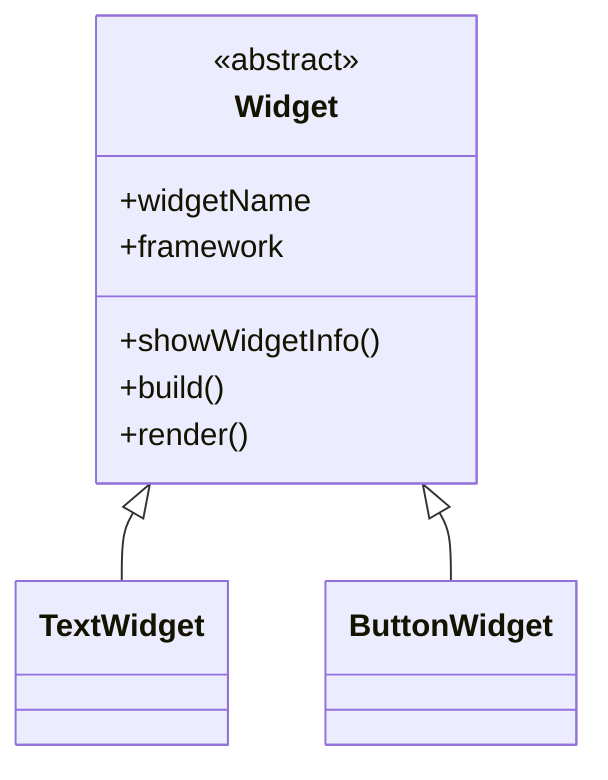
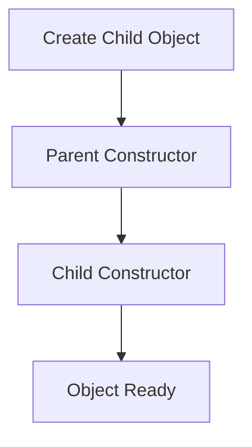

# 📘 Day 22 – Abstraction in Dart 🎭

> **Goal:** Master the fourth pillar of Object-Oriented Programming (OOP) by understanding Abstract Classes, Abstract Methods, Concrete Methods, Constructors, Getters, and their relation to Flutter's Widget architecture.

---

# 📚 Topics Covered

- ✅ Introduction to Abstraction
- ✅ Abstract Class
- ✅ Abstract Methods
- ✅ Concrete Methods
- ✅ Constructors in Abstract Classes
- ✅ Constructor Execution Order
- ✅ Getters in Abstract Classes
- ✅ Runtime Polymorphism with Abstract Classes
- ✅ Method Returning Values
- ✅ Flutter Widget Architecture (Simulation)

---

# 📂 Practice Files

| File | Topic |
|------|-------|
| 01_Payment_Abstraction.dart | Basic Abstract Class |
| 02_Vehicle_Abstraction.dart | Abstract + Concrete Methods |
| 03_Food_Delivery_Abstraction.dart | Real World Example |
| 04_Employee_Constructor_Abstraction.dart | Constructors |
| 05_Smart_Device_Status.dart | Getters |
| 06_Online_Shopping_System.dart | Returning Values |
| 07_Payment_Gateway_Revision.dart | Full Revision |
| 08_Flutter_Widget_Abstraction_Revision.dart | Flutter Style Combined Revision |

---

# 🧠 Key Learnings

- Created Abstract Classes using `abstract`
- Understood why Abstract Classes cannot be instantiated
- Learned how Child Classes implement Abstract Methods
- Used Concrete Methods for shared behavior
- Learned Constructor execution flow
- Used Getters for common information
- Applied Runtime Polymorphism with Abstract Classes
- Simulated Flutter Widget Architecture without importing Flutter

---

# 🏗️ Architecture



---

# 🔄 Constructor Flow



---

# 🎯 Abstraction Flow

```mermaid
flowchart LR

A[Abstract Class]
-->B[Abstract Method]

B-->C[Child Class]

C-->D[@override]

D-->E[Implementation]

E-->F[Runtime Execution]
```

---

# 📱 Flutter Connection

```text
               Widget
                  │
      ┌───────────┼───────────┐
      ▼           ▼           ▼
    Text      Container   ElevatedButton
```

Flutter internally follows the same abstraction principle where **Widget** acts as a common blueprint and every widget provides its own implementation.

---

# 💡 Professional Takeaways

- Abstract Classes define **WHAT** should happen.
- Child Classes decide **HOW** it should happen.
- Constructors initialize common data.
- Concrete Methods reduce duplicate code.
- Getters expose common read-only information.
- Runtime Polymorphism makes applications flexible and scalable.

---

# 📈 Progress

```text
Classes & Objects      ✅
Constructors           ✅
Encapsulation          ✅
Inheritance            ✅
Polymorphism           ✅
Abstraction            ✅
Interfaces             🔜
```

---

# 🏆 Outcome

After completing Day 22, I can:

- ✅ Create Abstract Classes
- ✅ Create Abstract Methods
- ✅ Use Concrete Methods
- ✅ Use Constructors in Abstract Classes
- ✅ Use Getters
- ✅ Apply Runtime Polymorphism
- ✅ Design Better OOP Architecture
- ✅ Understand Flutter Widget Design

---

# 🚀 Next Topic

**Day 23 → Interfaces (`implements`)**

We'll learn:

- Difference between `extends` and `implements`
- Multiple Interfaces
- Flutter-style Interface Design
- Professional OOP Architecture