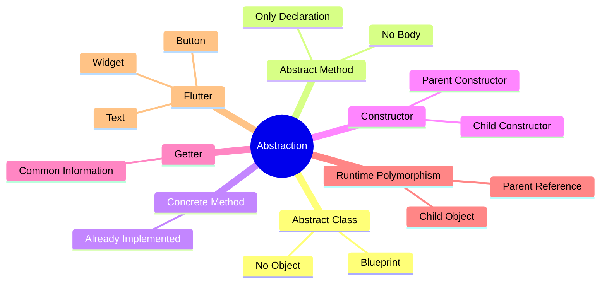
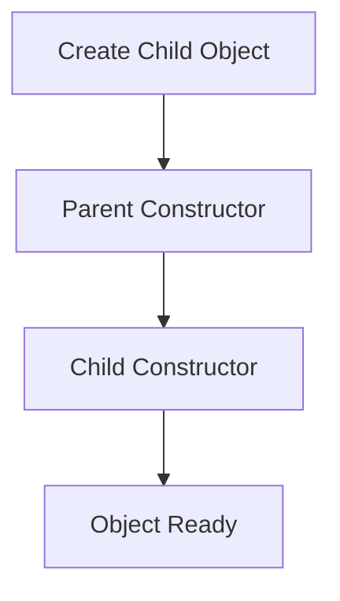

# 📘 Day 22 — Abstraction in Dart 🎭

> **Goal:** Abstraction ko Flutter-useful level tak understand karna — Abstract Class, Abstract Methods, Concrete Methods, Getters, Constructors aur Runtime Polymorphism.

---

# 📌 Day Overview

Abstraction OOP ka fourth pillar hai.

Simple Meaning:

```text
ABSTRACT
      ↓
Only Rules
      ↓
No Complete Implementation
```

> **Abstraction = Hide implementation details and expose only the necessary rules.**

Aaj humne seekha ki Parent sirf blueprint deta hai aur Child us blueprint ko implement karta hai.

---

# 🧠 Day 22 Memory Map



---

# 1️⃣ What is Abstraction?

Abstraction ka simple meaning hai:

> **Rules define karo, implementation Child par chhod do.**

Example:

```dart
abstract class Payment {

    void pay();

}
```

Yahaan Parent sirf rule bana raha hai.

Actual payment kaise hogi?

Ye Child decide karega.

---

# 🧠 Real World Example

```text
             Payment

                │

     ┌──────────┴──────────┐

     ▼                     ▼

 GooglePay            PhonePe

     │                     │

 Different           Different
 Implementation      Implementation
```

Same Rule

↓

Different Working

---

# 2️⃣ Abstract Class ⭐

Syntax

```dart
abstract class Widget{

}
```

Abstract class ka object nahi ban sakta.

❌ Invalid

```dart
Widget widget = Widget();
```

Reason

```text
Blueprint se ghar nahi banta.

Blueprint ko follow karke ghar banta hai.
```

Exactly same concept.

---

# 🧠 Golden Rule

```text
Abstract Class

↓

Cannot Create Object

↓

Must be Inherited

↓

Child Provides Implementation
```

---

# 3️⃣ Abstract Method

Abstract Method ke paas body nahi hoti.

Example

```dart
void build();
```

Ye sirf rule hai.

Implementation nahi.

Child class ko is method ko override karna hi padega.

---

# 📌 Flow

```mermaid
flowchart TD

A[Abstract Method]

-->

B[Child Class]

-->

C[@override]

-->

D[Implementation]
```

---

# 4️⃣ Concrete Method

Concrete Method already implemented hoti hai.

Example

```dart
void showWidgetInfo(){

   print(widgetName);

}
```

Is method ko Child direct use kar sakta hai.

Override karna optional hai.

---

# 🧠 Memory Chart

```text
Abstract Method

↓

No Body

↓

Must Override


Concrete Method

↓

Has Body

↓

Already Ready
```

---

# 5️⃣ Constructor in Abstract Class

Most beginners sochte hain:

"Object nahi ban sakta"

↓

"To constructor bhi nahi hoga."

❌ Wrong

Abstract class constructor rakh sakti hai.

Example

```dart
Widget({

 required this.widgetName

});
```

Object directly nahi banta.

Lekin Child object banne par Parent constructor execute hota hai.

---

# Constructor Flow



---

# 🧠 Golden Formula

```text
Child Object

↓

Parent Constructor

↓

Child Constructor

↓

Object Ready
```

---

# 6️⃣ Getter in Abstract Class

Getter common information dene ke liye use hota hai.

Example

```dart
String get framework => "Flutter";
```

Har Child automatically inherit karega.

---

# Getter Flow

```text
Widget

↓

framework

↓

Flutter

↓

Inherited by Every Child
```

---

# 7️⃣ Runtime Polymorphism + Abstraction

Parent Reference

↓

Child Object

```dart
Widget widget = TextWidget();
```

Method Call

```dart
widget.build();
```

Runtime decide karega kaunsi build() execute hogi.

---

# Flow Diagram

```mermaid
flowchart TD

Widget

↓

TextWidget

↓

build()

↓

TextWidget.build()
```

---

# 8️⃣ Flutter Connection 📱

Flutter ka sabse important Parent:

```text
Widget
```

Uske Children:

```text
                Widget

      ┌─────────┼──────────┐

      ▼         ▼          ▼

    Text     Container    Button
```

Har Widget

↓

Apna build()

↓

Apna UI

Isi wajah se Flutter itna flexible hai.

---

# 📊 Abstract vs Concrete Method

| Abstract Method | Concrete Method |
|-----------------|-----------------|
| No Body ❌ | Has Body ✅ |
| Rule Only | Ready to Use |
| Must Override | Optional |

---

# 📊 Normal Class vs Abstract Class

| Normal Class | Abstract Class |
|--------------|----------------|
| Object Banega ✅ | Object Nahi Banega ❌ |
| Complete Class | Blueprint |
| Direct Use | Inherit First |

---

# 🧠 Ultimate Memory Chart

```text
            ABSTRACTION

                │

        Parent Defines Rules

                │

                ▼

         Child Implements Rules

                │

                ▼

      Runtime Executes Child Code
```

---

# 🎯 Interview Questions

### Can we create object of Abstract Class?

❌ No

---

### Can Abstract Class have Constructor?

✅ Yes

---

### Can Abstract Class have Variables?

✅ Yes

---

### Can Abstract Class have Getter?

✅ Yes

---

### Can Abstract Class have Normal Methods?

✅ Yes

---

### Can Abstract Class contain Abstract + Concrete methods together?

✅ Yes

---

# 🚀 Flutter Foundation Progress

```text
DART OOP

Classes & Objects      ✅

Constructors           ✅

Encapsulation          ✅

Inheritance            ✅

Polymorphism           ✅

Abstraction            ✅

Interfaces             🔜
```

---

# 🧠 30-Second Revision

```text
Abstract Class

↓

Blueprint

↓

No Object

↓

Abstract Method

↓

No Body

↓

Child Overrides

↓

Concrete Method

↓

Already Implemented

↓

Getter

↓

Common Information

↓

Constructor

↓

Parent Executes First

↓

Runtime Polymorphism

↓

Flutter Widget Architecture
```

---

# 📂 Day 22 Practice Files

```text
01 → Payment Abstraction

02 → Vehicle Abstraction

03 → Food Delivery System

04 → Employee Constructor

05 → Smart Device Getter

06 → Online Shopping System

07 → Payment Gateway

08 → Flutter Widget Combined Revision
```

---

# 🏆 Day 22 Outcome

After completing Day 22, I can:

- ✅ Explain Abstraction
- ✅ Create Abstract Classes
- ✅ Create Abstract Methods
- ✅ Differentiate Abstract & Concrete Methods
- ✅ Use Constructors in Abstract Classes
- ✅ Use Getters
- ✅ Understand Parent Constructor Flow
- ✅ Use Runtime Polymorphism with Abstract Classes
- ✅ Understand Flutter Widget Architecture

---

# 🏁 DAY 22 — COMPLETED ✅

> **Abstraction = Parent defines rules, Child provides implementation.**

```text
Blueprint
      ↓
Abstract Class
      ↓
Abstract Methods
      ↓
Child Class
      ↓
Implementation
      ↓
Runtime Execution 🎭
```