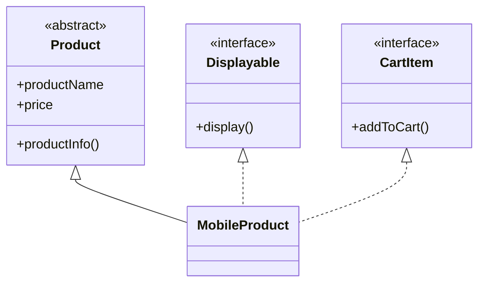

# 📘 Dart Journey — Day 23
## 🔗 Interfaces & Contract-Based Design

> **"Good software isn't built by writing more code. It's built by designing better code."**

---

# 🎯 Today's Mission

Today I completed the final major Object-Oriented Programming (OOP) concept in Dart by learning **Interfaces**.

Instead of focusing only on syntax, I learned **why interfaces exist**, **when to use them**, and **how they help build scalable software**.

---

# 📚 Topics Covered

- ✅ What is an Interface?
- ✅ `implements` Keyword
- ✅ Contract-Based Programming
- ✅ Interface with Properties
- ✅ Multiple Interfaces
- ✅ `extends` vs `implements`
- ✅ Abstract Class vs Interface
- ✅ Flutter-Style Interface Design
- ✅ Real World OOP Design

---

# 📂 Practice Files

| File | Description |
|------|-------------|
| 01_Basic_Interface.dart | Basic Interface using `implements` |
| 02_Interface_With_Properties.dart | Interface with Variables & Methods |
| 03_Multiple_Interfaces.dart | Implementing Multiple Interfaces |
| 04_Food_Delivery_Partner.dart | Real World Delivery Partner Example |
| 05_Abstract_vs_Interface.dart | Difference between Abstract Class & Interface |
| 06_Flutter_Style_Widget_Interface.dart | Flutter-style Widget Rendering Simulation |
| 07_Online_Shopping_System_Revision.dart | Final OOP Revision Project |

---

# 🧠 Concepts Learned

### ✔ Interface

A contract that defines **what a class must do**.

---

### ✔ implements

Used when a class promises to implement all required members.

---

### ✔ Multiple Interfaces

One class can support multiple capabilities without multiple inheritance.

---

### ✔ Abstract Class

Used for:

- Shared Data
- Constructors
- Common Behaviour

---

### ✔ Interface

Used for:

- Capabilities
- Rules
- Contracts

---

# 🏗️ Architecture



---

# 🔥 extends vs implements

| extends | implements |
|----------|------------|
| Code Reuse ✅ | Contract Only ✅ |
| Variables Inherited ✅ | Variables Must Be Implemented |
| Methods Inherited ✅ | Methods Must Be Overridden |
| Constructor Available ✅ | Constructor Not Inherited |

---

# 📱 Flutter Connection

Today's learning directly connects with Flutter architecture.

Flutter uses contract-based design in many places.

Examples include:

- Widgets
- Rendering
- ChangeNotifier
- Listenable
- PreferredSizeWidget

Understanding Interfaces today will make Flutter architecture much easier to understand.

---

# 💡 Real World Thinking

Today I realized that Interfaces are **not created to reduce code**.

They are created to **define responsibilities**.

Example:

```
Authentication
    ↓
login()
logout()
```

Instead of creating multiple unrelated classes, one interface can define a single responsibility.

---

# 🧠 Key Takeaways

- Contracts are different from inheritance.
- Code reuse and software design are not the same thing.
- Abstract Classes describe **what something IS**.
- Interfaces describe **what something CAN DO**.
- Good architecture focuses on responsibilities.

---

# 🚀 Skills Gained

- ✔ Contract-Based Programming
- ✔ Interface Design
- ✔ Multiple Interface Implementation
- ✔ Abstract + Interface Combination
- ✔ Runtime Polymorphism Revision
- ✔ Professional OOP Thinking

---

# 📈 Progress

```text
Variables               ✅
Operators               ✅
Conditions              ✅
Loops                   ✅
Functions               ✅
Collections             ✅
Classes & Objects       ✅
Constructors            ✅
Encapsulation           ✅
Inheritance             ✅
Polymorphism            ✅
Abstraction             ✅
Interfaces              ✅ 🎉
```

---

# 🎯 Day Summary

Today wasn't just about learning another keyword.

It was about understanding **how professional software is designed**.

Instead of asking:

> "Can this code work?"

I started asking:

> "Is this the right design?"

That mindset is what separates a programmer from a software engineer.

---

# 🏆 Status

```text
━━━━━━━━━━━━━━━━━━━━━━━━━━━━━━━━━━━━━━

📘 Day : 23

Topic : Interfaces

Practice Files : 7

Notes : ✅

README : ✅

Revision : ✅

Status : COMPLETED ✅

━━━━━━━━━━━━━━━━━━━━━━━━━━━━━━━━━━━━━━
```