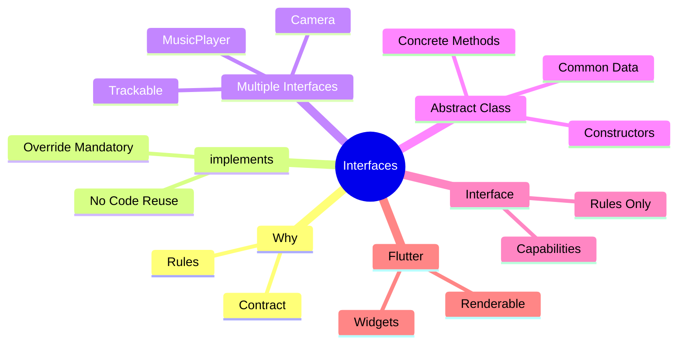

# 📘 Dart Day 23 – Interfaces (`implements`)

> **Goal:** Understand Interfaces in Dart, when to use `implements`, how it differs from `extends` and Abstract Classes, and how interfaces help build scalable and maintainable applications.

---

# 🎯 Day Objective

Today we learned the final major OOP concept in Dart:

- ✅ Interface
- ✅ `implements`
- ✅ Multiple Interfaces
- ✅ Interface with Properties
- ✅ Interface vs Abstract Class
- ✅ Flutter-style Interface Design
- ✅ Combined OOP Revision

---

# 🧠 Memory Map



---

# 🤔 Why do we need Interfaces?

Imagine a company says:

Every Payment Gateway must support:

- Pay
- Refund
- Check Status

But...

Google Pay

PhonePe

Paytm

All have different internal logic.

If we use inheritance, everyone inherits the parent's implementation—even if it is useless.

Instead, we only want a **contract**.

That is exactly why Interfaces exist.

---

# 📖 What is an Interface?

> **An Interface is a contract that tells a class WHAT it must do, but not HOW it should do it.**

The implementation is always provided by the child class.

---

# ⭐ Important Dart Fact

Unlike Java,

Dart **does not have an `interface` keyword.**

Every class can automatically act as an interface.

Example:

```dart
class Animal{

}
```

This class can also be used like:

```dart
class Dog implements Animal{

}
```

---

# 🚀 implements Keyword

Syntax:

```dart
class Dog implements Animal {

}
```

Meaning:

Dog promises to provide everything required by Animal.

---

# 🔥 extends vs implements

| extends | implements |
|----------|------------|
| Reuses Parent Code ✅ | No Code Reuse ❌ |
| Methods Inherited ✅ | Methods Not Inherited ❌ |
| Variables Inherited ✅ | Variables Not Inherited ❌ |
| Constructors Available ✅ | Constructors Not Inherited ❌ |
| Override Optional | Override Mandatory |

---

# 📦 Interface with Properties

Interfaces are not limited to methods.

They also include:

- Variables
- Getters
- Setters

Example:

```dart
class Student{
    String name="";
}
```

If

```dart
class CollegeStudent implements Student
```

Then

```dart
@override
String name="";
```

is mandatory.

---

# 🔗 Multiple Interfaces

A class can implement multiple interfaces.

```dart
class SmartPhone
implements Camera, MusicPlayer
```

This allows one class to support multiple capabilities.

---

# 🚫 Multiple Inheritance

Dart does **NOT** support:

```dart
class A extends B,C
```

But it supports:

```dart
class A implements B,C
```

---

# 🏗️ Abstract Class vs Interface

## Abstract Class

Use when:

- Common Data exists
- Constructors are needed
- Some methods can be shared

Example:

Employee

↓

Company Name

↓

Employee ID

↓

companyInfo()

---

## Interface

Use when:

Only capability is required.

Examples:

- Login
- Print
- Share
- Download
- Track Location

---

# 🧠 Golden Rule

```text
Abstract Class

↓

"What you ARE"


Interface

↓

"What you CAN DO"
```

Example:

```text
Employee

↓

IS an Employee
```

```text
Printable

↓

CAN Print
```

---

# ⭐ Same Responsibility Rule

If methods belong to the same feature:

```text
Authentication

↓

login()

logout()

resetPassword()
```

Keep them inside one interface.

---

Different responsibility?

Create another interface.

Example:

```text
Authentication

Printing

Downloading

Sharing
```

---

# 🧩 Real World Examples Covered

## ✅ Dog Interface

Implemented:

- eat()
- sleep()

---

## ✅ College Student

Implemented:

- Property
- Method

---

## ✅ Smart Phone

Implemented:

- Camera
- Music Player

---

## ✅ Delivery Partner

Implemented:

- Trackable
- Deliverable

---

## ✅ Employee Management

Combined:

- Abstract Class
- Interface

---

## ✅ Flutter Widget Rendering

Implemented:

- Renderable Interface

Widgets:

- TextWidget
- ImageWidget

---

## ✅ Online Shopping System

Combined:

- Product (Abstract Class)

Interfaces:

- Displayable
- CartItem

Child:

- MobileProduct

---

# 📱 Flutter Connection

Flutter follows Interface-like thinking everywhere.

Examples:

- Renderable Widgets
- Animation
- Listenable
- ChangeNotifier
- PreferredSizeWidget

Interfaces help define **capabilities** rather than identity.

---

# 🎨 What is Rendering?

Rendering means:

> **Displaying UI on the screen.**

Flow:

```text
Code

↓

Widget Created

↓

Flutter Engine

↓

Layout

↓

Paint

↓

Render

↓

Visible UI
```

Our `render()` method was only a simulation to understand the concept.

---

# 🧠 Common Mistakes

❌ Thinking `implements` copies code.

It does NOT.

---

❌ Forgetting `@override`

Always override required members.

---

❌ Expecting constructors to be inherited.

Constructors are **never** inherited through interfaces.

---

❌ Using multiple interfaces when one responsibility is enough.

Keep related methods inside one interface.

---

# 💡 Best Practices

✅ Use Abstract Class for common data and behavior.

✅ Use Interface for capabilities.

✅ Keep interfaces focused on one responsibility.

✅ Prefer meaningful interface names:

- Printable
- Shareable
- Downloadable
- Trackable
- Renderable

---

# 🎯 Interview Questions

### Q1. Does Dart have an `interface` keyword?

❌ No.

Every class can act as an interface.

---

### Q2. Difference between extends and implements?

- extends → Reuse code
- implements → Follow contract

---

### Q3. Can a class implement multiple interfaces?

✅ Yes.

---

### Q4. Are constructors inherited using implements?

❌ Never.

---

### Q5. Why are Interfaces useful?

They help enforce contracts and make software scalable, flexible, and easier to maintain.

---

# 🧠 30-Second Revision

```text
Interface

↓

Contract

↓

implements

↓

Override Everything

↓

No Code Reuse

↓

Multiple Interfaces Supported

↓

Capabilities

↓

Abstract Class

↓

Common Data + Common Behaviour
```

---

# 📊 Day 23 Dashboard

```text
Topic               Status
---------------------------------
Basic Interface          ✅
Properties               ✅
Multiple Interfaces      ✅
Abstract vs Interface    ✅
Flutter Example          ✅
Final Revision           ✅
```

---

# 🏆 Outcome

After completing Day 23, I can:

✅ Create Interfaces

✅ Use `implements`

✅ Override Mandatory Members

✅ Implement Multiple Interfaces

✅ Differentiate `extends` and `implements`

✅ Combine Abstract Classes and Interfaces

✅ Understand Interface-based Design

✅ Connect Interface concepts with Flutter Architecture