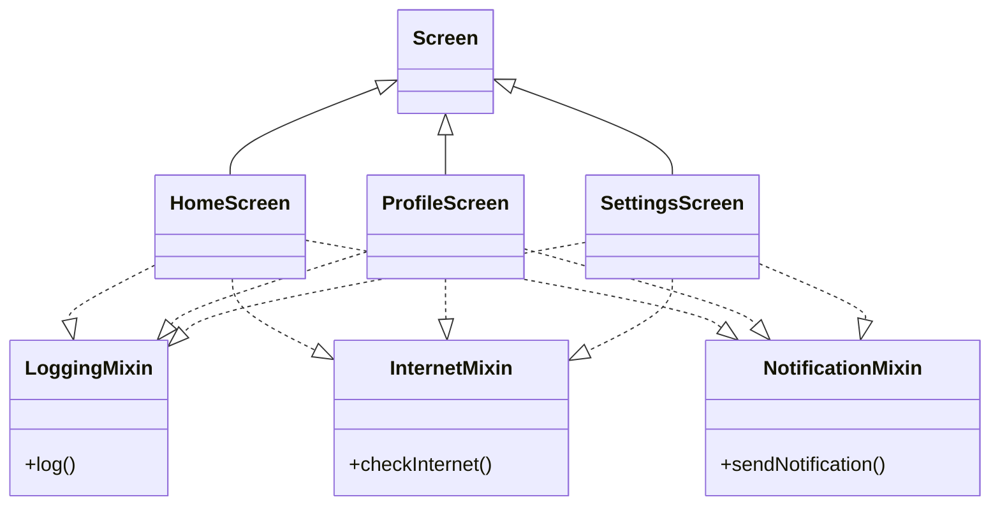

# 📘 Dart Journey – Day 24
## 🚀 Topic: Mixins (Behavior Composition & Code Reusability)

> **"Write Once, Reuse Everywhere."**

Today, I explored one of Dart's most powerful OOP features — **Mixins**. I learned how to reuse behavior across multiple classes without relying on inheritance, making applications cleaner, more maintainable, and easier to scale.

---

# 🎯 Learning Objectives

- Understand the purpose of Mixins.
- Learn how Mixins differ from Interfaces and Abstract Classes.
- Reuse behavior across multiple classes.
- Apply multiple Mixins to a single class.
- Resolve method conflicts between Mixins.
- Restrict Mixins using the `on` keyword.
- Understand how Flutter internally uses Mixins.

---

# 📂 Files Covered

| File | Topic |
|------|-------|
| ✅ 01_Basic_Mixin.dart | Introduction to Mixins |
| ✅ 02_Multiple_Mixins.dart | Applying Multiple Mixins |
| ✅ 03_Notification_Mixin.dart | Real-world Notification Example |
| ✅ 04_SmartPhone_Mixins.dart | Multiple Behaviors in One Class |
| ✅ 05_Method_Conflict_In_Mixins.dart | Method Resolution (Last Mixin Wins) |
| ✅ 06_Mixin_On_Keyword.dart | Restricting Mixins using `on` |
| ✅ 07_Flutter_Style_Mixin_Project.dart | Flutter-style Practical Project |

---

# 📖 Concepts Learned

### ✅ Basic Mixins
- Reusable behavior
- `with` keyword
- Code reusability

### ✅ Multiple Mixins
- One class can use multiple Mixins.
- Different behaviors can be combined easily.

### ✅ Mixins with Variables
- Mixins can contain both methods and variables.

### ✅ Method Conflict Resolution
- If multiple Mixins contain the same method,
- **The Last Mixin Wins.**

### ✅ `on` Keyword
- Restricts a Mixin to a specific class hierarchy.
- Helps create safer and more meaningful reusable behaviors.

### ✅ Flutter Connection
- Learned why Flutter uses Mixins like:
  - `SingleTickerProviderStateMixin`
- Understood that Flutter prefers behavior composition instead of deep inheritance.

---

# 🧠 Key Takeaways

- Mixins are used for **behavior reuse**, not inheritance.
- `with` applies a Mixin to a class.
- `on` restricts where a Mixin can be used.
- Multiple Mixins can be combined.
- Method conflicts follow the **Last Mixin Wins** rule.
- Mixins encourage **Composition over Inheritance**.

---

# 🏗 Architecture



---

# 🧠 Mind Map

```text
                          MIXINS
                             │
        ┌────────────────────┼────────────────────┐
        │                    │                    │
  Code Reuse          Behavior Sharing      Multiple Mixins
        │                    │                    │
        │              Ready Methods       Camera + GPS + Music
        │
        ▼
     with Keyword
        │
        ├───────────────┐
        │               │
    Methods         Variables
        │
        ▼
 Method Conflict
        │
        ▼
 Last Mixin Wins
        │
        ▼
    on Keyword
        │
        ▼
 Restrict Usage
        │
        ▼
 Flutter Mixins
```

---

# 💼 Real-World Examples

- 📱 Notification System
- 📱 SmartPhone Features
- 📱 Flutter Widget Behaviors
- 📱 Screen Logging
- 🌐 Internet Checking
- 🔔 Notification Handling

---

# 💡 Industry Insight

Modern software development prefers:

> **Composition over Inheritance**

Instead of creating deep inheritance trees, developers compose objects by attaching reusable behaviors using Mixins, Extensions, and other composition techniques.

---

# 🎯 Interview Highlights

### Q. What is a Mixin?
A reusable block of behavior that can be shared across multiple classes without inheritance.

### Q. Which keyword applies a Mixin?
`with`

### Q. Which keyword restricts a Mixin?
`on`

### Q. Can a class use multiple Mixins?
Yes.

### Q. What happens if two Mixins contain the same method?
The **last applied Mixin overrides the previous one.**

---

# 📊 Day Progress

- ✅ Basic Mixins
- ✅ Multiple Mixins
- ✅ Real-world Examples
- ✅ Method Conflict Resolution
- ✅ `on` Keyword
- ✅ Flutter-style Project
- ✅ Industry Concepts

---

# 🚀 Skills Unlocked

- Behavior Composition
- Code Reusability
- Cleaner Architecture
- Better OOP Design
- Flutter Foundation
- Industry-Level Thinking

---

# 🏁 Day 24 Status

**Module Completed Successfully ✅**

> "Good developers write code. Great developers write reusable code."