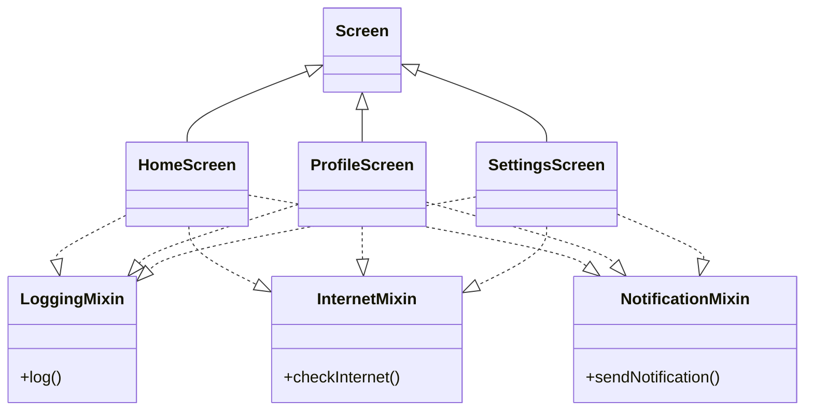

# 📘 Dart Day 24 – Mixins

## 🎯 Definition

A **Mixin** is a special feature in Dart that allows us to reuse **ready-made behavior (methods and properties)** across multiple classes without using inheritance. It promotes code reusability and follows the principle of **Write Once, Reuse Everywhere**.

---

# 🤔 Why Mixins?

Suppose multiple classes need the same functionality.

Example:

- Bird can fly.
- Duck can fly.
- Eagle can fly.

Writing the same `fly()` method in every class creates duplicate code.

Instead, we create one mixin and reuse it wherever required.

---

# 🔑 Syntax

```dart
mixin Flying {
  void fly() {
    print("Flying...");
  }
}

class Bird with Flying {}
```

---

# 🧠 Key Points

- Reuses common behavior.
- Avoids duplicate code.
- Uses the `with` keyword.
- Supports multiple mixins.
- Can contain methods and variables.
- Does not create an IS-A relationship.
- Supports restrictions using the `on` keyword.

---

# 🆚 Interface vs Mixin

| Interface | Mixin |
|-----------|--------|
| Defines a contract | Provides ready-made behavior |
| Requires overriding methods | No overriding required |
| Tells WHAT to do | Already knows HOW to do it |
| Implementation written by child | Implementation already available |

---

# 🆚 Abstract Class vs Mixin

| Abstract Class | Mixin |
|----------------|--------|
| Represents an IS-A relationship | Represents reusable behavior |
| Uses `extends` | Uses `with` |
| Only one parent can be extended | Multiple mixins can be added |

---

# 🎯 Multiple Mixins

A class can use more than one mixin.

```dart
class SmartPhone
    with Camera, MusicPlayer, GPS {}
```

Each mixin provides a different behavior.

---

# 🎯 Mixins with Variables

Mixins can also contain variables.

```dart
mixin TurboMode {

  int turboLevel = 5;

  void boost() {
    print("Turbo Level : $turboLevel");
  }

}
```

---

# ⚠️ Method Conflict

If multiple mixins contain the same method, Dart follows one simple rule.

> **Last Mixin Wins**

Example

```dart
class Person with Teacher, Student {}
```

If both mixins contain `intro()`,

Output

```
I am Student
```

because `Student` is written last.

---

# 🔒 on Keyword

The `on` keyword restricts a mixin so that it can only be used with a specific class hierarchy.

```dart
class Animal {}

mixin Flying on Animal {

  void fly() {
    print("Flying...");
  }

}

class Bird extends Animal with Flying {}
```

Invalid Example

```dart
class Car with Flying {}
```

Reason:

`Car` does not extend `Animal`.

---

# 🌍 Real World Examples

### Notification System

- WhatsApp
- Instagram
- Gmail

All reuse

`NotificationMixin`

instead of writing the same notification code repeatedly.

---

### SmartPhone

A smartphone can reuse

- Camera
- MusicPlayer
- GPS

using multiple mixins.

---

### Flutter

Flutter uses mixins internally.

Example

```dart
SingleTickerProviderStateMixin
```

It provides reusable animation behavior to widgets.

---

# 🏗 Mermaid Diagram



---

# 🧠 Mind Map

```text
                         MIXINS
                            │
        ┌───────────────────┼───────────────────┐
        │                   │                   │
   Code Reuse          Ready Behavior      Multiple Mixins
        │                   │                   │
        │             No Override          Camera + GPS + Music
        │
        ▼
    with Keyword
        │
        ├──────────────┐
        │              │
     Methods       Variables
        │
        ▼
  Method Conflict
        │
        ▼
 Last Mixin Wins
        │
        ▼
    on Keyword
        │
        ▼
 Restrict Classes
        │
        ▼
 Flutter Mixins
```

---

# 💡 Industry Principle

> **Composition over Inheritance**

Instead of creating deep inheritance hierarchies, modern applications prefer composing objects using reusable behaviors.

---

# 🎯 Interview Questions

### Q1. What is a Mixin?

A Mixin is used to reuse ready-made behavior across multiple classes without inheritance.

---

### Q2. Which keyword is used to apply a mixin?

`with`

---

### Q3. Which keyword restricts a mixin?

`on`

---

### Q4. Can a class use multiple mixins?

Yes.

---

### Q5. Can a mixin contain variables?

Yes.

---

### Q6. If two mixins have the same method, which one executes?

The method from the **last mixin** executes.

---

# 📝 Quick Revision

- ✅ Mixin = Ready-made behavior
- ✅ with = Apply mixin
- ✅ on = Restrict mixin
- ✅ Multiple mixins allowed
- ✅ Variables + Methods supported
- ✅ Last Mixin Wins
- ✅ Write Once, Reuse Everywhere
- ✅ Flutter heavily uses mixins