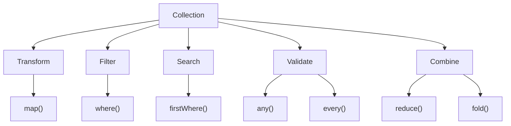

# 🚀 Dart Day 27 — Higher Order Methods

> **Turning collections into meaningful data with clean, expressive Dart code.**

Today was focused on completing the core **Higher Order Methods** of Dart Collections.

Instead of manually writing loops and conditions for every collection operation, Dart provides powerful methods that allow us to **transform, filter, search, validate, and combine collection data** in a cleaner and more readable way.

---

## 🎯 Day 27 Objective

The primary goal of Day 27 was:

- Understand `firstWhere()`
- Understand `any()`
- Understand `every()`
- Understand `reduce()`
- Understand `fold()`
- Learn the difference between these methods.
- Practice each method with a real-world scenario.
- Build one complete revision program combining multiple Higher Order Methods.

---

# 📂 Files Covered

| File | Method / Concept | Real-World Use |
|------|------------------|----------------|
| `01_FirstWhere_Method.dart` | `firstWhere()` | Finding the first matching record |
| `02_Any_Method.dart` | `any()` | Checking whether at least one item satisfies a condition |
| `03_Every_Method.dart` | `every()` | Validating whether all items satisfy a condition |
| `04_Reduce_Method.dart` | `reduce()` | Combining multiple values into one result |
| `05_Fold_Method.dart` | `fold()` | Combining values using an initial value |
| `06_Higher_Order_Methods_Revision.dart` | Complete Revision | Applying multiple methods together |
| `practice.dart` | Practice | Independent practice and experimentation |

---

# 🔎 01 — firstWhere()

## 📌 Purpose

`firstWhere()` searches a collection and returns the **first element** that satisfies a given condition.

### Mental Model

```text
Collection
    ↓
Check each element
    ↓
Condition satisfied?
    ↓
YES → Return FIRST matching element
    ↓
STOP
```

### Example Concept

```text
A
B
C  ← First Match
C  ← Another Match
D
```

`firstWhere()` returns only the first matching element.

### Important Difference

```text
where()
    ↓
All matching elements

firstWhere()
    ↓
First matching element
```

### Real-World Applications

- Finding the first matching user
- Finding a particular chat
- Finding a specific song
- Searching records
- Finding the first available item

---

# 🔵 02 — any()

## 📌 Purpose

`any()` checks whether **at least one element** satisfies a condition.

It returns:

```text
true
```

or

```text
false
```

### Mental Model

```text
Collection
    ↓
Check elements
    ↓
Is ANY ONE valid?
    ↓
YES → true
NO  → false
```

### Example

```text
Player 1 → Offline
Player 2 → Offline
Player 3 → Online ✅

Result → true
```

Once a matching element is found, there is no need to find another one.

### Real-World Applications

- Is any player online?
- Is any account blocked?
- Is any order pending?
- Is any notification unread?
- Does any student have marks below the passing level?

### Golden Rule

> **ANY = At least ONE**

---

# 🟢 03 — every()

## 📌 Purpose

`every()` checks whether **all elements** satisfy a condition.

It also returns:

```text
true
```

or

```text
false
```

### Mental Model

```text
Collection
    ↓
Check every element
    ↓
Did ALL pass?
    ↓
YES → true
NO  → false
```

### Example

```text
Customer 1 → KYC Verified ✅
Customer 2 → KYC Verified ✅
Customer 3 → KYC Verified ✅
Customer 4 → KYC Verified ❌

Result → false
```

One failed condition makes the complete result `false`.

### Real-World Applications

- Are all customers KYC verified?
- Are all payments successful?
- Are all students eligible?
- Are all required fields completed?
- Are all orders delivered?

### Golden Rule

> **EVERY = ALL must satisfy the condition**

---

# 🟠 04 — reduce()

## 📌 Purpose

`reduce()` combines multiple collection elements into **one final value**.

Unlike `map()` and `where()`, the goal here is not to create another collection.

The goal is:

```text
Many Values
     ↓
Combine
     ↓
ONE Value
```

### Example

```text
250
400
150
300

↓

250 + 400 = 650
650 + 150 = 800
800 + 300 = 1100

↓

1100
```

### Real-World Applications

- Total sales
- Total order amount
- Total marks
- Sum of transactions
- Combining numerical values

### Important Point

`reduce()` does **not** take an initial value.

The calculation starts from the collection's first element.

---

# 🟣 05 — fold()

## 📌 Purpose

`fold()` also combines collection elements into one final result.

The major difference is:

> `fold()` allows us to provide an **initial value**.

### Example

Suppose:

```text
Cart Prices:

250
400
150
```

Initial value:

```text
100
```

Calculation:

```text
100 + 250 = 350

350 + 400 = 750

750 + 150 = 900
```

Final result:

```text
900
```

### Syntax Pattern

```dart
collection.fold(initialValue, (result, element) {
  return result + element;
});
```

### Real-World Applications

- Cart totals
- Account balances
- Adding a starting bonus
- Calculating totals with an initial amount
- Building a final accumulated result

---

# ⚔️ reduce() vs fold()

| Feature | `reduce()` | `fold()` |
|---------|------------|----------|
| Combines values | ✅ | ✅ |
| Returns one result | ✅ | ✅ |
| Initial value | ❌ | ✅ |
| Starts from collection | ✅ | ❌ |
| Custom starting value | ❌ | ✅ |
| Empty collection handling | Problematic | Can use initial value |

### Easy Memory Trick

```text
reduce()
   ↓
Start from collection

fold()
   ↓
Start from YOUR value
```

---

# 🧠 Higher Order Methods — Complete Mental Model



---

# 🗺️ Quick Mental Map

```text
                    HIGHER ORDER METHODS
                            │
        ┌───────────────────┼───────────────────┐
        │                   │                   │
   TRANSFORM              FILTER              SEARCH
        │                   │                   │
      map()              where()          firstWhere()
                                                │
                                                ▼
                                           First Match
        │
        │
        └─────────────────────────────────────────────┐
                                                      │
                                                   CHECK
                                                      │
                                             ┌────────┴────────┐
                                             │                 │
                                           any()            every()
                                             │                 │
                                         ONE pass          ALL pass
                                             │                 │
                                             └────────┬────────┘
                                                      │
                                                   COMBINE
                                                      │
                                                ┌─────┴─────┐
                                                │           │
                                            reduce()     fold()
                                                │           │
                                          No initial    Initial value
```

---

# 🧠 Most Important Comparison

## `map()`

> **Har element ko transform karo.**

```text
[1, 2, 3]

map()

[10, 20, 30]
```

---

## `where()`

> **Sirf matching elements rakho.**

```text
[1, 2, 3, 4]

where(even)

[2, 4]
```

---

## `firstWhere()`

> **Pehla matching element do.**

```text
[1, 2, 4, 6]

firstWhere(even)

2
```

---

## `any()`

> **Kya koi ek condition satisfy karta hai?**

```text
[1, 3, 5, 6]

any(even)

true
```

---

## `every()`

> **Kya sabhi condition satisfy karte hain?**

```text
[2, 4, 6, 8]

every(even)

true
```

---

## `reduce()`

> **Multiple values ko combine karke one value banao.**

```text
[10, 20, 30]

reduce(+)

60
```

---

## `fold()`

> **Initial value ke saath multiple values ko combine karo.**

```text
Initial = 100

[10, 20, 30]

fold(+)

160
```

---

# 📱 Real-World Flutter Connection

These methods become extremely useful when working with:

### 🌐 REST APIs

```text
API Response
     ↓
List of Objects
     ↓
map()
     ↓
Flutter Objects / Widgets
```

---

### 🔎 Search

```text
Users
  ↓
firstWhere()
  ↓
Matching User
```

---

### 🔍 Filtering

```text
Products
   ↓
where()
   ↓
Filtered Products
```

---

### ✅ Validation

```text
Users
   ↓
every()
   ↓
Are all users verified?
```

---

### ❓ Existence Check

```text
Orders
   ↓
any()
   ↓
Is any order pending?
```

---

### 💰 Calculations

```text
Transactions
   ↓
reduce()
   ↓
Total Amount
```

or

```text
Transactions
   ↓
fold()
   ↓
Total + Initial Balance
```

---

# 🔥 Method Selection Guide

When facing a collection problem, ask:

```text
Do I need to CHANGE every element?
        ↓
      map()


Do I need to FILTER elements?
        ↓
      where()


Do I need ONLY the FIRST match?
        ↓
   firstWhere()


Do I only need YES / NO
and ONE match is enough?
        ↓
      any()


Do I need YES / NO
and ALL must match?
        ↓
     every()


Do I need ONE final value
from multiple values?
        ↓
     reduce()


Do I need ONE final value
with a starting value?
        ↓
      fold()
```

---

# 🧪 Revision Program

The `06_Higher_Order_Methods_Revision.dart` file combines the concepts into one real-world **Employee Management** scenario.

It demonstrates:

```text
Employee List
      │
      ├── map()
      │     └── Employee → Employee Name
      │
      ├── where()
      │     └── Filter Developers
      │
      ├── firstWhere()
      │     └── Find First High-Paid Employee
      │
      ├── any()
      │     └── Check Inactive Employee
      │
      ├── every()
      │     └── Validate Salary Condition
      │
      ├── reduce()
      │     └── Calculate Total Salary
      │
      └── fold()
            └── Calculate Salary + Initial Bonus Pool
```

This file acts as the **single revision point** for the Higher Order Methods module.

---

# 💻 Practice

`practice.dart` is reserved for independent experimentation.

Recommended practice pattern:

```text
Don't copy the previous examples.

Create your own:

→ Real-world collection
→ Choose a problem
→ Select the correct method
→ Implement it
→ Test different inputs
```

### Suggested Scenarios

- 🏦 Banking
- 🎮 Gaming
- 🎵 Music
- 💬 Chat
- 📚 Education
- 🚕 Ride Booking
- 🍔 Food Delivery
- 🏥 Hospital
- 📦 Delivery System

---

# 📊 Day 27 Progress

```text
Dart Collections
│
├── List Fundamentals        ✅
│
└── Higher Order Methods
      │
      ├── map()              ✅
      ├── where()            ✅
      ├── firstWhere()       ✅
      ├── any()              ✅
      ├── every()            ✅
      ├── reduce()           ✅
      └── fold()             ✅
```

### 🏆 Module Status

```text
Higher Order Methods

████████████████████ 100%
```

---

# 🎯 Key Takeaways

1. `map()` transforms every element.
2. `where()` filters matching elements.
3. `firstWhere()` returns the first matching element.
4. `any()` checks whether at least one element matches.
5. `every()` checks whether all elements match.
6. `reduce()` combines values without an initial value.
7. `fold()` combines values using an initial value.
8. `map()` and `where()` commonly produce collections.
9. `any()` and `every()` produce Boolean results.
10. `firstWhere()` produces a single matching element.
11. `reduce()` and `fold()` produce one accumulated result.
12. These methods make collection processing more expressive and readable.

---

# 🚀 Developer Mindset

The goal is not to memorize:

```text
map()
where()
firstWhere()
any()
every()
reduce()
fold()
```

The goal is to recognize the **problem pattern**.

```text
Transform?
→ map()

Filter?
→ where()

First match?
→ firstWhere()

At least one?
→ any()

All?
→ every()

Combine?
→ reduce()

Combine + Initial Value?
→ fold()
```

> **The method should follow the problem—not the other way around.**

---

# 🏁 Day 27 Status

**Higher Order Methods — COMPLETED ✅**

### Learned

```text
Collections
   ↓
Higher Order Methods
   ↓
Transformation
   ↓
Filtering
   ↓
Searching
   ↓
Validation
   ↓
Aggregation
```

### Next Step

```text
📦 Collections
      ↓
   List ✅
      ↓
Higher Order Methods ✅
      ↓
   Next Collection Topic 🚀
```

---

## 🧑‍💻 Developer Note

Day 27 was not about writing more code.

It was about learning how to **think about collection problems**.

A collection is just data. The important skill is deciding what needs to happen to that data:

**Transform → Filter → Search → Validate → Combine**

Once that thinking becomes natural, Dart collection APIs—and later Flutter's API/Firebase data handling—become significantly easier to work with.

---

# 🔥 Day 27 Complete

> **Think in operations. Write less code. Express more intent.**

**Higher Order Methods: MASTERED 🚀**