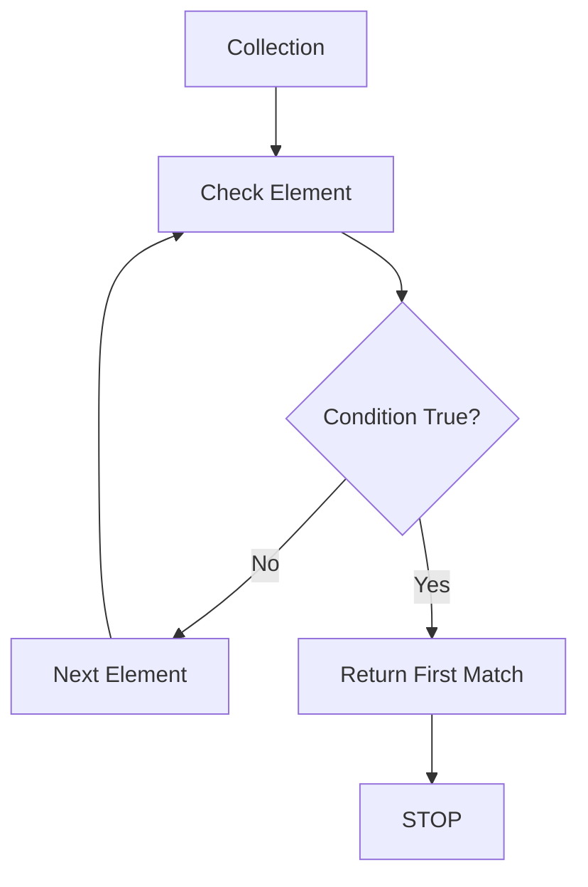
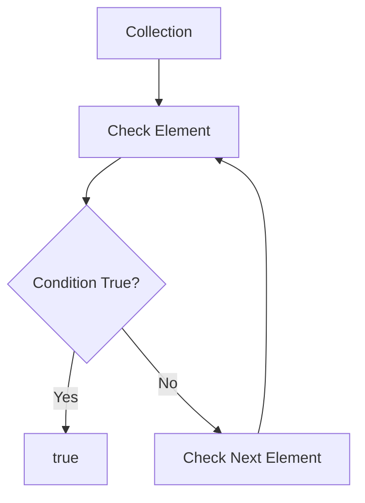
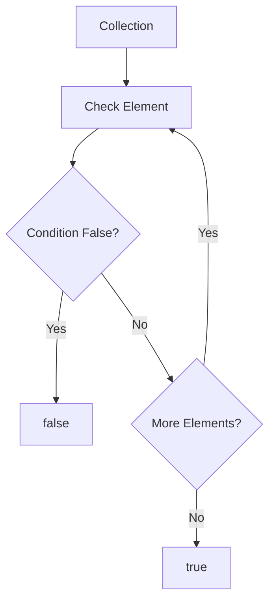
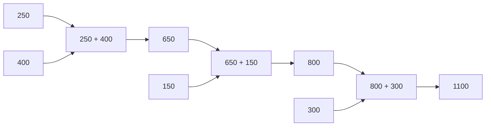
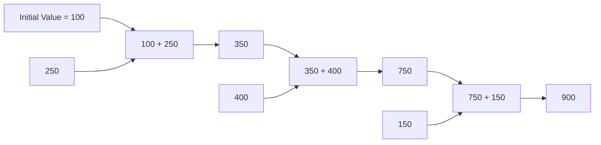
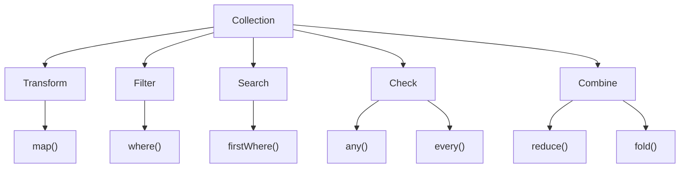

# 📘 Dart Day 27 — Higher Order Methods

## 🎯 Today's Topics

Today we completed the remaining important Higher Order Methods:

- `firstWhere()`
- `any()`
- `every()`
- `reduce()`
- `fold()`

Previously completed:

- `map()`
- `where()`

---

# 🔎 1. firstWhere()

## Definition

`firstWhere()` collection me condition satisfy karne wale **first element** ko return karta hai.

### Simple Meaning

> "Mujhe condition satisfy karne wala pehla element do."

---

## Example

```dart
List<int> numbers = [10, 25, 30, 40];

int result = numbers.firstWhere((number) {
  return number > 20;
});

print(result);
```

### Output

```text
25
```

Why?

```text
10 → false ❌
25 → true  ✅ → STOP
30 → check nahi hoga
40 → check nahi hoga
```

---

## 🧠 Mental Model



---

## `where()` vs `firstWhere()`

```text
where()

Collection
    ↓
All Matching Elements
    ↓
New Collection
```

```text
firstWhere()

Collection
    ↓
First Matching Element
    ↓
Single Element
```

### Golden Rule

```text
where()      → ALL matches
firstWhere() → FIRST match
```

---

## ⚠️ No Match

Agar koi element condition satisfy nahi karta, `firstWhere()` normally error throw kar sakta hai.

Is situation me `orElse` use kiya ja sakta hai:

```dart
Product result = products.firstWhere(
  (product) => product.name == "TV",
  orElse: () => Product(
    name: "Not Found",
    price: 0,
  ),
);
```

`orElse` ka meaning:

> "Agar match nahi mila to alternative value return karo."

---

# 🔵 2. any()

## Definition

`any()` check karta hai ki collection me **at least one element** condition satisfy karta hai ya nahi.

Return type:

```text
bool
```

Result:

```text
true
```

ya

```text
false
```

---

## Example

```dart
List<int> marks = [35, 45, 70, 80];

bool hasPassedStudent = marks.any((mark) {
  return mark >= 40;
});

print(hasPassedStudent);
```

Output:

```text
true
```

Because at least one mark `40` ya usse zyada hai.

---

## 🧠 Mental Model



---

## Real-World Uses

`any()` useful hai jab question ho:

- Kya koi player online hai?
- Kya koi order pending hai?
- Kya koi account blocked hai?
- Kya koi notification unread hai?
- Kya koi student pass hai?

### Golden Rule

> **ANY = At least ONE**

---

# 🟢 3. every()

## Definition

`every()` check karta hai ki collection ke **ALL elements** condition satisfy karte hain ya nahi.

Return type:

```text
bool
```

---

## Example

```dart
List<int> marks = [70, 80, 90, 60];

bool allPassed = marks.every((mark) {
  return mark >= 40;
});

print(allPassed);
```

Output:

```text
true
```

Sabhi marks `40` se zyada hain.

---

## Agar ek fail ho?

```text
70 → true  ✅
80 → true  ✅
30 → false ❌
90 → true
```

Final:

```text
false
```

Ek bhi element fail hua to `every()` false ho jayega.

---

## 🧠 Mental Model



---

# ⚔️ any() vs every()

| Method | Question |
|---|---|
| `any()` | Kya **koi ek** condition satisfy karta hai? |
| `every()` | Kya **sabhi** condition satisfy karte hain? |

Memory Trick:

```text
ANY   → ONE is enough
EVERY → ALL must pass
```

---

# 🟠 4. reduce()

## Definition

`reduce()` collection ke multiple elements ko combine karke **one final value** produce karta hai.

### Simple Meaning

> "Saari values ko combine karke ek result bana do."

---

## Example

```dart
List<double> sales = [250, 400, 150, 300];

double total = sales.reduce((previous, current) {
  return previous + current;
});

print(total);
```

Output:

```text
1100
```

---

## 🧠 Working

```text
250 + 400 = 650

650 + 150 = 800

800 + 300 = 1100
```

---

## Mermaid Flow



---

## Important Point

`reduce()` me **initial value nahi hoti**.

Calculation collection ke first element se start hoti hai.

```text
[250, 400, 150]

250 ← Starting Point
```

---

## Real-World Uses

- Total sales
- Total marks
- Total transaction amount
- Total order amount
- Sum of values

---

# 🟣 5. fold()

## Definition

`fold()` bhi multiple values ko combine karke one final result produce karta hai.

Lekin iska special feature hai:

> **`fold()` ek initial value accept karta hai.**

---

## Example

```dart
List<double> prices = [250, 400, 150];

double total = prices.fold(100, (total, price) {
  return total + price;
});

print(total);
```

Output:

```text
900
```

---

## 🧠 Working

Initial value:

```text
100
```

Then:

```text
100 + 250 = 350

350 + 400 = 750

750 + 150 = 900
```

---

## Mermaid Flow



---

# ⚔️ reduce() vs fold()

| Feature | `reduce()` | `fold()` |
|---|---|---|
| Multiple values combine | ✅ | ✅ |
| One final result | ✅ | ✅ |
| Initial value | ❌ | ✅ |
| Starts from first element | ✅ | ❌ |
| Custom starting value | ❌ | ✅ |

### Memory Trick

```text
reduce()
↓
Collection se start

fold()
↓
Meri given value se start
```

---

# ⚠️ Empty Collection

Ye important practical difference hai.

Suppose:

```dart
List<int> numbers = [];
```

`reduce()` ko calculation start karne ke liye first element chahiye.

Lekin list empty hai.

So `reduce()` safely result nahi bana sakta.

---

`fold()` me initial value de sakte hain:

```dart
int total = numbers.fold(0, (total, number) {
  return total + number;
});
```

Result:

```text
0
```

Isliye `fold()` empty collections ke cases me useful ho sakta hai jab suitable initial value available ho.

---

# 🧠 Complete Higher Order Methods Map



---

# 📊 Complete Comparison

| Method | Main Purpose | Result |
|---|---|---|
| `map()` | Transform every element | Collection |
| `where()` | Filter matching elements | Collection |
| `firstWhere()` | Find first matching element | Single Element |
| `any()` | Check if at least one matches | `bool` |
| `every()` | Check if all match | `bool` |
| `reduce()` | Combine values | One Value |
| `fold()` | Combine with initial value | One Value |

---

# 🧠 Method Selection Cheat Sheet

```text
Mujhe har element ko CHANGE karna hai
        ↓
      map()


Mujhe kuch elements FILTER karne hain
        ↓
      where()


Mujhe FIRST matching element chahiye
        ↓
   firstWhere()


Mujhe sirf YES/NO chahiye:
Kya KOI EK match karta hai?
        ↓
      any()


Mujhe sirf YES/NO chahiye:
Kya SAB match karte hain?
        ↓
     every()


Mujhe multiple values ko ONE value me combine karna hai
        ↓
     reduce()


Mujhe combine karna hai + INITIAL VALUE bhi deni hai
        ↓
      fold()
```

---

# 📱 Flutter Connection

Ye methods Flutter development me bahut useful honge.

## API Data

```text
API Response
     ↓
List of Objects
     ↓
map()
     ↓
Transformed Data / Widgets
```

---

## Search

```text
Users
  ↓
firstWhere()
  ↓
Matching User
```

---

## Filtering

```text
Products
   ↓
where()
   ↓
Filtered Products
```

---

## Validation

```text
Customers
    ↓
every()
    ↓
Are all verified?
```

---

## Existence Check

```text
Orders
   ↓
any()
   ↓
Is any order pending?
```

---

## Calculations

```text
Transactions
     ↓
reduce()
     ↓
Total
```

or

```text
Transactions
     ↓
fold()
     ↓
Initial Balance + Transactions
```

---

# 🎯 Final Revision

## `map()`

> **Transform**

```text
Every Element
     ↓
New Value
```

---

## `where()`

> **Filter**

```text
Condition
     ↓
Keep Matching Elements
```

---

## `firstWhere()`

> **First Match**

```text
Condition
     ↓
First Match
     ↓
STOP
```

---

## `any()`

> **At Least One**

```text
ONE match
   ↓
true
```

---

## `every()`

> **All**

```text
ALL match
   ↓
true
```

---

## `reduce()`

> **Combine**

```text
Many Values
     ↓
One Value
```

---

## `fold()`

> **Combine + Initial Value**

```text
Initial Value
     +
Collection
     ↓
One Value
```

---

# 🏆 Day 27 Completed

```text
Higher Order Methods

✅ map()
✅ where()
✅ firstWhere()
✅ any()
✅ every()
✅ reduce()
✅ fold()

━━━━━━━━━━━━━━━━━━━━
       100%
━━━━━━━━━━━━━━━━━━━━
```

### 🔥 Final Thought

> **Programming ka goal methods yaad karna nahi hai. Goal ye samajhna hai ki problem kis type ki hai aur us problem ke liye correct method choose karna hai.**

```text
Transform → map()

Filter → where()

First Match → firstWhere()

At Least One → any()

All → every()

Combine → reduce()

Combine + Initial → fold()
```

**Higher Order Methods — DONE ✅🚀**