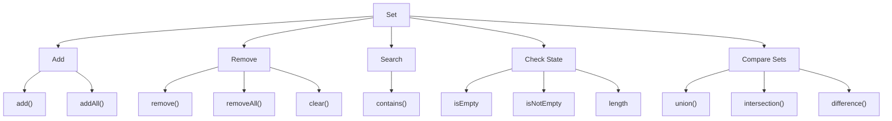
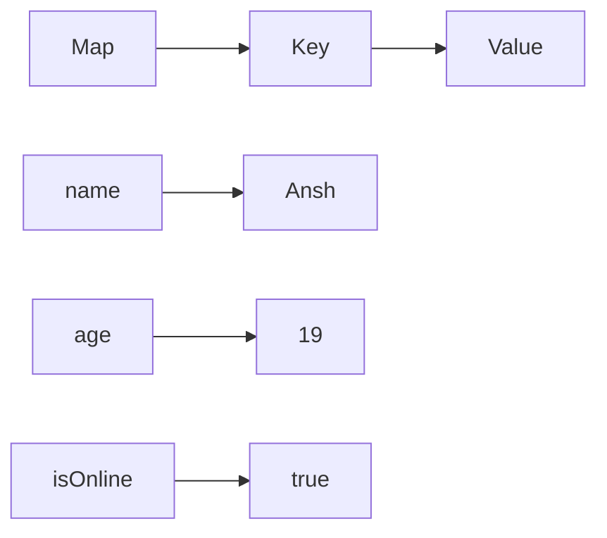
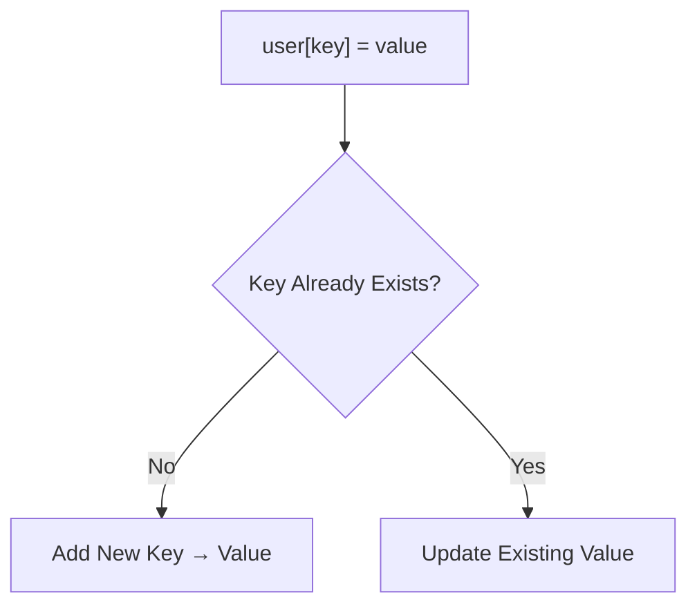
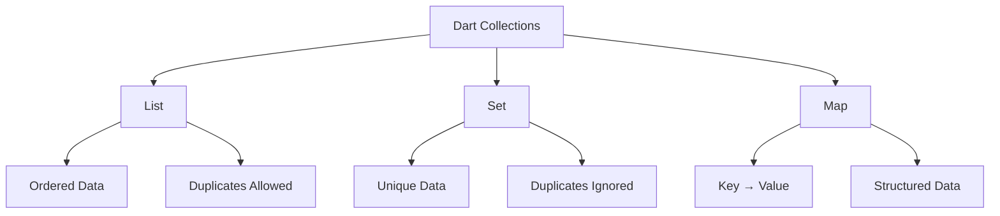

# 📦 Dart Day 28 — Collections: Set & Map

> **Understanding how Dart stores unique data and key-value based data for real-world applications.**

Day 28 focused on completing the remaining important parts of Dart Collections by learning **Set** and **Map**.

The goal was not to memorize every available collection method, but to understand the collection types that will frequently appear while working with Flutter, APIs, JSON, Firebase, and application data.

---

# 🎯 Day 28 Objectives

Today's goals were:

- Understand `Set`
- Understand why Set removes duplicates
- Learn important Set operations
- Understand `Map`
- Learn Key → Value data storage
- Add and update Map values
- Access Map data
- Learn useful Map properties and methods
- Understand nested Maps
- Connect Map concepts with API/JSON-style data

---

# 📂 Files Covered

| File | Topic | Focus |
|------|-------|-------|
| `01_Set.dart` | Set Basics | Unique values & duplicate handling |
| `02_Set_Methods.dart` | Set Methods | Practical Set operations |
| `03_Set_Operations.dart` | Advanced Set Operations | `addAll()`, `removeAll()`, `union()`, `intersection()`, etc. |
| `04_Map_Basics.dart` | Map Basics | Key → Value data |
| `05_Map_Operations.dart` | Map Operations | Keys, values, searching, removing |
| `06_Nested_Map_JSON_Style.dart` | Nested Map | API / JSON-style structured data |

---

# 🟢 01 — Set

## 📌 What is a Set?

A `Set` is a Dart collection that stores **unique values**.

Duplicate values are automatically ignored.

Example:

```dart
Set<String> students = {
  "Ansh",
  "Rahul",
  "Ansh",
  "Vansh",
};
```

Result:

```text
{Ansh, Rahul, Vansh}
```

The second `"Ansh"` is not stored again.

---

# 🧠 Set Mental Model

```text
Input Values

Ansh
Rahul
Ansh
Vansh
Rahul

        ↓

       Set

        ↓

Ansh
Rahul
Vansh
```

### Golden Rule

> **Set = Unique Values**

---

# ⚔️ List vs Set

| List | Set |
|------|-----|
| Duplicates allowed | Duplicates ignored |
| Index-based access | Not index-focused |
| Maintains collection order | Used primarily for uniqueness |
| `list[0]` possible | Index access is not the normal Set pattern |

### Example

```dart
List<String> skills = [
  "Dart",
  "Flutter",
  "Dart",
];
```

Result:

```text
[Dart, Flutter, Dart]
```

Set:

```dart
Set<String> skills = {
  "Dart",
  "Flutter",
  "Dart",
};
```

Result:

```text
{Dart, Flutter}
```

---

# 🛠️ Important Set Operations

## `add()`

Adds one value.

```dart
students.add("Nitin");
```

---

## `addAll()`

Adds multiple values.

```dart
students.addAll({
  "Nitin",
  "Sagar",
});
```

Duplicates are still ignored.

---

## `remove()`

Removes one value.

```dart
students.remove("Rahul");
```

---

## `removeAll()`

Removes multiple values.

```dart
students.removeAll({
  "Rahul",
  "Sagar",
});
```

---

## `contains()`

Checks whether a value exists.

```dart
students.contains("Ansh");
```

Returns:

```text
true / false
```

---

## `length`

Returns number of unique elements.

```dart
students.length
```

---

## `isEmpty`

Checks whether the Set is empty.

```dart
students.isEmpty
```

---

## `isNotEmpty`

Checks whether the Set contains any data.

```dart
students.isNotEmpty
```

---

## `clear()`

Removes all values.

```dart
students.clear();
```

---

# 🔗 Set Operations

Dart also provides useful operations for comparing Sets.

## `union()`

Combines two Sets while maintaining uniqueness.

```text
Set A
{Dart, Flutter}

Set B
{Flutter, Java}

Union
{Dart, Flutter, Java}
```

---

## `intersection()`

Returns values common to both Sets.

```text
Set A
{Dart, Flutter, Java}

Set B
{Flutter, Java, SQL}

Intersection
{Flutter, Java}
```

---

## `difference()`

Returns values present in the first Set but not in the second.

```text
Set A
{Dart, Flutter, Java}

Set B
{Flutter, Java, SQL}

Difference
{Dart}
```

---

# 🗺️ Set Operations Diagram



---

# 🔵 02 — Map

## 📌 What is a Map?

A `Map` stores data in:

```text
Key → Value
```

pairs.

Example:

```dart
Map<String, dynamic> user = {
  "name": "Ansh",
  "age": 19,
  "isOnline": true,
};
```

Here:

```text
"name"     → "Ansh"
"age"      → 19
"isOnline" → true
```

---

# 🧠 Map Mental Model



---

# ⚔️ List vs Set vs Map

```text
List
 ↓
Index → Value


Set
 ↓
Unique Values


Map
 ↓
Key → Value
```

### Example

```dart
List<String> names = [
  "Ansh",
  "Rahul",
];
```

Access:

```dart
names[0]
```

---

Set:

```dart
Set<String> names = {
  "Ansh",
  "Rahul",
};
```

Main purpose:

```text
Unique values
```

---

Map:

```dart
Map<String, dynamic> user = {
  "name": "Ansh",
  "age": 19,
};
```

Access:

```dart
user["name"]
```

---

# 🛠️ Map Basics

## Accessing Values

```dart
print(user["name"]);
```

The key is used instead of an index.

---

## Adding Data

If the key doesn't exist:

```dart
user["profession"] = "Flutter Developer";
```

A new key-value pair is added.

---

## Updating Data

If the key already exists:

```dart
user["city"] = "Noida";
```

The existing value is updated.

---

# 🧠 Add vs Update



This is one of the most important Map concepts.

---

# ⚙️ Important Map Operations

## `keys`

Returns all keys.

```dart
settings.keys
```

---

## `values`

Returns all values.

```dart
settings.values
```

---

## `containsKey()`

Checks whether a key exists.

```dart
settings.containsKey("theme");
```

---

## `containsValue()`

Checks whether a value exists.

```dart
settings.containsValue("dark");
```

---

## `remove()`

Removes a key-value pair.

```dart
settings.remove("fontSize");
```

---

## `length`

Returns number of key-value pairs.

```dart
settings.length
```

---

## `isEmpty`

Checks whether Map is empty.

```dart
settings.isEmpty
```

---

## `isNotEmpty`

Checks whether Map contains data.

```dart
settings.isNotEmpty
```

---

# 🌐 Nested Map

A Map can contain another Map as its value.

Example:

```dart
Map<String, dynamic> user = {
  "name": "Ansh",
  "age": 19,
  "address": {
    "city": "Noida",
    "state": "Uttar Pradesh",
  },
};
```

Structure:

```text
user
│
├── name → Ansh
│
├── age → 19
│
└── address
      │
      ├── city  → Noida
      └── state → Uttar Pradesh
```

---

# 🧠 Nested Map Access

First:

```dart
user["address"]
```

This gives the inner Map.

Then:

```dart
(user["address"] as Map)["city"]
```

gives:

```text
Noida
```

Similarly:

```dart
(user["address"] as Map)["state"]
```

gives:

```text
Uttar Pradesh
```

---

# 📱 Why Map Matters for Flutter

Map is extremely important for future Flutter development because API and JSON data commonly follow the same key-value structure.

Conceptually:

```text
API Response
     ↓
JSON Data
     ↓
Map
     ↓
Access / Transform Data
     ↓
Dart Object
     ↓
Flutter UI
```

Example:

```dart
Map<String, dynamic> data = {
  "name": "Ansh",
  "age": 19,
};
```

Later, this kind of data can be converted into proper Dart model objects.

---

# 🔥 Real-World Use Cases

## Set

Useful when we need:

- Unique usernames
- Unique tags
- Unique registered users
- Unique categories
- Removing duplicates
- Comparing groups of data

---

## Map

Useful for:

- API responses
- JSON data
- User profiles
- App settings
- Configuration
- Temporary structured data
- Key-value storage

---

# 🧠 Collections Mental Model



---

# 📊 Collections Progress

```text
📦 Dart Collections

List
████████████████████ 100%

Higher Order Methods
████████████████████ 100%

Set
████████████████████ 100%

Map
████████████████████ 100%

Overall Collections
██████████████████░░ 90%
```

---

# 🎯 What We Have Learned

### List

```text
Data Collection
   ↓
Index Based Access
```

### Higher Order Methods

```text
map()
where()
firstWhere()
any()
every()
reduce()
fold()
```

### Set

```text
Unique Values
```

### Map

```text
Key → Value
```

### Nested Map

```text
Map
 ↓
Map
 ↓
Value
```

---

# 🧠 Developer Cheat Sheet

```text
Need ordered/index-based data?
        ↓
      List


Need unique values?
        ↓
       Set


Need Key → Value data?
        ↓
       Map


Need to transform a List?
        ↓
      map()


Need to filter a List?
        ↓
      where()


Need first matching element?
        ↓
   firstWhere()


Need YES/NO for at least one?
        ↓
      any()


Need YES/NO for all?
        ↓
     every()


Need to combine values?
        ↓
     reduce()


Need to combine + initial value?
        ↓
      fold()
```

---

# 🏁 Day 28 Status

## 📦 Collections Module

```text
List                         ✅
List Operations              ✅
Higher Order Methods         ✅
Set                          ✅
Set Operations               ✅
Map                          ✅
Map Operations               ✅
Nested Map                   ✅

Final Revision               ⏳
```

---

# 🚀 Next — Day 29

Day 29 will be the **final Collections Day**.

The goal:

```text
List
  +
Set
  +
Map
  +
Higher Order Methods
  ↓
Complete Real-World Program
  ↓
Final Revision
  ↓
📦 COLLECTIONS MODULE — 100%
```

After that, we move forward to the next Dart module according to the roadmap.

---

# 💡 Developer Note

The objective of Collections is not to memorize every method.

The important skill is recognizing **what kind of data you are dealing with**.

```text
Ordered / indexed data
        → List

Unique data
        → Set

Key-value data
        → Map

Transform
        → map()

Filter
        → where()

Search
        → firstWhere()

Check one
        → any()

Check all
        → every()

Combine
        → reduce()

Combine + starting value
        → fold()
```

> **Choose the collection according to the data, and choose the method according to the operation.**

---

# 🔥 Day 28 Complete

> **Set gave us uniqueness. Map gave us structure. Higher Order Methods gave us powerful ways to process data.**

**Tomorrow: Collections — FINAL DAY 🚀**