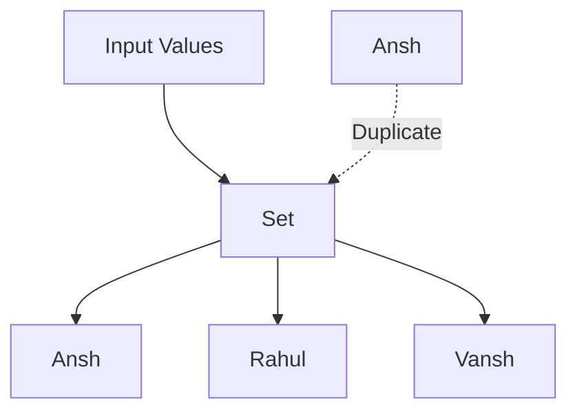
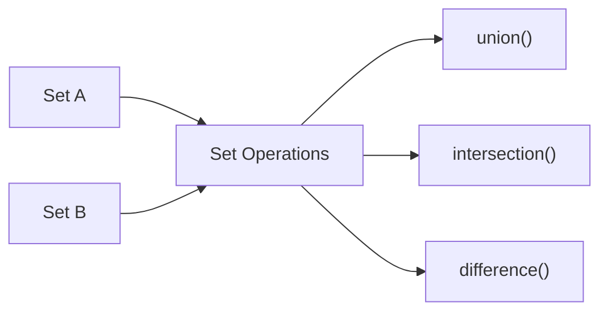
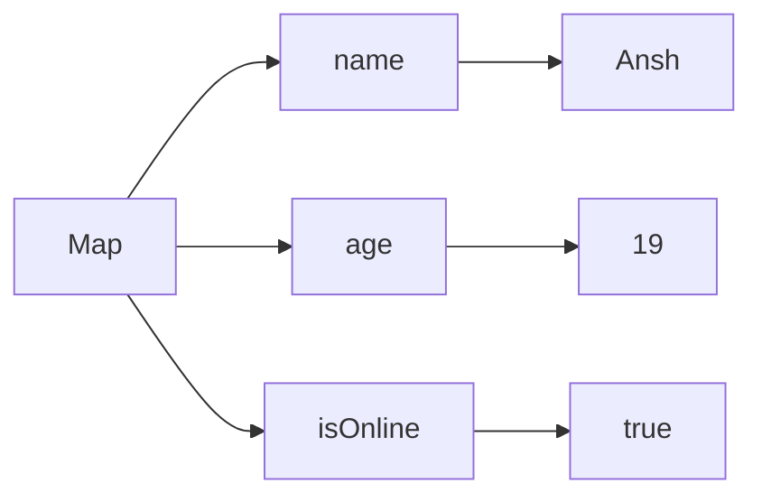
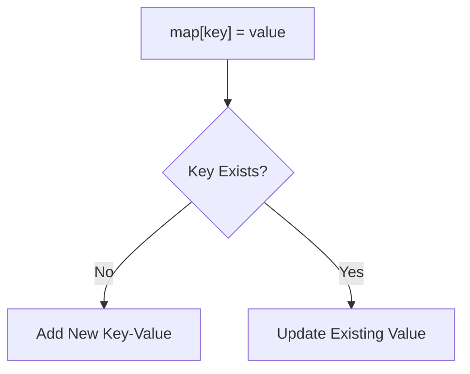
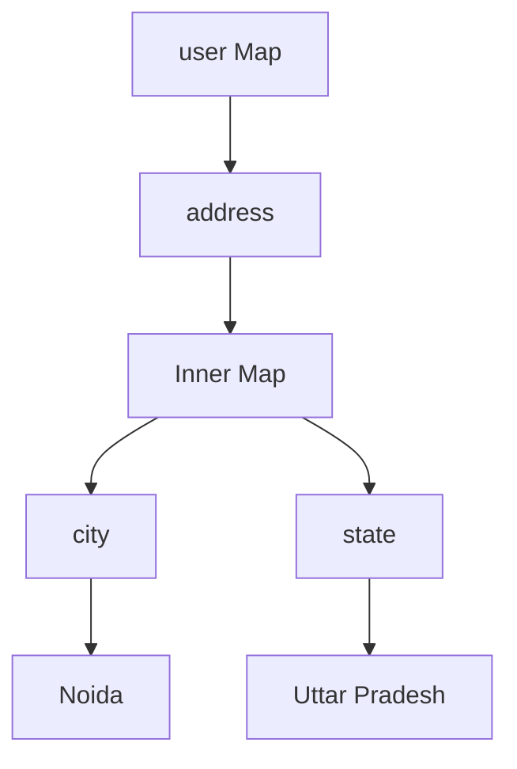
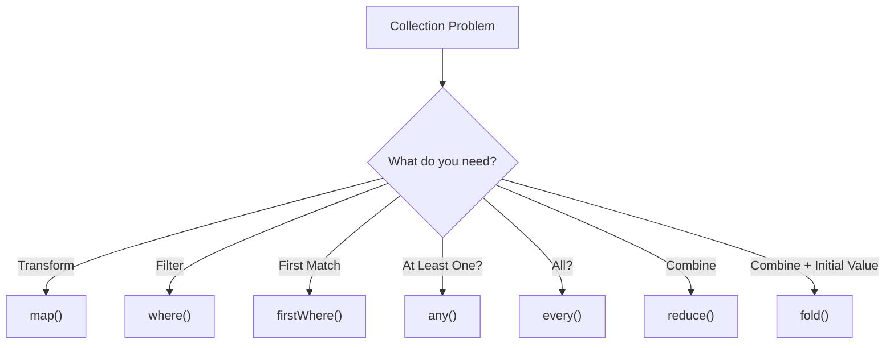

# 📘 Dart Day 28 — Collections: Set & Map

## 🎯 Today's Topics

- Set
- List vs Set
- Set Operations
- Map
- Key → Value
- Map Operations
- Nested Map
- JSON/API-style data

---

# 🟢 1. Set

## Definition

`Set` Dart ki collection hai jo **unique values** store karti hai.

Agar same value multiple times add ki jaye, Set duplicate values ko store nahi karta.

```dart
Set<String> students = {
  "Ansh",
  "Rahul",
  "Ansh",
  "Vansh",
};
```

Result:

```text
{Ansh, Rahul, Vansh}
```

### Simple Rule

```text
Set → Unique Values
```

---

# ⚔️ List vs Set

## List

List duplicates allow karti hai.

```dart
List<String> names = [
  "Ansh",
  "Rahul",
  "Ansh",
];
```

Result:

```text
[Ansh, Rahul, Ansh]
```

List me index se access kar sakte hain:

```dart
names[0]
```

---

## Set

Set duplicate values ko ignore karta hai.

```dart
Set<String> names = {
  "Ansh",
  "Rahul",
  "Ansh",
};
```

Result:

```text
{Ansh, Rahul}
```

Set ka main purpose index-based access nahi, balki **unique data maintain karna** hai.

---

# 🧠 Set Mental Model



---

# 🛠️ Important Set Operations

## `add()`

Ek value add karta hai.

```dart
students.add("Nitin");
```

---

## `addAll()`

Multiple values add karta hai.

```dart
students.addAll({
  "Nitin",
  "Sagar",
});
```

Duplicates automatically ignore honge.

---

## `remove()`

Ek value remove karta hai.

```dart
students.remove("Rahul");
```

---

## `removeAll()`

Multiple values remove karta hai.

```dart
students.removeAll({
  "Rahul",
  "Sagar",
});
```

---

## `contains()`

Check karta hai ki value Set me exist karti hai ya nahi.

```dart
students.contains("Ansh");
```

Result:

```text
true / false
```

---

## `length`

Set me total unique values batata hai.

```dart
students.length
```

---

## `isEmpty`

Check karta hai ki Set empty hai ya nahi.

```dart
students.isEmpty
```

---

## `isNotEmpty`

Check karta hai ki Set me koi value hai ya nahi.

```dart
students.isNotEmpty
```

---

## `clear()`

Set ki saari values remove karta hai.

```dart
students.clear();
```

---

# 🔗 Set Comparison Operations

## `union()`

Do Sets ki unique values ko combine karta hai.

```text
Set A
{Dart, Flutter}

Set B
{Flutter, Java}

Union
{Dart, Flutter, Java}
```

---

## `intersection()`

Dono Sets ki common values return karta hai.

```text
Set A
{Dart, Flutter, Java}

Set B
{Flutter, Java, SQL}

Intersection
{Flutter, Java}
```

---

## `difference()`

First Set me present aur second Set me absent values return karta hai.

```text
Set A
{Dart, Flutter, Java}

Set B
{Flutter, Java, SQL}

Difference
{Dart}
```

---

# 🧠 Set Operations Diagram



---

# 🔵 2. Map

## Definition

`Map` data ko **Key → Value** pairs me store karta hai.

```dart
Map<String, dynamic> user = {
  "name": "Ansh",
  "age": 19,
  "isOnline": true,
};
```

Yahan:

```text
"name"     → "Ansh"
"age"      → 19
"isOnline" → true
```

### Simple Rule

```text
Map → Key → Value
```

---

# 🧠 Map Mental Model



---

# ⚔️ List vs Set vs Map

```text
List
 ↓
Index → Value

Set
 ↓
Unique Values

Map
 ↓
Key → Value
```

---

# 🛠️ Map Basics

## Accessing Value

Map me index ki jagah key use hoti hai.

```dart
print(user["name"]);
```

Output:

```text
Ansh
```

---

## Adding a New Key

Agar key exist nahi karti:

```dart
user["profession"] = "Flutter Developer";
```

New key-value pair add ho jayega.

---

## Updating Existing Value

Agar key already exist karti hai:

```dart
user["city"] = "Noida";
```

Existing value update ho jayegi.

---

# 🧠 Add vs Update



---

# ⚙️ Important Map Operations

## `keys`

Map ki saari keys provide karta hai.

```dart
settings.keys
```

---

## `values`

Map ki saari values provide karta hai.

```dart
settings.values
```

---

## `containsKey()`

Check karta hai ki particular key exist karti hai ya nahi.

```dart
settings.containsKey("theme");
```

---

## `containsValue()`

Check karta hai ki particular value exist karti hai ya nahi.

```dart
settings.containsValue("dark");
```

---

## `remove()`

Key-value pair remove karta hai.

```dart
settings.remove("fontSize");
```

---

## `length`

Map me total key-value pairs batata hai.

```dart
settings.length
```

---

## `isEmpty`

Check karta hai ki Map empty hai ya nahi.

```dart
settings.isEmpty
```

---

## `isNotEmpty`

Check karta hai ki Map me data hai ya nahi.

```dart
settings.isNotEmpty
```

---

# 🌐 3. Nested Map

Ek Map ke andar doosra Map bhi value ke form me store ho sakta hai.

Example:

```dart
Map<String, dynamic> user = {
  "name": "Ansh",
  "age": 19,
  "address": {
    "city": "Noida",
    "state": "Uttar Pradesh",
  },
};
```

Structure:

```text
user
│
├── name → Ansh
│
├── age → 19
│
└── address
      │
      ├── city  → Noida
      └── state → Uttar Pradesh
```

---

# 🧠 Nested Map Access

Outer Map se:

```dart
user["address"]
```

inner Map milta hai.

Uske baad inner key:

```dart
(user["address"] as Map)["city"]
```

Result:

```text
Noida
```

Similarly:

```dart
(user["address"] as Map)["state"]
```

Result:

```text
Uttar Pradesh
```

---

# 🗺️ Nested Map Flow



---

# 📱 Flutter / API Connection

Map future Flutter development me important hai because API aur JSON data commonly key-value structure follow karta hai.

Conceptual flow:

```text
API
 ↓
JSON
 ↓
Map
 ↓
Read / Transform Data
 ↓
Dart Model
 ↓
Flutter UI
```

Example:

```dart
Map<String, dynamic> data = {
  "name": "Ansh",
  "age": 19,
};
```

Later isi type ke data ko proper Dart model objects me convert karna seekhenge.

---

# 🧠 Collections Quick Revision

```text
LIST
↓
Ordered / Index Based Data


SET
↓
Unique Data


MAP
↓
Key → Value Data
```

---

# 🔥 Higher Order Methods Revision

Collections me previously learned methods:

```text
map()
↓
Transform Every Element

where()
↓
Filter Elements

firstWhere()
↓
First Matching Element

any()
↓
At Least One Match?

every()
↓
All Match?

reduce()
↓
Combine Values

fold()
↓
Combine + Initial Value
```

---

# 🎯 Collection Method Selection



---

# 📊 Day 28 Summary

## Set

```text
✅ Creation
✅ Unique Values
✅ add()
✅ addAll()
✅ remove()
✅ removeAll()
✅ contains()
✅ length
✅ isEmpty
✅ isNotEmpty
✅ clear()
✅ union()
✅ intersection()
✅ difference()
```

## Map

```text
✅ Creation
✅ Key → Value
✅ Access
✅ Add
✅ Update
✅ keys
✅ values
✅ containsKey()
✅ containsValue()
✅ remove()
✅ length
✅ isEmpty
✅ isNotEmpty
✅ Nested Map
```

---

# 🧠 Final Mental Model

```text
              DART COLLECTIONS
                     │
       ┌─────────────┼─────────────┐
       │             │             │
      List          Set           Map
       │             │             │
   Index Based     Unique       Key → Value
       │             │             │
       └─────────────┼─────────────┘
                     │
              Higher Order
                 Methods
                     │
       ┌─────────────┼─────────────┐
       │             │             │
    Transform      Filter        Search
       │             │             │
     map()        where()     firstWhere()
                     │
                ┌────┴────┐
                │         │
              any()     every()
                │         │
               ONE       ALL
                     │
                  Combine
                 /       \
             reduce()   fold()
```

---

# 🏆 Day 28 Status

```text
List                    ✅
Higher Order Methods    ✅
Set                     ✅
Set Operations          ✅
Map                     ✅
Map Operations          ✅
Nested Map              ✅

Final Collections
Revision                ⏳
```

---

# 🚀 Next

**Day 29 = Final Collections Day**

Target:

```text
List
+
Set
+
Map
+
Higher Order Methods
+
Real-World Combined Program
+
Final Revision

        ↓

📦 COLLECTIONS MODULE
        ↓
       100% ✅
```

> **Choose the collection according to the data, and choose the method according to the operation.**